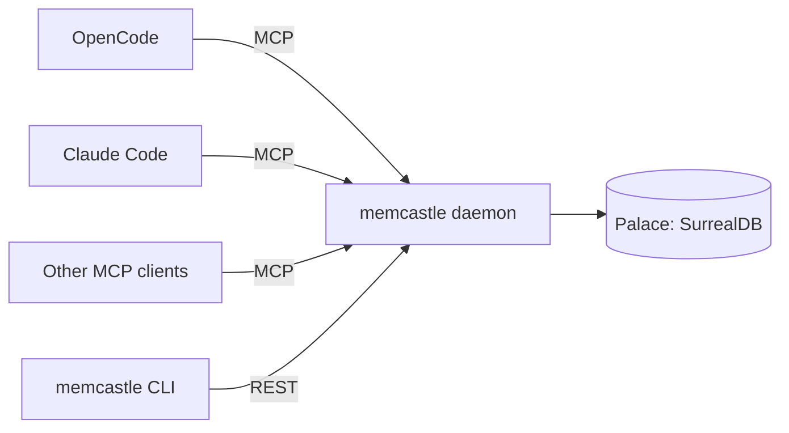

<p align="center">
  
</p>

<p align="center"><strong>Local-first, always-on memory server for AI coding agents over MCP/HTTP</strong></p>

<p align="center">
  <a href="https://github.com/noirbizarre/memcastle/actions/workflows/ci.yaml">
    
  </a>
  <a href="https://codecov.io/gh/noirbizarre/memcastle">
    
  </a>
  
  <a href="https://noirbizarre.github.io/memcastle/">
    
  </a>
  
</p>

---

Running several AI coding agents (OpenCode, Claude Code, Cursor, ...) side by side
usually means each one gets its own, disconnected memory — or none at all.
MemCastle is a single daemon per palace (the memory store that one or more of your projects share)
that all of them talk to over MCP or HTTP,
so a mining run, a search, or a saved decision from one agent
is immediately visible to every other agent and to the CLI.
Everything lives in one SurrealDB store, embedded by default, so there is no external service to run.



## Installation

```bash
brew install noirbizarre/homebrew-tap/memcastle   # macOS
paru -S memcastle-bin                             # Arch Linux (AUR)
```

Or download a binary for your platform from the [latest release](https://github.com/noirbizarre/memcastle/releases/latest),
or build from source with `cargo install --path .`.
See the [installation guide](https://noirbizarre.github.io/memcastle/installation/) for details and platform notes.

## Quickstart

Start the daemon in one terminal.
It serves `127.0.0.1:8420` and keeps its data in `~/.local/share/memcastle/default`:

```bash
memcastle serve
```

Then, from another terminal:

```bash
memcastle status                       # is it up, where, and is its datastore healthy?
memcastle mine ./project               # submits a durable, resumable job — doesn't block
memcastle job list                     # follow it
memcastle search "why did we switch to GraphQL?"
```

Connect an MCP client to `http://127.0.0.1:8420/mcp`:

```bash
claude mcp add --transport http memcastle http://127.0.0.1:8420/mcp   # Claude Code
```

For OpenCode, add a `remote` server to `opencode.json`.
The [MCP client guide](https://noirbizarre.github.io/memcastle/mcp-clients/) has the exact configuration for both.
Stop and restart the daemon whenever you like: the palace is on disk, and it is all still there.

## Documentation

The full documentation is at <https://noirbizarre.github.io/memcastle/>.

| To... | Read |
|---|---|
| Install and try it | [Installation](https://noirbizarre.github.io/memcastle/installation/), [Quickstart](https://noirbizarre.github.io/memcastle/quickstart/) |
| Use it from an agent | [Connect an MCP client](https://noirbizarre.github.io/memcastle/mcp-clients/), [MCP tools and REST API](https://noirbizarre.github.io/memcastle/mcp-and-api/) |
| Run it day to day | [Running the daemon](https://noirbizarre.github.io/memcastle/daemon/), [Authentication](https://noirbizarre.github.io/memcastle/authentication/), [Memory modes](https://noirbizarre.github.io/memcastle/memory-modes/), [Database access](https://noirbizarre.github.io/memcastle/database-access/), [Troubleshooting](https://noirbizarre.github.io/memcastle/troubleshooting/) |
| Configure it | [Configuration](https://noirbizarre.github.io/memcastle/configuration/) (XDG paths on Linux and macOS, config file, environment, flags), [CLI reference](https://noirbizarre.github.io/memcastle/cli/) |
| Know where data lives | [Storage and data](https://noirbizarre.github.io/memcastle/storage/), [Migrations and upgrades](https://noirbizarre.github.io/memcastle/migrations/) |
| Understand or change it | [Architecture](https://noirbizarre.github.io/memcastle/architecture/), [Development](https://noirbizarre.github.io/memcastle/development/), [Architecture Decisions](https://noirbizarre.github.io/memcastle/adr/) |

## Contributing

See [CONTRIBUTING.md](CONTRIBUTING.md).

## License

MIT — see [LICENSE](LICENSE).
