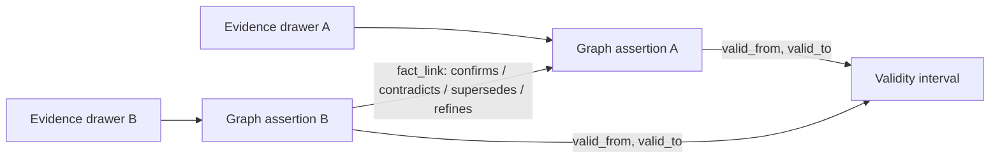

# ADR-046: Fact lifecycle is an auditable relation between assertions

## Status

Accepted.
Builds on [ADR-024](024-entity-extraction-as-an-enrich-job.md),
[ADR-025](025-memory-deduplication-and-entity-resolution.md) and
[ADR-032](032-temporal-retrieval-and-history.md).

## Context

Validity dates and drawer supersession preserve *when* knowledge was claimed, but cannot say *why* two independent
sources disagree, or why a person corrected one assertion.
Similar drawer text does not establish either truth or contradiction.
The original drawers must remain evidence even when a graph assertion is no longer believed.

## Decision

The `relates_to` edge is the assertion; the `fact_link` table holds immutable decisions connecting assertion IDs.
Each link records its kind, origin (`inferred` or `explicit`), reason, recorded instant and an evidence-drawer ID when
available.
Direct checkpoint assertions point to the checkpoint drawer through `assertion`; extracted edges retain their existing
drawer/job/extractor provenance.
Lifecycle state is computed from these records on read rather than stored as a mutable status column.
Schema is applied by SurrealKit and no legacy claims are guessed or merged during migration.

After resolving entities, extraction confirms claims with equal subject, predicate and object and overlapping validity
from independent evidence.
When a source drawer replaces an earlier version, resolved facts with the same subject and predicate are also linked as
`supersedes` to the closed assertions from that predecessor drawer.
This uses explicit drawer lineage rather than assuming that two independently mined documents are revisions.
It identifies different objects as contradictory only when the normalized predicate is `located_in`, interpreted by
this first policy as one primary location; other predicates (`works_on`, `uses`, `member_of`, and so on) are multi-valued.
Free-text assertions are not automatically assigned a predicate's cardinality.
An inferred disagreement leaves both edges open and visible with `conflicting` state; it never chooses truth from recency.
For presentation only, an unresolved conflict's `preferred` ID is ranked by direct assertion, then confidence,
`valid_from`, then ID, and `basis` describes the tie breaks.
This hint does not remove or invalidate other evidence.
The rule and its version are recorded in each inferred link's reason, not obtained from a provider-specific extractor.

An explicit checkpoint supersession atomically closes the targeted edge, opens its replacement and links the two.
An explicit invalidation closes an edge without replacement and records its reason.
A caller may explicitly `link` two existing assertions as `confirms`, `contradicts` or `refines` with a nonblank reason;
refinement is not inferred from text similarity.
Deterministic link IDs make retries safe, and fact IDs derived from the checkpoint item or extracted drawer preserve the
same identity across a replay.
Inferred links never override an explicit correction.

An assertion's validity uses the existing half-open `[valid_from, valid_to)` interval.
An `as_of` read ignores explicit decisions recorded after its requested instant and judges conflicts only against other
claims valid at that instant; inferred comparisons remain visible when their evidence was discovered later.
Current graph and graph expansion omit closed edges but include both sides of unresolved conflicts.
Drawer search still returns verbatim evidence under its own temporal filter; an assertion link never rewrites a drawer.
`GET /api/relationships/{id}/history`, `memcastle_fact_history` and `memcastle fact history` expose the decision trail.

## Alternatives rejected

Automatically superseding a disagreeing claim by arrival time would mistake later extraction for a correction and erase
the visible disagreement.
Inferring conflicts for every different object would treat multi-valued facts such as `uses` as mutually exclusive.
Asking an LLM to arbitrate every claim would make replay dependent on a provider and would hide the policy behind a model.
Storing a mutable `current` flag on every edge would duplicate validity and link state and could diverge after a crash.

## Consequences

Corrections preserve their predecessor's content and provenance, and conflicting sources can coexist without silent
overwriting.
There is no general-purpose truth maintenance: a claim outside the conservative cardinality rule remains open until
someone explicitly relates or corrects it.
