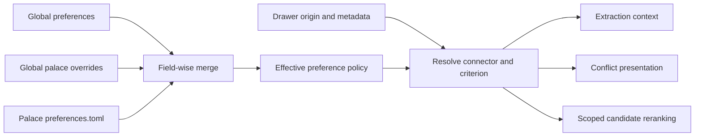

# ADR 048: Source preference is bounded evidence, with palace-local overrides

## Context

Mined drawers have an adapter name and source-document metadata, but retrieval used relevance alone and conflict
presentation used explicitness, confidence and validity time without source authority.
One daemon serves one palace; the global XDG configuration is not copied with palace data.

## Decision

Use three ordered levels (`low`, `normal`, `high`) rather than expose numeric tuning.
The global configuration declares `[preferences]`, the same file can override it under `[palace.preferences]`, and a
preferences-only `<palace.path>/preferences.toml` can override both.
Merge individual fields, and replace a connector's criteria only when explicitly supplied; `criteria = []` clears them.
An absent preference defaults to `normal`, and an unknown adapter name is permitted as a future connector.
Matching criteria compare JSON scalar values at connector-specific dot-separated metadata paths, without imposing a
shared schema on source authors.
More-specific paths win, with declaration order deciding equal-depth matches.
The matching document metadata is snapshotted with a mined drawer's origin so later revisions cannot retroactively
change historical evidence; a change to the policy itself is evaluated at read time.

The ranking adjustment is bounded and applies only to already relevant, temporally eligible candidates.
Search normalizes relevance inside the candidate pool and adjusts it by at most 0.08 for either extreme; the original
BM25, cosine or fusion signal remains visible alongside the effective preference on a search hit.
Graph expansion remains after direct search results.
For unresolved conflicts, explicit assertions precede the read-side hint; confidence, bounded freshness and a smaller
source adjustment decide between other open facts, without closing either assertion.
Supersession and temporal validity determine eligibility before any preference calculation.
Extraction passes the preference and provenance context to command and HTTP providers, but preserves provider confidence
and the configured extraction floor; source priority does not make a claim true.
Exact/near deduplication keeps independent mined evidence rather than merging sources into a single authority.
The server does not generate answers: search, recall and fact responses carry provenance and preference explanations for
clients that synthesize answers from evidence.

## Consequences

Adding a connector needs no MemCastle code change to the policy; only its metadata conventions need documenting.
Changing configuration requires a daemon restart, while old provenance and contradictory evidence remain inspectable.
Future query-specific strategies can use the same effective policy without changing the TOML contract.
