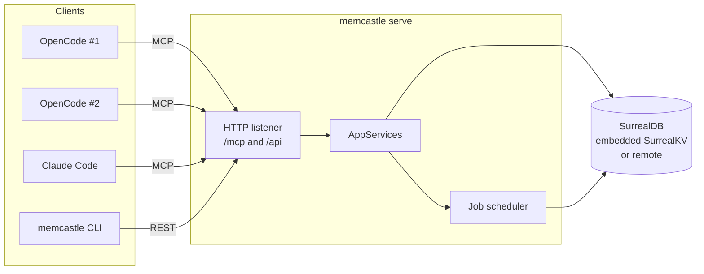
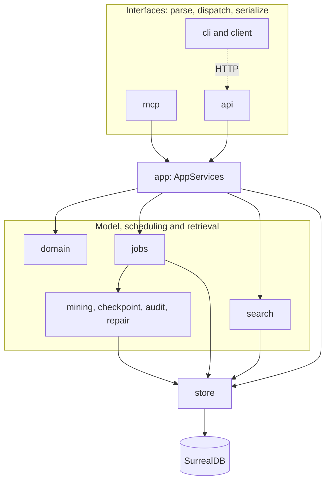
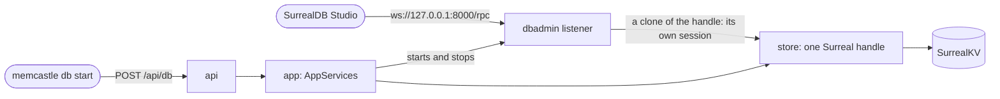
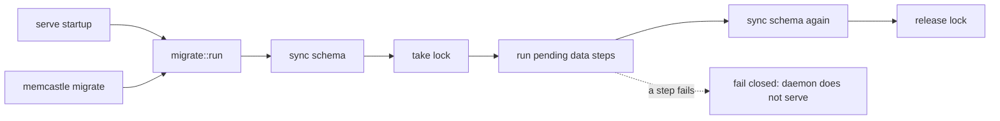
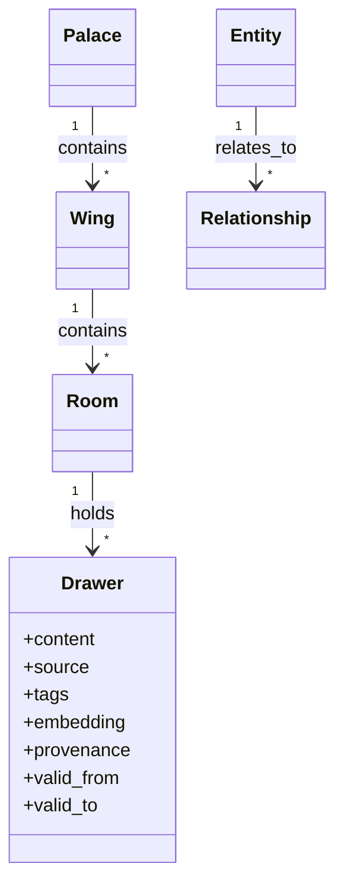
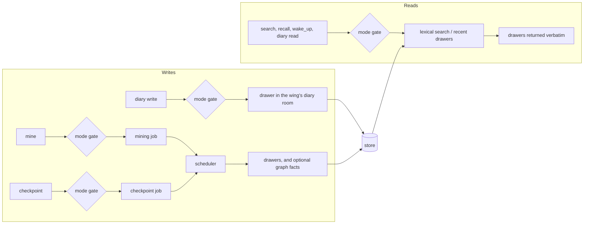
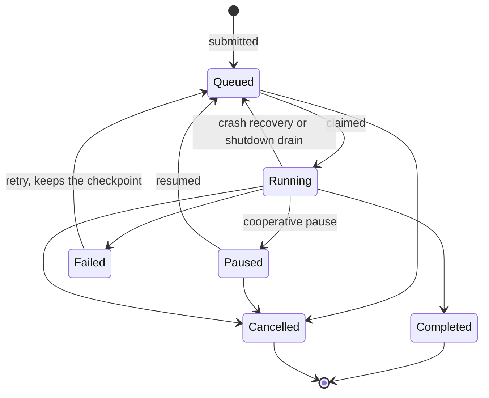
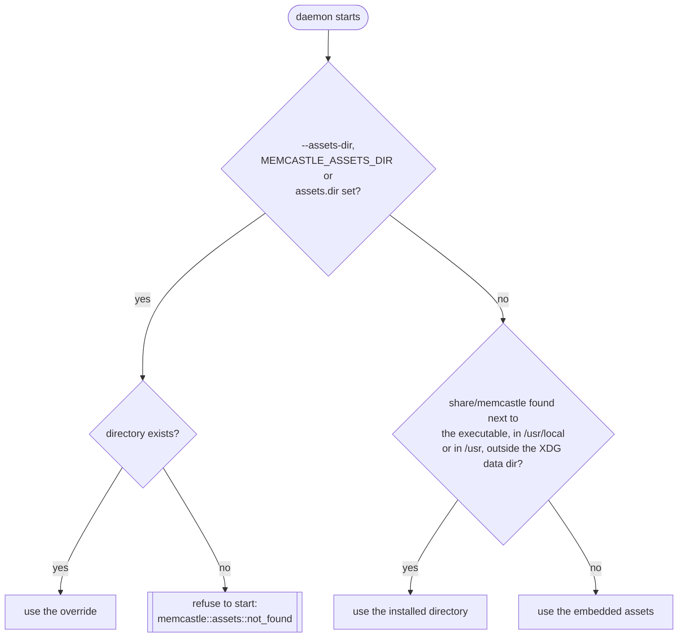

# Architecture

This page is for people changing MemCastle, or who want to know why it is shaped the way it is.
To use it, start at [Installation](installation.md) and the [Quickstart](quickstart.md).
Behaviour that users rely on is documented in the guides and references, and linked from here rather than repeated:
[Running the daemon](daemon.md), [Memory modes](memory-modes.md), [Storage and data](storage.md),
[Migrations and upgrades](migrations.md), [CLI](cli.md) and [MCP tools and REST API](mcp-and-api.md).

## The core idea

> MemCastle is a long-running memory server, not a CLI process that happens to expose MCP.

There is one MemCastle daemon per palace.
Multiple AI coding-agent instances — several OpenCode sessions, Claude Code, Cursor, a future web dashboard —
connect to that *same* daemon, so they share exactly the same palace, job queue and search.

Tools that run one process per invocation load their configuration and open their storage on every command.
MemCastle instead keeps one process that owns the store, so there is one writer per embedded palace
and no second index file to drift out of sync with the database.
A remote palace may be shared by several daemons, which job leases keep safe (see [ADR-006](adr/006-job-leases.md)).

## Layers

Dependencies point inward: `cli / mcp / api -> app -> domain + store/jobs/search -> store`.
Nothing in `domain` knows SurrealDB exists, and nothing in `cli`, `mcp` or `api` knows `store` exists.
The dotted line is the important one: the CLI is an HTTP client of the daemon, exactly as a script or dashboard would be.

**The CLI has no business logic MCP/HTTP can't reuse.**
Every subcommand except `serve`/`daemon`/`migrate` is a thin `client::DaemonClient` call —
`memcastle mine ./project` submits a job over HTTP the way an MCP tool call would, rather than mining anything itself.
`restart` adds only process management: it reads the daemon's registry file (`server::lifecycle`)
to know when the old daemon is really gone, then respawns `serve`, and never touches `store` or `jobs`.
`serve` is the composition root (`server::run`): it owns the store, the scheduler and the HTTP/MCP listeners.
`migrate` is a second, narrow exception: it connects to storage directly through `crate::migrate`,
the same runner `serve` calls on every startup, because migration must work before a daemon exists
(see [ADR-004](adr/004-versioned-database-migrations.md)).

`app::AppServices` is the one seam every interface (`api`, `mcp` and `server::run` itself) calls through.
The invariants that keep this true are listed in `AGENTS.md`, and each is enforced by a `prek` hook or a test:
`store-isolation` greps for forbidden imports, and `single-writer` limits who may construct a store.

## Storage: one SurrealDB, embedded or remote

`store::SurrealStore` wraps a single `Surreal<Any>` connection (`surrealdb::engine::any`),
which dispatches on a connection string's scheme at runtime:
`surrealkv:<path>` for the embedded default, or a `ws://`/`wss://` URL for a remotely hosted instance.
The rest of the codebase never branches on the backend:
`config::StoreConfig` picks one, `Backend` carries it, and `SurrealStore::connect` is the only place that cares.
SurrealKV (pure Rust) is the only embedded backend compiled, see [ADR-001](adr/001-surrealkv-embedded-storage-engine.md).
Choosing and building a server-side storage engine of our own is deferred until a deployment needs one.

Every read and write is hand-written SurrealQL (`db.query(...).bind(...)`)
rather than the SDK's typed `create`/`select` helpers:
datetimes cross the boundary as RFC3339 strings with explicit `<datetime>`/`<string>` casts,
in one canonical form written only by `store::stored` (why optional timestamps are strings is
[ADR-005](adr/005-timestamp-representation.md)),
and a record's own `id` is always projected out via `record::id(id)`.
That trades some verbosity for depending on only the smallest, most stable part of the driver's API,
whose typed surface has already changed shape across SDK majors once.

Where the data lives on disk, and how to back it up, is in [Storage and data](storage.md).

### The database admin endpoint

An embedded SurrealKV database has no server, so SurrealDB Studio cannot connect to it,
and a second process may not open its directory.
`memcastle db start` therefore asks the *daemon* to open a second listener, on loopback and only on request.
The listener speaks SurrealDB's WebSocket protocol and runs each connection on a clone of the handle `store` already holds,
which is a separate session over the same datastore.
It adds no storage layer, opens no database and leaves schema and migrations where they were.
See [Database access](database-access.md) and [ADR-015](adr/015-database-admin-endpoint.md).

### Migrations

Two migration shapes are kept deliberately separate, both driven by one `crate::migrate::run`:

- **Schema.** Declarative `.surql` files under `database/schema/`, embedded into the binary via SurrealKit's
  `embed_schema!()` macro and applied through its `Sync` builder (`SurrealStore::sync_schema`).
  SurrealKit, not MemCastle, owns diffing, content-hash tracking and pruning;
  MemCastle does not implement a parallel schema-diff engine.
- **Data.** An ordered, immutable list of versioned Rust steps (`crate::migrate::DataMigration`) for changes
  that cannot be expressed as an additive schema sync.
  A MemCastle-owned version watermark (the `migration_state` table, read and written only by `store::migration_state`)
  makes each step run exactly once.

`SurrealStore::connect` itself neither syncs schema nor migrates: that is this explicit step,
not a side effect of opening a connection.
A failed migration fails the daemon closed, and the watermark stays at the last step that succeeded,
so a corrected run resumes instead of replaying.
Operating instructions are in [Migrations and upgrades](migrations.md), and the design in
[ADR-004](adr/004-versioned-database-migrations.md).

## Domain model

A `Drawer`'s `content` is immutable once written;
provenance, tags, an optional `embedding` and a `valid_from`/`valid_to` pair travel alongside it.
Provenance has one meaning for every writer (diary, mining, checkpoint):
`provenance.requested_by` is the **channel** the write came through (`cli`, `http`, `mcp`),
and `source.agent` is the **agent identity** behind it, or absent when no agent is involved (mining).
Diary drawers written before this rule carry the agent in both fields;
migration 1 rewrites their `requested_by` to `unknown`, because the channel was never recorded.

`domain::entity` (`Entity`, `Relationship`) defines a bi-temporal knowledge-graph shape,
and `store::entities` is wired to the schema: create, supersede, invalidate and list operations exist
and are exercised by `checkpoint::run`'s optional `fact` mutation.
`relates_to` is a SurrealDB-native graph edge table (`TYPE RELATION IN entity OUT entity`),
unlike every other relationship in the model (wing to palace, room to wing, drawer to room),
which is a plain foreign-key column on a regular table.
What is missing is a populator: nothing extracts entities or relationships from mined content yet.

## Search

Lexical (BM25 full-text) search over `drawer.content` is the working search path (`search::lexical_search`).
It can be scoped to one wing and/or room by name.
The scope is expressed as SurrealQL predicates, with nested subqueries resolving the name to room ids,
so SurrealDB applies the filter as part of query execution rather than MemCastle fetching candidates and filtering them.
Semantic and vector search, temporal filtering, graph-aware retrieval and hybrid ranking are future work
on the same table.

## Memory flows

Writes reach the store through two routes, and reads through one.

- **Diary writes** are a direct, synchronous call rather than a job, see
  [ADR-003](adr/003-checkpoint-as-a-durable-job.md) for why checkpoint differs.
- **Mining and checkpoint** are durable jobs, resumable after a pause or a crash.
- `AppServices::recall` is `search` under a recall-oriented name, never paraphrasing or truncating a `Drawer.content`.
  It exists as a name to hang future recall-specific ranking off, not to duplicate logic today.
  MemCastle does not enforce a search-before-answer protocol; that discipline belongs to an integration or skill.
- `AppServices::wake_up` builds a deterministic session-start context:
  the agent's most recent diary entry (when a `wing` is given)
  plus up to `WakeUpBudget::max_items` recent checkpoint-originated drawers, trimmed to `max_bytes` by whole drawers only.
  A highlight too big for what is left of the budget is skipped, and older, smaller ones after it are still tried.
  It is deliberately simple; a more elaborate token optimizer is not built.
- `diary_write` and `diary_read` persist and read an agent's journal as drawers under a fixed per-wing `"diary"` room,
  keyed by a caller-supplied `agent_identity` that MemCastle stores faithfully but never validates.

## Memory mode enforcement

The behaviour, and how to pick a mode, is in [Memory modes](memory-modes.md).
Implementation-wise, `domain::MemoryMode` (`Full`/`ReadOnly`/`Disabled`) is deliberately never a process-wide setting,
because the daemon serves many agents at once.

Enforcement is centralized in `app::AppServices` (`require_read` and `require_write`, checked before any store contact).
`api` and `mcp` only *extract* a `MemoryMode` and pass it down, never deciding what is allowed themselves.
`Disabled` is symmetric on purpose: reads fail with the same typed `Error::ModeForbidden` as writes,
never a silent empty `Ok`, which would be indistinguishable from "found nothing".
The gate follows what an operation reads or writes rather than its name, see
[ADR-007](adr/007-memory-mode-gate-follows-data-access.md).

- **HTTP** reads `X-MemCastle-Mode` once per request through an `axum` extractor (`api::ModeHeader`),
  defaulting to `Full` when absent and answering `400` for an unparsable value.
- **MCP** has no per-request header in the tool-call model, so the mode is negotiated once per session.
  A `memcastle_set_mode` call is remembered in a single slot inside `McpTools`,
  tagged with the `mcp-session-id` that rmcp's streamable-HTTP transport assigns.
  rmcp builds one `McpTools` per session and drops it when the session ends, so nothing accumulates.
  A call with no session id has nothing to remember a mode under: it runs as `Full`,
  and `memcastle_set_mode` on it is an error.

The rationale and rejected alternatives are in [ADR-002](adr/002-memory-mode-session-scoping.md).

## Jobs: a durable queue, not an in-memory one

> The queue state is durable; the in-memory scheduler is only the execution mechanism.

`domain::Job` is a plain record persisted in SurrealDB:
`id`, `kind`, `status`, `priority`, timestamps, `progress`, `attempt`/`recovery_attempts`/`max_attempts`,
`checkpoint`, `result`, `error`, the lease (`lease_owner`, `lease_expires_at`),
and any pending `pause_requested` or `cancel_requested`.
Its status only ever changes through `Job::apply(event)`, an explicit transition table;
any `(status, event)` pair not listed is rejected with a `TransitionError`.

### Job lifecycle

Retrying clears the error but keeps the checkpoint.
`Failed` is terminal unless someone retries it.

**Priority.** `Job.priority` is `domain::Priority`, a five-level enum
(`Background < Low < Normal < High < Critical`) — coarse buckets rather than an arbitrary integer,
so callers cannot invent incomparable numeric scales.
It serializes to the store's `job.priority` (`TYPE int`) column through fixed values
(`Critical`=100, `High`=75, `Normal`=50, `Low`=25, `Background`=0, with headroom between levels).
A value read back that matches none of the five is a surfaced `InvalidPriority` error, never coerced to a default.
`SurrealStore::claim_next_job` claims the oldest, highest-priority `Queued` job first,
backed by the composite index `job_status_idx ON job FIELDS status, priority, created_at`.
Default priorities: `Mine` is `Background` (so mining never delays anything else), `Demo`, `Audit` and `Repair` are
`Normal`, `Checkpoint` is `High`, and an emergency `Checkpoint` is `Critical`.

**Scheduling.** `jobs::Scheduler` is a single sequential dispatcher loop (`store.claim_next_job`, a claim-and-transition)
that spawns bounded worker tasks (a `tokio::sync::Semaphore`, sized by `jobs.max_concurrency`).
The claim is a `SELECT` followed by a write guarded on the job still being `Queued`,
so two daemons racing for one job cannot both win, without a distributed lock.
The claim also leases the job (`lease_owner`, and `lease_expires_at` of now plus `jobs.lease_ttl_secs`),
which the owning daemon renews with a heartbeat every third of that.
Every write a worker makes to its job is fenced on still holding the lease, see [ADR-006](adr/006-job-leases.md).

**Pause and cancel are cooperative, never a process kill.**
A handler (`jobs::demo`, `mining::run`) is a loop over discrete units of work (steps, files)
that checks `JobContext::should_pause` and `is_cancelled` between units,
persists a `checkpoint` before stopping, and returns; the scheduler transitions the status afterwards.
Resuming re-reads the checkpoint and continues from there, not from zero.
`Audit` and `Repair` honour both too (audit checks between wings, after the job scan and every 500 drawers;
an applied repair checks before each delete).
Neither keeps a checkpoint, so a paused or shutdown-interrupted one restarts from scratch when resumed.
That is safe: an audit only reads, and a repair recomputes the live orphan set.

**Resuming is replay-safe.**
A handler writes an item's records first and saves the checkpoint after,
so a crash between the two makes the resumed attempt redo that item.
Mining and checkpoint therefore derive each drawer's id (and each new fact edge's id) from the job id and item index
and skip a record that already exists, so the replay lands on the same record instead of storing a second copy.
See [ADR-008](adr/008-replay-safe-job-resume.md).

**Crash recovery** (`Scheduler::recover`, run once at daemon startup):
any job left `Running` by an unclean shutdown is re-queued if its crash-recovery budget allows,
or marked `Failed` with the reason recorded, never silently forgotten.
The budget is `Job::max_attempts` (3), and what it counts is `Job::recovery_attempts`: crashes survived, and nothing else.
`Job::attempt` is a separate, informational count of every claim,
so a job that was merely paused twice is not one crash from failing.
With an embedded palace, where SurrealKV's file lock admits one daemon, every `Running` job is a dead predecessor's
and is recovered at startup.
With a remote palace only jobs whose lease has expired are, so a second daemon cannot steal a live one's work.
A reaper running alongside the heartbeat repeats that check periodically.
`Queued` jobs need no recovery, and `Paused` jobs are deliberately left paused until someone resumes them.
A pause or cancel request does not depend on in-memory state surviving:
`request_pause` and `request_cancel` write `pause_requested` and `cancel_requested` on the `Running` job record
before the API answers, and `Job::apply` clears them when the job leaves `Running`.
`recover` honours them, so a job cancelled before a crash comes back `Cancelled` (cancel beats pause),
and one paused comes back `Paused`; neither runs again, and neither spends attempt budget.

**`checkpoint` versus `result`.** `Job.checkpoint` is handler-defined *resume* state
(for mining and checkpoint, `{"next_index": n}`), present on every job kind and defaulting to `{}`.
`Job.result` is separate: the once-set output of a job whose point is to produce a report.
Most kinds never set it; `Mine`, `Audit` and `Repair` do on completion.
Two fields mean "where do I read progress from" and "where do I read what it found" never share one ambiguous field.

### Job kinds

- **`Mine`** (`src/mining`) files one drawer per file of a directory, in name order,
  and stops at a bounded number of files, recording `truncated: true` when it does.
- **`Checkpoint`** (`src/checkpoint`) persists an already-classified batch of items as durable drawers.
  Classification into destination buckets happens client-side, in the calling integration; MemCastle has no LLM client.
  It mirrors `mining::run`: per-item cooperative pause and cancel, checkpointing `{"next_index": n}` after each item.
  Every item gets a drawer, and *additionally* applies its `fact` mutation when present,
  so a checkpoint item is never only a graph mutation with no drawer to audit it.
  There is deliberately no artificial per-item delay, because an emergency checkpoint exists to save state before a crash.
- **`Audit`** (`src/audit`) is a read-only consistency report, scoped to what is structurally possible
  with a single database.
  It checks for orphan drawers (a `room` reference that no longer resolves), dangling `provenance.job_id` references,
  `Failed` jobs that exhausted their attempt budget, a plain count of `Running` jobs,
  and drawers with no `embedding` (informational: semantic search does not exist yet).
  A full scan is cheap and idempotent, so it keeps no per-unit checkpoint.
- **`Repair`** (`src/repair`) turns a subset of audit findings into a fix.
  It is dry-run-first (`dry_run = true` is the default at every entry point) and deliberately narrow:
  only orphan-drawer removal shipped.
  A second candidate, failing jobs stuck beyond a heuristic,
  duplicated what `Scheduler::recover` already does at every start and was dropped.
  `based_on_job` narrows a run to what a specific prior audit found but never replaces a fresh live scan,
  because a destructive operation must not act on a report that may have gone stale.
- **`Demo`** is a synthetic job with no side effects, used to exercise the scheduler.

## The daemon lifecycle

`memcastle serve` runs in the **foreground**; backgrounding it is a supervisor's job (systemd, launchd, Docker, your shell).
The startup order, and what an operator sees, is in [Running the daemon](daemon.md#what-happens-on-startup).
The design points worth knowing:

- The listener is bound first, before anything else has an effect,
  so an address that is taken fails the start without having created, migrated or recovered anything
  (see [ADR-011](adr/011-split-bind-address-and-port.md)).
- The registry file, which is how clients find the daemon, is written only once the daemon is ready to serve.
  It is **operational metadata, never the source of truth** for "is a daemon running":
  that is always answered by a live HTTP request.
  The file's PID is checked with a liveness probe before it is trusted, and a stale file is simply overwritten.
- On SIGINT, SIGTERM or `POST /api/shutdown`, the daemon stops accepting new jobs and asks every running job to stop
  at its next unit-of-work boundary.
  Each one checkpoints and goes straight back to `Queued` (a job the user had paused stays `Paused`),
  so the next daemon resumes it.
  The wait is bounded by `jobs.drain_timeout_secs`;
  a job that does not stop in time is left `Running` and re-queued by `Scheduler::recover` on the next start.
  See [ADR-009](adr/009-shutdown-drains-jobs.md).
- The embedded database has no explicit close: it stops itself in a background task once the last handle is dropped.
  `serve` and `migrate` therefore keep the process alive, for at most ten seconds, until that task has finished,
  so the storage engine is flushed before exit instead of being cancelled by the runtime's teardown.
- `memcastle status` resolves the daemon the way every client does (a live registry file, then the configured address),
  asks `GET /api/status`, and still reports from configuration and the registry file when no daemon answers.
  The datastore section of `/api/status` comes from a ping and the migration watermark;
  an unhealthy datastore is reported there with HTTP 200, while `/api/health` stays a plain liveness check.
  See [ADR-012](adr/012-status-reports-a-stopped-daemon-and-exits-by-state.md).

## Release packaging and runtime assets

A release is a single executable that starts a daemon on a machine with nothing else installed and no network.
What else a release may carry falls into three kinds, kept apart on purpose:

- **Embedded** in the binary: anything small that must match its version exactly.
  The SurrealDB schema (`surrealkit::embed_schema!`) and the data migrations (`crate::migrate`) are of this kind.
- **Installed** by a package manager under `share/memcastle`: a future web UI, for instance.
- **User data and configuration**, under the XDG directories and never treated as assets.

`assets::Assets::resolve` picks one source for the run, in this order:

The resolver only reads directories, so startup never needs the network, and it serves nothing yet:
the web UI is the first consumer.
The module is pure and the daemon's composition root calls it once, before binding the listener,
so a mistyped override fails a start that has changed nothing.
[ADR-013](adr/013-release-packaging-and-asset-resolution.md) records the layout, the order and what was rejected;
[Installation](installation.md#standalone-binary-or-native-package) documents the layout for users.

## MCP: another interface on the daemon, not a special process

`mcp::McpTools` implements `rmcp::ServerHandler` and is mounted at `/mcp` on the *same* `axum` router as the REST API,
via `rmcp`'s streamable-HTTP server transport.
It is HTTP-only on purpose: it is natively multi-client (the goal is N agents sharing one daemon),
and most MCP clients already support a URL-based transport, so no bridging process is needed.
A stdio bridge for clients that can only spawn a subprocess is deferred;
tool logic never touches a transport type, so adding one is additive.

The tool surface mirrors what the CLI and REST offer, so an integration never has to leave MCP.
It is listed in [MCP tools and REST API](mcp-and-api.md).
The instruction text sent at `initialize` is generated from the registered tools, and a test compares the two,
so it cannot drift from the surface.

**One error and logging surface.**
Whichever way a failure is reached, it is the same `{error, code, help}` (`Error::body`):
the REST API serves it as the response body, every MCP tool returns it as the text of an error result
(all through one `mcp::tool_result` helper, which also turns a value that fails to serialize into an error
instead of an empty success), and the CLI renders the daemon's own `code` and `help` from it.
Logging follows the same shape: a `tower-http` trace layer on the shared router records every request and response at
`debug`, `api::ApiError` logs a rejected request at `warn` and a server failure at `error` with its diagnostic code,
and every MCP tool call is traced at `debug` (a failed one at `warn`).

**One authentication layer.**
When authentication is enabled, a single middleware on the merged router checks the bearer token before any REST
handler or the MCP service sees the request, and only `GET /api/health` is exempt.
It calls `AppServices::authenticate`, which checks a configured secret and the stored verifier in constant time.
Generating and revoking a token are REST and CLI operations over `AppServices`, and MCP has no tool for either.
The trace layer logs no headers, so the `Authorization` header never reaches the log.
See [Authentication](authentication.md) and [ADR-014](adr/014-optional-token-authentication.md).

**The database console is opt-in.**
`memcastle serve` opens one listener and nothing else.
The admin endpoint exists only after an explicit `db start`, binds loopback unless `--allow-remote` and authentication are
both given, refuses browser pages from other sites, and has no MCP tool.
See [ADR-015](adr/015-database-admin-endpoint.md).

## Non-goals for now

Deliberately out of scope, and each is structurally possible without rework given the module boundaries above:

- Semantic/vector search, embeddings, hybrid ranking.
- Entity and relationship extraction wired into mining (the schema exists; nothing populates it).
- A stdio MCP bridge for clients that cannot speak HTTP.
- The CLI auto-starting a daemon on demand.
- `wings`/`rooms`/`drawers`/`maintenance` commands (reserved names that return `not_implemented`).
- Remote SurrealDB authentication beyond root sign-in.
- TLS on the daemon's own listener (use a TLS-terminating proxy).
- A read-only mode, live queries or transactions on the database admin endpoint
  ([ADR-015](adr/015-database-admin-endpoint.md)).
- OAuth/OIDC, users, roles and scopes: 0.1 has one optional shared bearer token,
  and the authentication layer is where those would attach ([ADR-014](adr/014-optional-token-authentication.md)).
- Robust cross-platform process supervision for `memcastle restart`
  (it is a best-effort respawn; use a real supervisor in production).
- A web dashboard (the API is shaped so one can be built entirely as an API client, as the CLI is).
  Its packaging is settled, in [ADR-013](adr/013-release-packaging-and-asset-resolution.md);
  the daemon serves nothing from the asset directory yet.
- Any network-based asset download.

Decisions and their rejected alternatives are collected in the [Architecture Decisions](adr/README.md).
