# Architecture

This page is for people changing MemCastle, or who want to know why it is shaped the way it is.
To use it, start at [Installation](installation.md) and the [Quickstart](quickstart.md).
Behaviour that users rely on is documented in the guides and references, and linked from here rather than repeated:
[Running the daemon](daemon.md), [Memory modes](memory-modes.md), [Storage and data](storage.md),
[Migrations and upgrades](migrations.md), [CLI](cli.md) and [MCP tools and REST API](mcp-and-api.md).

## The core idea

> MemCastle is a long-running memory server, not a CLI process that happens to expose MCP.

There is one MemCastle daemon per palace.
Multiple AI coding-agent instances — several OpenCode sessions, Claude Code, Cursor, the web UI —
connect to that *same* daemon, so they share exactly the same palace, job queue and search.

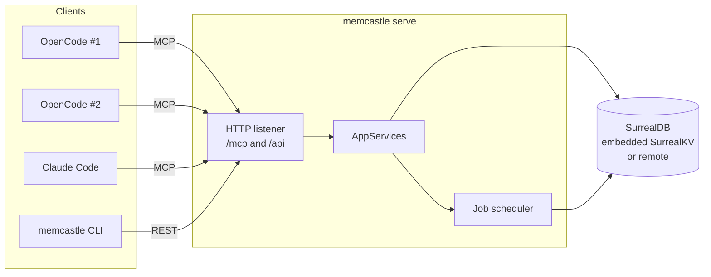

Tools that run one process per invocation load their configuration and open their storage on every command.
MemCastle instead keeps one process that owns the store, so there is one writer per embedded palace
and no second index file to drift out of sync with the database.
A remote palace may be shared by several daemons, which job leases keep safe (see [ADR-006](adr/006-job-leases.md)).

## Layers

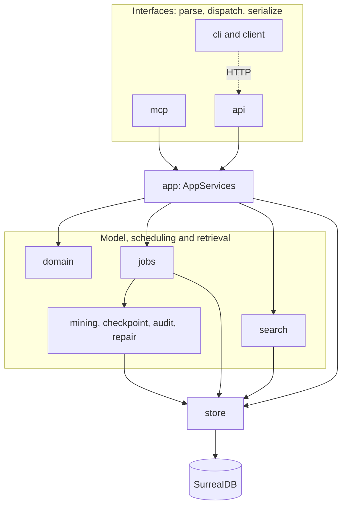

Dependencies point inward: `cli / mcp / api -> app -> domain + store/jobs/search -> store`.
Nothing in `domain` knows SurrealDB exists, and nothing in `cli`, `mcp` or `api` knows `store` exists.
The dotted line is the important one: the CLI is an HTTP client of the daemon, exactly as a script or dashboard would be.

**The CLI has no business logic MCP/HTTP can't reuse.**
Every subcommand except `serve`/`daemon start`/`daemon restart`/`migrate`, the local `completions`, the local
`source init`/`build`/`test`/`package`/`index`/`keygen` and the local `integration list`/`install`/`update`/`remove`
is a thin `client::DaemonClient` call
(`note` also reads the project directory through `crate::project` to choose a wing and room, then calls the daemon) —
`memcastle mine ./project` submits a job over HTTP the way an MCP tool call would, rather than mining anything itself.
`daemon stop` is one of them: it only asks the daemon to shut down.
`daemon start` and `daemon restart` add only process management:
they read the daemon's registry file (`server::lifecycle`) to know when the old daemon is really gone,
then spawn `serve` detached, and never touch `store` or `jobs`.
`serve` is the composition root (`server::run`): it owns the store, the scheduler and the HTTP/MCP listeners.
`migrate` is a second, narrow exception: it connects to storage directly through `crate::migrate`,
the same runner `serve` calls on every startup, because migration must work before a daemon exists
(see [ADR-004](adr/004-versioned-database-migrations.md)).

`app::AppServices` is the one seam every interface (`api`, `mcp` and `server::run` itself) calls through.
The invariants that keep this true are listed in `AGENTS.md`, and each is enforced by a `prek` hook or a test:
`store-isolation` greps for forbidden imports, and `single-writer` limits who may construct a store.

## Change notices: a bus, not a database feature

A client that wants to know "something changed" without polling reads `GET /api/events`, a server-sent events stream
([ADR-041](adr/041-server-sent-events-for-dashboard-updates.md)).
The notices come from a small in-process bus (`events::EventBus`, a bounded `tokio::sync::broadcast`) that `server::run`
creates and hands to the scheduler and to `AppServices`.

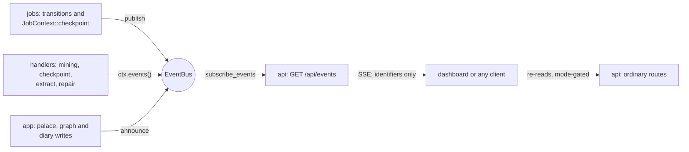

An event is published after the change is saved and holds identifiers and kinds, never content,
so a client re-reads through the routes that apply the memory mode and the stream cannot show what a read would refuse.
A connection that falls behind the bounded channel is told to `resync` instead of being queued.
The bus is this process's only: on a remote palace shared by several daemons, another daemon's writes are not announced
here, which is why the dashboard keeps its Refresh button.
Subscribing is a read (a `disabled` session gets a `403`), and the stream ends with the daemon's shutdown.

## Storage: one SurrealDB, embedded or remote

`store::SurrealStore` wraps a single `Surreal<Any>` connection (`surrealdb::engine::any`),
which dispatches on a connection string's scheme at runtime:
`surrealkv:<path>` for the embedded default, or a `ws://`/`wss://` URL for a remotely hosted instance.
The rest of the codebase never branches on the backend:
`config::StoreConfig` picks one, `Backend` carries it, and `SurrealStore::connect` is the only place that cares.
SurrealKV (pure Rust) is the only embedded backend compiled, see [ADR-001](adr/001-surrealkv-embedded-storage-engine.md).
Choosing and building a server-side storage engine of our own is deferred until a deployment needs one.

Every read and write is hand-written SurrealQL (`db.query(...).bind(...)`)
rather than the SDK's typed `create`/`select` helpers:
datetimes cross the boundary as RFC3339 strings with explicit `<datetime>`/`<string>` casts,
in one canonical form written only by `store::stored` (why optional timestamps are strings is
[ADR-005](adr/005-timestamp-representation.md)),
and a record's own `id` is always projected out via `record::id(id)`.
That trades some verbosity for depending on only the smallest, most stable part of the driver's API,
whose typed surface has already changed shape across SDK majors once.

Where the data lives on disk, and how to back it up, is in [Storage and data](storage.md).

### The database admin endpoint

An embedded SurrealKV database has no server, so SurrealDB Studio cannot connect to it,
and a second process may not open its directory.
`memcastle db start` therefore asks the *daemon* to open a second listener, on loopback and only on request.
The listener speaks SurrealDB's WebSocket protocol and runs each connection on a clone of the handle `store` already holds,
which is a separate session over the same datastore.
It adds no storage layer, opens no database and leaves schema and migrations where they were.
See [Database access](database-access.md) and [ADR-015](adr/015-database-admin-endpoint.md).

### Migrations

Two migration shapes are kept deliberately separate, both driven by one `crate::migrate::run`:

- **Schema.** Declarative `.surql` files under `database/schema/`, embedded into the binary via SurrealKit's
  `embed_schema!()` macro and applied through its `Sync` builder (`SurrealStore::sync_schema`).
  SurrealKit, not MemCastle, owns diffing, content-hash tracking and pruning;
  MemCastle does not implement a parallel schema-diff engine.
- **Data.** An ordered, immutable list of versioned Rust steps (`crate::migrate::DataMigration`) for changes
  that cannot be expressed as an additive schema sync.
  A MemCastle-owned version watermark (the `migration_state` table, read and written only by `store::migration_state`)
  makes each step run exactly once.

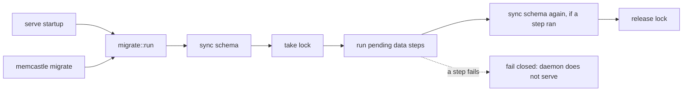

`SurrealStore::connect` itself neither syncs schema nor migrates: that is this explicit step,
not a side effect of opening a connection.
A failed migration fails the daemon closed, and the watermark stays at the last step that succeeded,
so a corrected run resumes instead of replaying.
Operating instructions are in [Migrations and upgrades](migrations.md), and the design in
[ADR-004](adr/004-versioned-database-migrations.md).

## Domain model

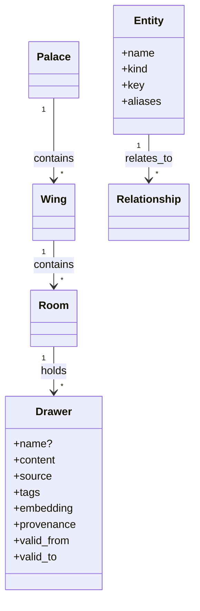

A `Drawer`'s `content` is immutable once written, and it may carry a `name` that is unique within its room,
so it can be addressed as `wing/room/name`
(wings, rooms and drawers are managed through REST and the CLI, see [ADR-018](adr/018-palace-hierarchy-management.md));
provenance, tags, an optional `embedding` (derived data, see [Search](#search)) and a `valid_from`/`valid_to` pair
travel alongside it.
A drawer is corrected by *superseding* it: its `valid_to` is set and a replacement opens from the same instant, so the old
content is never rewritten.
The two drawers record each other (`superseded_by`, `supersedes`), set in the same transaction, so the evolution of a piece
of knowledge can be read back as a chain without guessing from names or timestamps
([ADR-032](adr/032-temporal-retrieval-and-history.md)).
Provenance has one meaning for every writer (diary, mining, checkpoint):
`provenance.requested_by` is the **channel** the write came through (`cli`, `http`, `mcp`),
and `source.agent` is the **agent identity** behind it, or absent when no agent is involved (mining).
Diary drawers written before this rule carry the agent in both fields;
migration 1 rewrites their `requested_by` to `unknown`, because the channel was never recorded.

`domain::entity` (`Entity`, `Relationship`) defines a bi-temporal knowledge-graph shape,
and `store::entities` is wired to the schema: create, supersede, invalidate and list operations exist
and are exercised by `checkpoint::run`'s optional `fact` mutation.
`relates_to` is a SurrealDB-native graph edge table (`TYPE RELATION IN entity OUT entity`),
unlike every other relationship in the model (wing to palace, room to wing, drawer to room),
which is a plain foreign-key column on a regular table.
A `mentions` edge (`TYPE RELATION IN drawer OUT entity`) links a drawer to the entities it talks about, which is how
graph-aware search gets from canonical memory into the graph.
The `extract` job fills the graph from mined content: it reads drawers that carry a source origin,
or that were captured as a note (`memcastle note`), and adds entities, `mentions` links and `relates_to` edges,
each recording the drawer, job and extractor it came from
(`domain::FactProvenance`), and from a closed vocabulary of entity kinds and predicates.
It never writes a drawer.
Links can also be made explicitly (`POST /api/drawers/{id}/mentions`), and a checkpoint's `fact` still takes free-form labels.
See [ADR-024](adr/024-entity-extraction-as-an-enrich-job.md).

Deduplication is a domain decision with the database only proposing candidates.
`domain::fingerprint` and `domain::resolution` hold the policy as pure functions, `store::duplicates` and
`store::resolution` find candidates and record edges, and `dedup` orchestrates a drawer write for every writer.
A new drawer is compared with the current drawers of its room: an exact copy is not stored, a likely copy gets a
`similar_to` edge with its evidence, and nothing is merged.
A name seen by extraction or by a manual link resolves to an existing entity when it is a spelling variant, a recorded
alias or a unique typo, keeping the drawer's own spelling on the `mentions` edge, and otherwise stays distinct beside
`possibly_same_as` candidates.
See [Deduplication](deduplication.md) and [ADR-025](adr/025-memory-deduplication-and-entity-resolution.md).

## Search

Retrieval is SurrealDB's work, and MemCastle owns the contract and the policy
([ADR-021](adr/021-richer-retrieval.md)).
The `search` module takes a `SearchQuery` (text, ranking, scope, point in time, expansion) and returns `SearchHit`s: the
stored drawer verbatim, a score and the signals behind it.
No second vector store, graph store or index file exists; everything runs against the one `drawer` table.

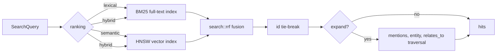

- **Lexical** (BM25) first requires every word to match.
  Only if that finds nothing does it retry with any single word sufficing,
  because SurrealDB has no stop-word filter and a natural-language question carries words the stored text never contains.
- **Semantic** is a k-nearest-neighbour query on an HNSW index over `drawer.embedding` (768 dimensions, cosine).
- **Hybrid** runs both and merges them with SurrealDB's own `search::rrf`, which fuses by rank and so needs no score
  normalisation.
  Rust breaks ties by drawer id, so a query always ranks the same way.
- **One scope for every leg.**
  Wing, room, tags, source kind and validity form a single `WHERE` fragment that SurrealDB applies *before* ranking
  and before the limit, including inside the vector index traversal,
  instead of MemCastle fetching candidates and filtering them.
- **Time.**
  Validity time (`valid_from`, `valid_to`: when it was true) is searched, and record time (`created_at`: when it was
  learned) is not.
  A drawer or relationship is valid at an instant when `valid_from <= t` and it has no `valid_to` or `valid_to > t`,
  and it overlaps a window `[from, until)` when `valid_from < until` and it has no `valid_to` or `valid_to > from`.
  A point is a one-nanosecond window, so *now*, `as_of` and an interval are one clause, `VALIDITY_WHERE`,
  shared by every leg and by graph expansion's `relates_to` hops, with no temporal index behind it
  ([ADR-032](adr/032-temporal-retrieval-and-history.md)).
  Search defaults to now, `as_of` and `from` with `until` reach older memory, and `include_historical` applies no filter.
  `drawer history` walks the supersession links to return how one piece of knowledge evolved.
- **Graph expansion** appends drawers that share an entity with a hit, or sit one valid `relates_to` hop away,
  after the direct hits, and never reorders them.
- **Where vectors come from.**
  The `embed` module wraps a provider (an operator's program, an OpenAI-compatible endpoint, or none) behind one trait,
  and the `Embed` job fills drawers that have none.
  A caller may instead send vectors itself.
  With no provider, `auto` ranking is lexical, so a palace keeps working without any model.

## Memory flows

Writes reach the store through two routes, and reads through one.

- **Diary writes** are a direct, synchronous call rather than a job, see
  [ADR-003](adr/003-checkpoint-as-a-durable-job.md) for why checkpoint differs.
- **Mining and checkpoint** are durable jobs, resumable after a pause or a crash.
  Mining is also **source-driven**: it acquires data from a source itself, with no agent writing and no model involved,
  see [Mining sources](mining-sources.md).
- `AppServices::recall` is `search` under a recall-oriented name, never paraphrasing or truncating a `Drawer.content`.
  It exists as a name to hang future recall-specific ranking off, not to duplicate logic today.
  MemCastle does not enforce a search-before-answer protocol; that discipline belongs to an integration or skill
  (see the [Integration contract](integration-contract.md)).
- `AppServices::wake_up` builds a deterministic session-start context:
  the agent's most recent diary entry (when a `wing` is given)
  plus up to `WakeUpBudget::max_items` recent checkpoint-originated drawers, trimmed to `max_bytes` by whole drawers only.
  A highlight too big for what is left of the budget is skipped, and older, smaller ones after it are still tried.
  It is deliberately simple; a more elaborate token optimizer is not built.
- `diary_write` and `diary_read` persist and read an agent's journal as drawers under a fixed per-wing `"diary"` room,
  keyed by a caller-supplied `agent_identity` that MemCastle stores faithfully but never validates.

## Memory mode enforcement

The behaviour, and how to pick a mode, is in [Memory modes](memory-modes.md).
Implementation-wise, `domain::MemoryMode` (`Full`/`ReadOnly`/`Disabled`) is deliberately never a process-wide setting,
because the daemon serves many agents at once.

Enforcement is centralized in `app::AppServices` (`require_read` and `require_write`, checked before any store contact).
`api` and `mcp` only *extract* a `MemoryMode` and pass it down, never deciding what is allowed themselves.
`Disabled` is symmetric on purpose: reads fail with the same typed `Error::ModeForbidden` as writes,
never a silent empty `Ok`, which would be indistinguishable from "found nothing".
The gate follows what an operation reads or writes rather than its name, see
[ADR-007](adr/007-memory-mode-gate-follows-data-access.md).

- **HTTP** reads `X-MemCastle-Mode` once per request through an `axum` extractor (`api::ModeHeader`),
  defaulting to `Full` when absent and answering `400` for an unparsable value.
- **MCP** has no per-request header in the tool-call model, so the mode is negotiated once per session.
  A `memcastle_set_mode` call is remembered in a single slot inside `McpTools`,
  tagged with the `mcp-session-id` that rmcp's streamable-HTTP transport assigns.
  rmcp builds one `McpTools` per session and drops it when the session ends, so nothing accumulates.
  A call with no session id has nothing to remember a mode under: it runs as `Full`,
  and `memcastle_set_mode` on it is an error.

The rationale and rejected alternatives are in [ADR-002](adr/002-memory-mode-session-scoping.md).

## Jobs: a durable queue, not an in-memory one

> The queue state is durable; the in-memory scheduler is only the execution mechanism.

`domain::Job` is a plain record persisted in SurrealDB:
`id`, `kind`, `status`, `priority`, timestamps, `progress`, `attempt`/`recovery_attempts`/`max_attempts`,
`checkpoint`, `result`, `error`, the lease (`lease_owner`, `lease_expires_at`),
and any pending `pause_requested` or `cancel_requested`.
Its status only ever changes through `Job::apply(event)`, an explicit transition table;
any `(status, event)` pair not listed is rejected with a `TransitionError`.

### Job lifecycle

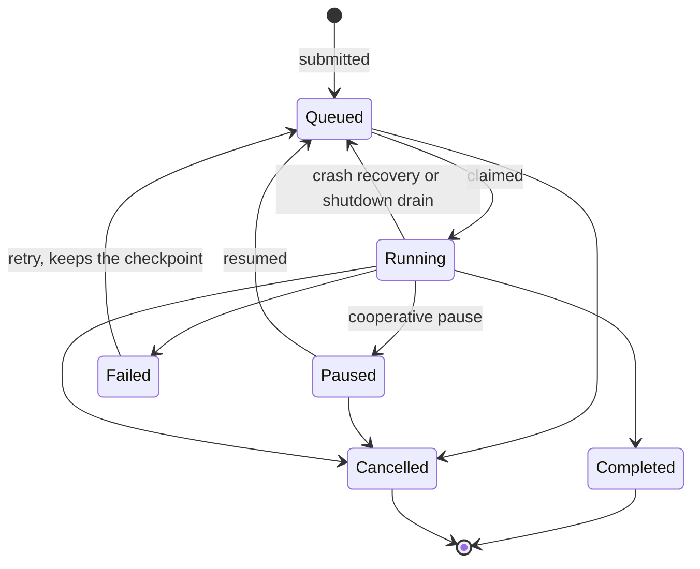

Retrying clears the error but keeps the checkpoint.
`Failed` is terminal unless someone retries it.

**Priority.** `Job.priority` is `domain::Priority`, a five-level enum
(`Background < Low < Normal < High < Critical`) — coarse buckets rather than an arbitrary integer,
so callers cannot invent incomparable numeric scales.
It serializes to the store's `job.priority` (`TYPE int`) column through fixed values
(`Critical`=100, `High`=75, `Normal`=50, `Low`=25, `Background`=0, with headroom between levels).
A value read back that matches none of the five is a surfaced `InvalidPriority` error, never coerced to a default.
`SurrealStore::claim_next_job` claims the oldest, highest-priority `Queued` job first,
backed by the composite index `job_status_idx ON job FIELDS status, priority, created_at`.
Default priorities: `Mine` is `Background` (so mining never delays anything else), `Demo`, `Audit` and `Repair` are
`Normal`, `Checkpoint` is `High`, and an emergency `Checkpoint` is `Critical`.

**Scheduling.** `jobs::Scheduler` is a single sequential dispatcher loop (`store.claim_next_job`, a claim-and-transition)
that spawns bounded worker tasks (a `tokio::sync::Semaphore`, sized by `jobs.max_concurrency`).
Mine, embed and extract jobs also share a second bound (`jobs.background_concurrency`, default 2);
when the total limit exceeds one, the effective background limit leaves at least one job slot for other kinds.
The dispatcher skips queued background jobs while their limit is full rather than claiming and leasing work it cannot start.
Both limits constrain job execution, not the REST/MCP request handlers, which share the daemon's database handle.
Mining may acquire two documents ahead, but files drawers, document records, cursors and checkpoints in candidate order;
directory discovery and reads, chunking and heuristic extraction run on the blocking pool instead of request executor threads.
The claim is a `SELECT` followed by a write guarded on the job still being `Queued`,
so two daemons racing for one job cannot both win, without a distributed lock.
The claim also leases the job (`lease_owner`, and `lease_expires_at` of now plus `jobs.lease_ttl_secs`),
which the owning daemon renews with a heartbeat every third of that.
Every write a worker makes to its job is fenced on still holding the lease, see [ADR-006](adr/006-job-leases.md).

**Pause and cancel are cooperative, never a process kill.**
A handler (`jobs::demo`, `mining::run`) is a loop over discrete units of work (steps, files)
that checks `JobContext::should_pause` and `is_cancelled` between units,
persists a `checkpoint` before stopping, and returns; the scheduler transitions the status afterwards.
Resuming re-reads the checkpoint and continues from there, not from zero.
`Audit` and `Repair` honour both too (audit checks between wings, after the job scan and every 500 drawers;
an applied repair checks before each delete).
Neither keeps a checkpoint, so a paused or shutdown-interrupted one restarts from scratch when resumed.
That is safe: an audit only reads, and a repair recomputes the live orphan set.
The terminal console also offers a distinct, confirmed **force-cancel** for a locally owned running mining job.
The daemon durably records the cancel request, aborts and joins its task, and then applies `JobEvent::Cancel`
with a write guarded by the job's running status and lease owner.
This fences later job checkpoints and lets crash recovery honour a request interrupted before completion.
It cannot undo work already filed or immediately interrupt blocking work running outside the aborted task;
a worker owned by another daemon must be stopped on that daemon or cancelled cooperatively.

**Resuming is replay-safe.**
A handler writes an item's records first and saves the checkpoint after,
so a crash between the two makes the resumed attempt redo that item.
Checkpoint therefore derives each drawer's id (and each new fact edge's id) from the job id and item index
and skips a record that already exists, so the replay lands on the same record instead of storing a second copy.
Mining derives a chunk's drawer id from the job, the source, the document, the chunk and its hash, and commits drawers,
then the document record, then the source's cursor, so a replay finds what it wrote and the cursor never runs ahead.
See [ADR-008](adr/008-replay-safe-job-resume.md).

**Crash recovery** (`Scheduler::recover`, run once at daemon startup):
any job left `Running` by an unclean shutdown is re-queued if its crash-recovery budget allows,
or marked `Failed` with the reason recorded, never silently forgotten.
The budget is `Job::max_attempts` (3), and what it counts is `Job::recovery_attempts`: crashes survived, and nothing else.
`Job::attempt` is a separate, informational count of every claim,
so a job that was merely paused twice is not one crash from failing.
With an embedded palace, where SurrealKV's file lock admits one daemon, every `Running` job is a dead predecessor's
and is recovered at startup.
With a remote palace only jobs whose lease has expired are, so a second daemon cannot steal a live one's work.
A reaper running alongside the heartbeat repeats that check periodically.
`Queued` jobs need no recovery, and `Paused` jobs are deliberately left paused until someone resumes them.
A pause or cancel request does not depend on in-memory state surviving:
`request_pause` and `request_cancel` write `pause_requested` and `cancel_requested` on the `Running` job record
before the API answers, and `Job::apply` clears them when the job leaves `Running`.
`recover` honours them, so a job cancelled before a crash comes back `Cancelled` (cancel beats pause),
and one paused comes back `Paused`; neither runs again, and neither spends attempt budget.

**`checkpoint` versus `result`.** `Job.checkpoint` is handler-defined *resume* state
(for checkpoint, `{"next_index": n}`; for mining, the run's cursor and counts, `{"cursor": ..., "stats": {...}}`),
present on every job kind and defaulting to `{}`.
`Job.result` is separate: the once-set output of a job whose point is to produce a report.
Most kinds never set it; `Mine`, `Audit` and `Repair` do on completion.
Two fields mean "where do I read progress from" and "where do I read what it found" never share one ambiguous field.

### Job kinds

- **`Mine`** (`src/mining`) mines a *source* through the unified model of
  [ADR-023](adr/023-unified-source-model-for-mining.md): a `SourceAdapter` discovers and reads documents past the
  source's stored cursor, and one shared pipeline chunks them, files drawers idempotently and advances the cursor.
  A directory is the one built-in adapter, and sources such as the Pi and OpenCode session histories
  (`sources/pi`, `sources/opencode`) are installed as WebAssembly components behind the same trait ([ADR-026](adr/026-pluggable-source-adapters-as-webassembly-components.md)).
  It stops at a bounded number of documents, recording `truncated: true` when it does, and a later job continues from
  the cursor.
  See [Mining sources](mining-sources.md).
- **`Checkpoint`** (`src/checkpoint`) persists an already-classified batch of items as durable drawers.
  Classification into destination buckets happens client-side, in the calling integration; MemCastle has no LLM client.
  It mirrors `mining::run`: per-item cooperative pause and cancel, checkpointing `{"next_index": n}` after each item.
  Every item gets a drawer (unless it is an exact copy of one its room already holds, see
  [Deduplication](deduplication.md)), and *additionally* applies its `fact` mutation when present,
  so a checkpoint item is never only a graph mutation with no drawer to audit it.
  There is deliberately no artificial per-item delay, because an emergency checkpoint exists to save state before a crash.
- **`Embed`** (`src/embed/job.rs`) computes the embedding of every drawer that has none.
  The database is its cursor: each pass asks for the next unembedded drawers, so pausing, crashing or running it again
  loses and repeats nothing, and only the `embedding` field is ever written.
  It is queued automatically after drawer-writing jobs and writes, and at startup.
- **`Extract`** (`src/extract/job.rs`) reads every current mined drawer and note with no marker in `drawer_extraction`
  and writes the entities, `mentions` links and `relates_to` edges its provider finds, then the marker.
  Like `Embed` the database is its cursor, and every write is idempotent, so a crash or a retry repeats nothing.
  It first closes the open facts whose evidence drawer has since been superseded.
  The provider (`heuristic`, a `command`, or an OpenAI-compatible `http` endpoint) sits behind the `Extractor` trait,
  and `Extraction::extract` holds every answer to the closed vocabulary and its bounds.
  It is queued after a mining job completes, after a note is written and at startup, when a provider is configured.
- **`Audit`** (`src/audit`) is a read-only consistency report, scoped to what is structurally possible
  with a single database.
  It checks for orphan drawers (a `room` reference that no longer resolves), dangling `provenance.job_id` references,
  `Failed` jobs that exhausted their attempt budget, a plain count of `Running` jobs,
  and drawers with no `embedding` (informational: a backlog the `Embed` job clears when a provider is configured).
  A full scan is cheap and idempotent, so it keeps no per-unit checkpoint.
- **`Repair`** (`src/repair`) turns a subset of audit findings into a fix.
  It is dry-run-first (`dry_run = true` is the default at every entry point) and deliberately narrow:
  only orphan-drawer removal shipped.
  A second candidate, failing jobs stuck beyond a heuristic,
  duplicated what `Scheduler::recover` already does at every start and was dropped.
  `based_on_job` narrows a run to what a specific prior audit found but never replaces a fresh live scan,
  because a destructive operation must not act on a report that may have gone stale.
- **`Demo`** is a synthetic job with no side effects, used to exercise the scheduler.

## The daemon lifecycle

`memcastle serve` runs in the **foreground**, which is what a supervisor (systemd, launchd, Docker) runs.
`memcastle daemon start` is the convenience for everyone else: it spawns `serve` detached and waits until it is serving.
The startup order, and what an operator sees, is in [Running the daemon](daemon.md#what-happens-on-startup).
The design points worth knowing:

- The listener is bound first, before anything else has an effect,
  so an address that is taken fails the start without having created, migrated or recovered anything
  (see [ADR-011](adr/011-split-bind-address-and-port.md)).
- The registry file, which is how clients find the daemon, is written only once the daemon is ready to serve.
  It is **operational metadata, never the source of truth** for "is a daemon running":
  that is always answered by a live HTTP request.
  The file's PID is checked with a liveness probe before it is trusted, and a stale file is simply overwritten.
- On SIGINT, SIGTERM or `POST /api/shutdown`, the daemon stops accepting new jobs and asks every running job to stop
  at its next unit-of-work boundary.
  Each one checkpoints and goes straight back to `Queued` (a job the user had paused stays `Paused`),
  so the next daemon resumes it.
  The wait is bounded by `jobs.drain_timeout_secs`;
  a job that does not stop in time is left `Running` and re-queued by `Scheduler::recover` on the next start.
  See [ADR-009](adr/009-shutdown-drains-jobs.md).
- The embedded database has no explicit close: it stops itself in a background task once the last handle is dropped.
  `serve` and `migrate` therefore keep the process alive, for at most ten seconds, until that task has finished,
  so the storage engine is flushed before exit instead of being cancelled by the runtime's teardown.
- `memcastle status` resolves the daemon the way every client does (a live registry file, then the configured address),
  asks `GET /api/status`, and still reports from configuration and the registry file when no daemon answers.
  The datastore section of `/api/status` comes from a ping and the migration watermark;
  an unhealthy datastore is reported there with HTTP 200, while `/api/health` stays a plain liveness check.
  See [ADR-012](adr/012-status-reports-a-stopped-daemon-and-exits-by-state.md).

## Release packaging and runtime assets

A release is a single executable that starts a daemon on a machine with nothing else installed and no network.
What else a release may carry falls into three kinds, kept apart on purpose:

- **Embedded** in the binary: anything small that must match its version exactly.
  The SurrealDB schema (`surrealkit::embed_schema!`) and the data migrations (`crate::migrate`) are of this kind.
- **Installed** by a package manager under `share/memcastle`: the sources bundled with MemCastle, the agent integrations
  and the skills they read, and the web UI.
- **User data and configuration**, under the XDG directories and never treated as assets.

`assets::Assets::resolve` picks one source for the run, in this order:

The resolver only reads directories, so startup never needs the network.
Its consumers are the bundle of sources (`sources/`), the integration installer (`integrations/`, `skills/`) and the
dashboard's static routes (`web/dist/`, only when `web.enable` is set).
The assets root is a directory with that layout, so a checkout of the repository is a valid one,
which is how a developer installs the integrations as built in their worktree (see below).
The module is pure and the daemon's composition root calls it once, before binding the listener,
so a mistyped override fails a start that has changed nothing.
[ADR-013](adr/013-release-packaging-and-asset-resolution.md) records the layout, the order and what was rejected;
[Installation](installation.md#standalone-binary-or-native-package) documents the layout for users.

## MCP: another interface on the daemon, not a special process

`mcp::McpTools` implements `rmcp::ServerHandler` and is mounted at `/mcp` on the *same* `axum` router as the REST API,
via `rmcp`'s streamable-HTTP server transport.
It is HTTP-only on purpose: it is natively multi-client (the goal is N agents sharing one daemon),
and most MCP clients already support a URL-based transport, so no bridging process is needed.
A stdio bridge for clients that can only spawn a subprocess is deferred;
tool logic never touches a transport type, so adding one is additive.

The tool surface mirrors the CLI and REST *memory* operations,
so an integration never has to leave MCP to remember or recall.
Management stays off it on purpose:
there are no tools for wings, rooms and drawers, authentication tokens, the database endpoint or daemon lifecycle.
It is listed in [MCP tools and REST API](mcp-and-api.md).
The instruction text sent at `initialize` is generated from the registered tools, and a test compares the two,
so it cannot drift from the surface.

**One error and logging surface.**
Whichever way a failure is reached, it is the same `{error, code, help}` (`Error::body`):
the REST API serves it as the response body, every MCP tool returns it as the text of an error result
(all through one `mcp::tool_result` helper, which also turns a value that fails to serialize into an error
instead of an empty success), and the CLI renders the daemon's own `code` and `help` from it.
Logging follows the same shape: a `tower-http` trace layer on the shared router records every request and response at
`debug`, `api::ApiError` logs a rejected request at `warn` and a server failure at `error` with its diagnostic code,
and every MCP tool call is traced at `debug` (a failed one at `warn`).

**One authentication layer.**
When authentication is enabled, a single middleware on the merged router checks the bearer token before any REST
handler or the MCP service sees the request, and only `GET /api/health` is exempt.
It calls `AppServices::authenticate`, which checks a configured secret and the stored verifier in constant time.
Generating and revoking a token are REST and CLI operations over `AppServices`, and MCP has no tool for either.
The trace layer logs no headers, so the `Authorization` header never reaches the log.
See [Authentication](authentication.md) and [ADR-014](adr/014-optional-token-authentication.md).

**Integrations are lifecycle glue over this surface.**
An agent integration decides when to call these tools and never reaches storage, the job code or the database console,
and every integration is held to the same conformance matrix with the same fixtures.
The core stays a memory runtime:
it has no scheduler for an integration's timers and no session of its own beyond the MCP session.
See the [Integration contract](integration-contract.md) and [ADR-019](adr/019-shared-integration-contract.md).

**Installing an integration is local tooling, not a daemon operation.**
`memcastle integration` finds an integration under the assets root, checks it against the running MemCastle and the
agent's version, copies it to the user's data directory, and registers it through the agent's own mechanism:
`pi install` for Pi, one marked plugin file for OpenCode.
It lives in `crate::integration`, which like `crate::source` touches neither the store nor the jobs and opens no network,
needs no daemon, and has no MCP tool or REST route, so an agent cannot change the code it runs.

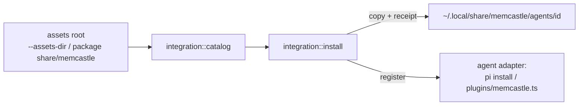

See [Agent integrations](integrations.md) and [ADR-034](adr/034-agent-integration-distribution.md).

**The database console is opt-in.**
`memcastle serve` opens one listener and nothing else.
The admin endpoint exists only after an explicit `db start`, binds loopback unless `--allow-remote` and authentication are
both given, refuses browser pages from other sites, and has no MCP tool.
See [ADR-015](adr/015-database-admin-endpoint.md).

**Mining sources are one contract with two kinds of implementation.**
A built-in adapter is Rust in the binary; an installed source is a WebAssembly component the daemon runs in a sandbox,
and `mining::registry` turns a source name into either behind the same `SourceAdapter` trait, so the pipeline is
identical for both.

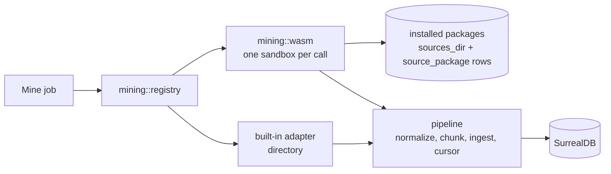

The sandbox grants only what the package's manifest lists and the user consented to at install: directories read-only,
named programs without a shell, named environment variables, the network all or nothing, a memory ceiling and a time
limit.
The source never sees the store, and the core compiles no source-specific SDK.
Installing, enabling and removing are administrative (REST and CLI, no MCP tool),
and the `source init`, `build`, `test`, `package`, `index` and `keygen` commands work without a daemon.
See [Writing a mining source](writing-sources.md) and [ADR-026](adr/026-pluggable-source-adapters-as-webassembly-components.md).

**Sources arrive from four places and share one lifecycle.**
A built-in source is compiled in.
A bundled source is an ordinary package unpacked beside the binary: it is installed from the start, run in place, and
only its enabled state is stored (`mining::bundled`, [ADR-040](adr/040-bundled-sources-are-installed-from-the-start-and-the-official-registry-is-published.md)).
A registry source comes from a static `memcastle-index.json` the user configured, the official one by default.
A local source is a file or a project directory the user installed.
Only the daemon reaches a registry, and only `crate::distribution`, called from `app`, does the fetching
(`config` calls it only to parse a location, to refuse a bad one at load):
it reads an index, chooses the newest version that runs here, downloads the archive and proves it is the one the index
published (a SHA-256, and optionally an ed25519 signature under a trust policy), then hands the bytes to the same install
path a file uses, so consent, the compatibility check and the load proof are identical whatever the origin.

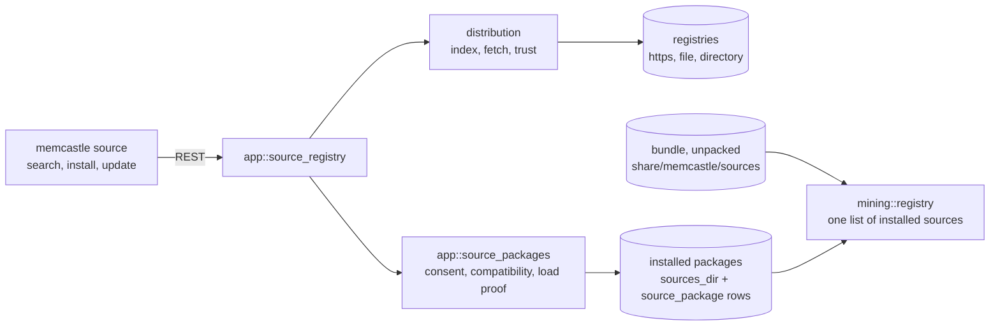

Installing from a registry is administrative like installing from a file: REST and CLI only, no MCP tool.
See [Publishing and installing sources](publishing-sources.md) and [ADR-033](adr/033-source-distribution.md).

**What to mine is configuration the daemon keeps in the file it was started from.**
A miner is a named `[[miners]]` entry (a source, a locator, a scope, a credential reference), not mined data:
the cursor stays on the source, so a miner can be renamed, disabled or re-scoped without losing where its source stopped.
`app::miners` holds the last good copy, re-reads the file when it changes, and rewrites only that section in place through
`config::miners_file`, so comments and everything else in the file survive.
The CLI, REST and MCP's two read-only tools all call it; changing a miner has no MCP tool, like installing a source.
See [Configuration](configuration.md#miners) and [ADR-037](adr/037-persistent-miner-configuration.md).

**When to mine on its own is configuration too, and is opt-in.**
A trigger is a named `[[triggers]]` entry (a miner, a type, its settings) kept in the same file, the same way, by
`app::triggers`.
The `trigger` module is the supervisor: it runs one task per *enabled* trigger (a timetable, a poll, a file watcher) and
the one webhook listener, and it knows nothing of the store, the jobs or any source.
Everything it needs it asks of the daemon through a trait that `app` implements, and everything it does ends in one call,
the request for a run that `miner run` makes, so a trigger can cause nothing a person could not.
The daemon starts nothing until the user enables a trigger, and what it remembers in the palace (progress, the deliveries
it accepted) never says whether one is enabled.
See [Triggers](triggers.md) and [ADR-043](adr/043-source-triggers.md).

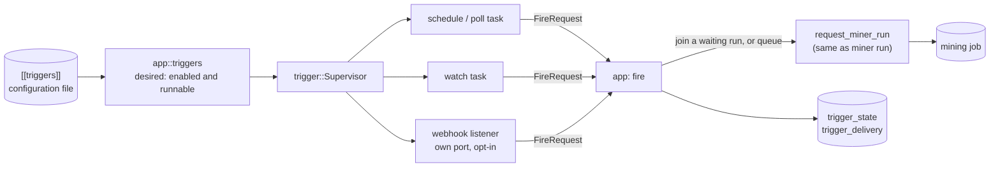

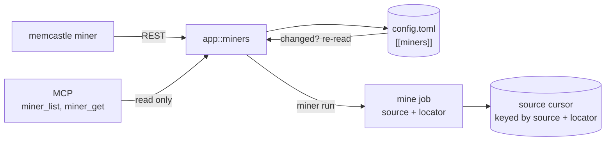

## Non-goals for now

Deliberately out of scope, and each is structurally possible without rework given the module boundaries above:

- Semantic processing of mined documents beyond entity extraction (summaries): mining stops at filing drawers, and the
  `extract` job is the stage that reads what was filed.
- Handing a static credential (an environment variable or a file) to a source: the model stores a credential
  *reference* and never a secret, and the source contract takes no static credential yet.
  What exists is an OAuth sign-in a source can declare, which the daemon runs, keeps and renews, and hands over as an
  access token ([ADR-039](adr/039-oauth-credentials-for-mining-sources.md)); no shipped source needs one yet.
- Restricting an installed source's network access by host name and a filesystem write permission for sources: the package
  contract allows each, and neither is built.
- A registry server and a search across registries beyond their names and descriptions: the official registry is a static
  file in the documentation that names GitHub repositories, and no service is run for it.
- Propagating a deletion at the source: a document that disappears is not noticed.
- Extracting entities from a *query* to resolve its words to the graph: extraction reads drawers, and expansion starts from
  drawers already found.
- Re-extracting drawers when the provider changes, and extracting from drawers that were not mined (checkpoints, the diary).
- Merging memories or entities that already exist.
  [Deduplication](deduplication.md) stops new duplicates and links likely ones, but never merges or deletes, and decides
  with no model; semantic (embedding) similarity at write time and folding accents are out of scope.
- A stdio MCP bridge for clients that cannot speak HTTP.
- The CLI auto-starting a daemon on demand.
- A `maintenance` command (a reserved name that returns `not_implemented`).
- Remote SurrealDB authentication beyond root sign-in.
- TLS on the daemon's own listener (use a TLS-terminating proxy).
- A read-only mode, live queries or transactions on the database admin endpoint
  ([ADR-015](adr/015-database-admin-endpoint.md)).
- OAuth/OIDC, users, roles and scopes for *access to the daemon*: there is one optional shared bearer token,
  and the authentication layer is where those would attach ([ADR-014](adr/014-optional-token-authentication.md)).
  OAuth as a *client*, to sign a mining source in to someone else's service, is a different thing and exists
  ([ADR-039](adr/039-oauth-credentials-for-mining-sources.md)).
- Robust cross-platform process supervision for `memcastle daemon start` and `daemon restart`
  (they are a best-effort detached spawn; use a real supervisor in production).
- A dashboard that is more than an API client.
  The [web UI](web.md) is one: a Vue application in `web/` that calls the REST API as the CLI does, is served from
  the runtime assets under `/ui` only when asked to be, and reaches no storage
  ([ADR-035](adr/035-web-ui.md)).
- Any network-based asset download.

Decisions and their rejected alternatives are collected in the [Architecture Decisions](adr/README.md).
