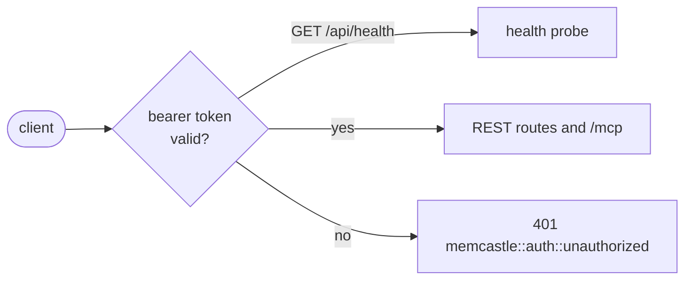

# Authentication

The daemon can require a bearer token from every client.
It is optional and off by default, so the local workflow (a daemon on `127.0.0.1`, used by you) needs none.
Turn it on when the daemon is reachable by anyone else: a non-loopback `server.bind`, a shared machine or a container.

The decision and the alternatives that were rejected are in
[ADR-014](adr/014-optional-token-authentication.md).

## What is protected

With authentication enabled, every request needs `Authorization: Bearer <token>`, with one exception:
`GET /api/health`, the liveness probe, stays open.
It answers only `{"status": "ok"}`, and `restart`, supervisors and health checks depend on it.

Everything else is protected, including `/api/status`, `/api/shutdown`, every other REST route, and `/mcp`.
A path that does not exist is refused with `401` too, rather than `404`.



A refused request is a `401` with the usual [error body](mcp-and-api.md#errors), the code `memcastle::auth::unauthorized`
and a `WWW-Authenticate: Bearer` header.
The CLI shows it as a rejection by the daemon (`memcastle::client::remote_rejected`, status 401),
which is not the same as `memcastle::client::not_running`: the daemon answered, it just did not accept the credential.
`memcastle status` exits `1` for it, not `3`.

Authentication answers "who are you", not "what may you do":
[memory modes](memory-modes.md) still apply on top, and there is one credential, not a user for each client.

## Choose where the token comes from

The daemon accepts a token from either of two sources.
The CLI, and any other client, presents whatever is in `MEMCASTLE_AUTH_TOKEN` or `auth.token`,
which is the shared secret or a token you generated and stored yourself:

| Source | Set by | Kept |
|---|---|---|
| A **shared secret** | `MEMCASTLE_AUTH_TOKEN`, or `auth.token` in the config file | by you, outside MemCastle |
| A **generated token** | `memcastle auth generate` | as a digest in the palace database |

A configured secret takes the usual [precedence](configuration.md#precedence): the environment beats the config file.
Prefer the environment variable, so the secret stays out of the file and can come from a secret manager.
A secret must be at least 16 characters.

MemCastle never writes the secret anywhere.
It is not in the registry file, the status report, the logs, the generated configuration or the database,
and the daemon keeps only its hash in memory.
The CLI accepts the token only through the environment or the config file, never as an argument,
so it does not reach your shell history or the process list.

## Provisioning

### With a generated token

The daemon has to be running without authentication the first time, because generating a token is a call to its API.

```sh
memcastle serve &                     # authentication is off
memcastle auth generate | op item create --category password --title memcastle - 'password[password]=-'
```

`auth generate` prints the token, and nothing else, on standard output, so it can be piped straight into a secret manager.
The instructions go to standard error.
The daemon stores only a SHA-256 digest of the token, so **it is shown once** and cannot be recovered.

Then turn authentication on and restart:

```sh
export MEMCASTLE_AUTH_ENABLED=true     # or `enabled = true` under [auth] in the config file
memcastle restart                      # `serve` refuses to start if nothing could authenticate a client
```

From now on the CLI needs the token in its environment:

```sh
export MEMCASTLE_AUTH_TOKEN="$(op read 'op://Private/memcastle/password')"
memcastle status
```

### With a shared secret from a secret manager

Skip generation and supply a secret you made yourself, to the daemon and to its clients:

```sh
export MEMCASTLE_AUTH_ENABLED=true
op run --env-file=memcastle.env -- memcastle serve      # memcastle.env: MEMCASTLE_AUTH_TOKEN=op://Private/memcastle/password
op run --env-file=memcastle.env -- memcastle status
```

Under systemd, give the unit an `EnvironmentFile=` with mode `0600`, or use `LoadCredential=` with a wrapper that
exports the credential as `MEMCASTLE_AUTH_TOKEN`; see [Under systemd](#under-systemd).

`restart` starts the new daemon with your environment and your `--config`, so a secret in either carries over
without being passed on the command line.

### Under systemd

The packaged user unit (the Arch `memcastle-bin`, `.deb` and `.rpm` packages, `/usr/lib/systemd/user/memcastle.service`)
is package-owned and holds no secret.
It reads an optional, user-owned `EnvironmentFile=-%E/memcastle/secret.env`, which is `~/.config/memcastle/secret.env`
unless you moved `XDG_CONFIG_HOME`.
The `-` makes the file optional, so with authentication disabled (the default) nothing needs provisioning.

**With a generated token**, the daemon only needs to be told authentication is on.
The verifier is already in the palace, in the `auth_state` table, not in a file:

```sh
systemctl --user start memcastle                  # authentication still off: the routes are open
memcastle auth generate                           # prints mc_... once; store it in your secret manager
install -m 600 /dev/null ~/.config/memcastle/secret.env
echo 'MEMCASTLE_AUTH_ENABLED=true' > ~/.config/memcastle/secret.env
systemctl --user restart memcastle
```

The service never sees or stores the plaintext token.
Your CLI and MCP clients read it from the secret manager, for example `op run --env-file=memcastle.env -- memcastle status`.

**With a shared secret**, put it in the same file instead, created with mode `0600` before it gets any content:

```sh
install -m 600 /dev/null ~/.config/memcastle/secret.env
op read op://Private/memcastle/password | sed 's/^/MEMCASTLE_AUTH_TOKEN=/' >> ~/.config/memcastle/secret.env
echo 'MEMCASTLE_AUTH_ENABLED=true' >> ~/.config/memcastle/secret.env
systemctl --user restart memcastle
```

The file holds the plaintext secret, so it is only as safe as your home directory permissions and backups;
keep it out of dotfile repositories.
The secret is not in the unit, the process arguments, `systemctl status` or the journal.
To avoid a plaintext file entirely, use a drop-in (`systemctl --user edit memcastle`) that sets `LoadCredential=`
and a wrapper `ExecStart=` exporting it as `MEMCASTLE_AUTH_TOKEN`, or one that runs `op run`.

If authentication is enabled with neither a configured secret nor a stored verifier, the service fails to start with
`memcastle::auth::not_configured`, visible in `journalctl --user -u memcastle`.
A `secret.env` that exists but is unreadable fails the unit before `ExecStart`,
and `systemctl --user status memcastle` names the file.

Rotation and revocation change only the palace verifier or your own `secret.env`, never a package-owned file.

## Rotation

Generate a new token while authenticated; the old one stops working the moment the new one exists:

```sh
memcastle auth generate | op item edit memcastle - 'password[password]=-'
```

The call needs the current token (`MEMCASTLE_AUTH_TOKEN`), and the rest of your clients must then switch to the new one.
There is nothing to restart: the daemon checks the stored digest on each request.

To rotate a **configured** secret, change `MEMCASTLE_AUTH_TOKEN` (or `auth.token`) for the daemon and its clients,
and restart the daemon.

## Revocation

```sh
memcastle auth revoke
```

This removes the stored digest, and the generated token is refused from the next request.
It does not touch a configured secret: that one lives outside the daemon, so change or unset it and restart.

Revoking the last credential locks everyone out, including the CLI that would have stopped the daemon.
If that happens, stop the process with your supervisor (or `kill`), and start it again with authentication disabled
(unset `MEMCASTLE_AUTH_ENABLED`) or with a new configured secret.
No data is lost: authentication guards access, and does not encrypt the palace.

## MCP clients

An MCP client sends the same header.
Most clients have a setting for headers on a remote server:

```json
{
  "mcpServers": {
    "memcastle": {
      "type": "http",
      "url": "http://127.0.0.1:8420/mcp",
      "headers": { "Authorization": "Bearer ${MEMCASTLE_AUTH_TOKEN}" }
    }
  }
}
```

Expand the token from the environment if your client supports it, and keep it out of a file that is committed.
Without a valid token a client cannot even complete `initialize`.

**MCP clients cannot manage credentials.**
Generating, rotating and revoking a token are REST and CLI operations only, and no MCP tool exists for them,
so an agent with MCP access cannot mint, replace or remove the credential that guards the palace.
The same token lets an agent use every MCP tool, so give it the token only if you want it to have that.

The MCP endpoint also checks the `Host` header against the loopback names (`localhost`, `127.0.0.1`, `::1`),
which is independent of authentication.
Reaching `/mcp` through another name or address is refused until that changes, even with a valid token.

## The database admin endpoint

The [database admin endpoint](database-access.md) is a separate listener, so the layer above does not wrap it.
It applies the same token itself, whenever `auth.enabled` is true.
Starting, stopping and inspecting it (`/api/db`) goes through the layer like any other route.

A browser cannot set a header on a WebSocket, so Studio presents the token in-band:
sign in with any username and the token as the password.
A client that is not a browser may send `Authorization: Bearer <token>` on the upgrade instead.
Both are checked by the same code as the REST API, so a token you rotate or revoke stops working for the next sign-in.
A connection that is already signed in is not closed by a revocation.
Five refused sign-ins close the connection, and until a session has signed in only the handshake methods work.

The endpoint listens beyond loopback only when `auth.enabled` is true, and never otherwise.

## Exposing the daemon

Authentication is not encryption.
The token crosses the network in cleartext over plain HTTP, and TLS on the daemon's own listener is not supported.
A daemon that is reachable beyond a trusted network needs a TLS-terminating proxy in front of it.

The daemon logs a warning at startup when it listens beyond loopback with authentication disabled.

## Reference

| Setting | Environment variable | Default |
|---|---|---|
| `auth.enabled` | `MEMCASTLE_AUTH_ENABLED` | `false` |
| `auth.token` (at least 16 characters) | `MEMCASTLE_AUTH_TOKEN` | none |

| Command | REST route |
|---|---|
| `memcastle auth generate` | `POST /api/auth/token` |
| `memcastle auth revoke` | `DELETE /api/auth/token` |
| `memcastle db serve`, `status`, `stop` | `POST`, `GET`, `DELETE /api/db` |

While authentication is disabled these two are open, which is how the first token is made.
Once it is enabled they need a valid token like every other route.

| Code | Meaning |
|---|---|
| `memcastle::auth::unauthorized` | The token was missing, malformed or wrong. |
| `memcastle::auth::not_configured` | Authentication is enabled, but no secret is configured and no token was generated. |

Only a digest is stored, in the `auth_state` table of the palace, with the algorithm and a version,
and it travels with a [backup](storage.md) of the palace.
A generated token is 256 random bits, written `mc_` followed by 64 hex digits.
