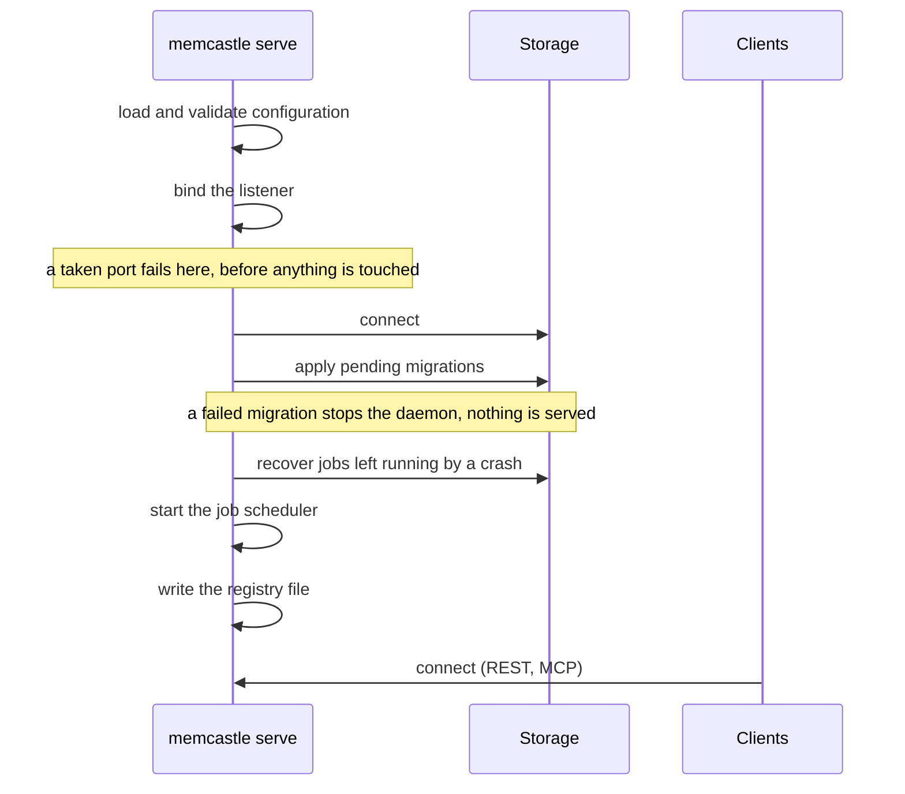

# Running the daemon

MemCastle is a long-running server: one daemon serves one palace, and every client — the CLI, MCP clients, scripts —
talks to it over HTTP.
Nothing starts it for you, so you start it once and leave it running.

## Start it

```sh
memcastle serve
```

`serve` runs in the **foreground** and logs to standard error.
Backgrounding it is your shell's or your supervisor's job: run it in a terminal multiplexer,
or hand it to systemd, launchd or Docker (see [Under a supervisor](#under-a-supervisor)).
`daemon` is an alias for `serve`.

With no configuration it listens on `127.0.0.1:8420` and serves the palace at `~/.local/share/memcastle/default`.
Change either from the command line, the environment or the config file:

```sh
memcastle serve --bind 127.0.0.1 --port 8787
memcastle --palace ~/palaces/work serve
```

See [Configuration](configuration.md) for every setting and how they combine.

### What happens on startup



The listener is bound first, so an address that is taken or unavailable fails the start
without having created, migrated or recovered anything.
Connections that arrive while storage is still opening wait in the listener's backlog.
The registry file, which is how clients find the daemon, is written only once the daemon is ready to serve,
and `serve` never answers a request against a palace that is not fully migrated.
See [Migrations and upgrades](migrations.md).

## Check on it

```sh
memcastle status
```

```text
MemCastle is running
  version    0.1.0 (pid 2528880, up 3s)
  endpoint   http://127.0.0.1:8420 (from the daemon's registry file)
  mcp        http://127.0.0.1:8420/mcp
  palace     default (/home/alice/.local/share/memcastle/default)
  datastore  ok - embedded /home/alice/.local/share/memcastle/default/db, migrations 2/2
  drawers    0
  jobs       0 queued, 0 running, 0 paused
  mode       full
Restart with `memcastle restart`, stop with `memcastle stop`.
```

With no daemon, `status` says so, shows where it looked and how to start one.
The exit code tells scripts which state it found:

| Exit code | State |
|---|---|
| `0` | Running, datastore healthy. |
| `1` | Running but degraded (datastore unreachable or migrations pending), or an error. |
| `3` | Not running. |

`memcastle status --json` prints the same report as JSON:

```sh
memcastle status --json | jq .daemon.datastore
memcastle status > /dev/null || echo "exit $?"
```

!!! note
    `status || serve` also starts a daemon when `status` exits `1`.
    Test for exit code 3 explicitly if a degraded daemon must not be replaced.

## How clients find the daemon

Client commands do not take `--bind` or `--port`.
They look for the daemon in this order:

1. The **registry file** of the palace they resolved, which a running daemon writes with its real address.
2. The configured address (`server.bind` and `server.port`, defaulting to `127.0.0.1:8420`).

The registry file is a hint, never the source of truth: whether a daemon is running is always answered by a live request.
It is keyed by the palace path, so several daemons for different palaces can run side by side on different ports,
and a command finds the right one as long as it is given the same `--palace` or configuration.
A file left behind by a crashed daemon (its process is gone) is reported by `status` as `stale` and overwritten by the
next daemon.
Its location and contents are in [Storage and data](storage.md#the-registry-file).

## Stop and restart

```sh
memcastle stop
memcastle restart
```

`stop` asks the daemon to shut down gracefully, and so does `SIGINT` or `SIGTERM` sent to a foreground `serve`.
The daemon stops accepting new jobs and asks every running job to stop at its next unit of work.
Each such job saves its checkpoint and goes back to the queue, so the next daemon resumes it on its own;
a job you had paused stays paused.
The wait is bounded by `jobs.drain_timeout_secs` (10 seconds by default).
A job that does not stop in time is left running, and the next start re-queues it.
Either way the daemon then removes its registry file and exits.

`restart` stops the running daemon, starts a fresh detached one and waits until it serves.
It passes on `--config`, `--bind`, `--port` and the palace it resolved.
The new daemon's log output is discarded, and `restart` is a best-effort convenience:
under a supervisor, restart through the supervisor instead.

## Logging

The daemon logs to standard error only; there are no log files.
`-v` logs MemCastle itself at `debug`, `-vv` at `trace`.
`MEMCASTLE_LOG` and `RUST_LOG` override the flags and accept filter directives such as `warn` or `memcastle=debug`;
`logging.level` in the config file is the lowest-precedence setting.
At `debug`, every REST and MCP request and every MCP tool call is logged.

The default level also shows startup messages from the embedded database, which are noisy but harmless.
Set `MEMCASTLE_LOG=warn` for a quiet daemon.

## Under a supervisor

The daemon does its own graceful shutdown on `SIGTERM`, does not fork, and logs to standard error,
which is what supervisors expect.
The binary neither generates nor installs service files: integrating with an init system is a package's job,
not the core binary's (see [ADR-013](adr/013-release-packaging-and-asset-resolution.md)).
A systemd user unit you can write by hand looks like this:

```ini title="~/.config/systemd/user/memcastle.service"
[Unit]
Description=MemCastle memory daemon

[Service]
ExecStart=%h/.local/bin/memcastle serve
Restart=on-failure
# Give running jobs time to checkpoint (jobs.drain_timeout_secs is 10 by default).
TimeoutStopSec=30

[Install]
WantedBy=default.target
```

```sh
systemctl --user daemon-reload
systemctl --user enable --now memcastle
journalctl --user -u memcastle -f
```

Adjust `ExecStart` to where `memcastle` is installed.
On macOS a launchd agent that runs `memcastle serve` with `KeepAlive` does the same job.

## Exposing the daemon

Authentication is optional and **off by default**.
The default, `127.0.0.1`, keeps the daemon reachable from your machine only.
Binding a non-loopback address such as `0.0.0.0` exposes the palace to that network, and the daemon logs a warning
when it does so without authentication.
Enable [authentication](authentication.md) when you do, and put a TLS-terminating proxy in front of it,
because the token travels in cleartext over plain HTTP.

With a supervisor, inject the secret as `MEMCASTLE_AUTH_TOKEN` from an `EnvironmentFile=` or your secret manager,
not as an argument; [Authentication](authentication.md#with-a-shared-secret-from-a-secret-manager) shows how.
