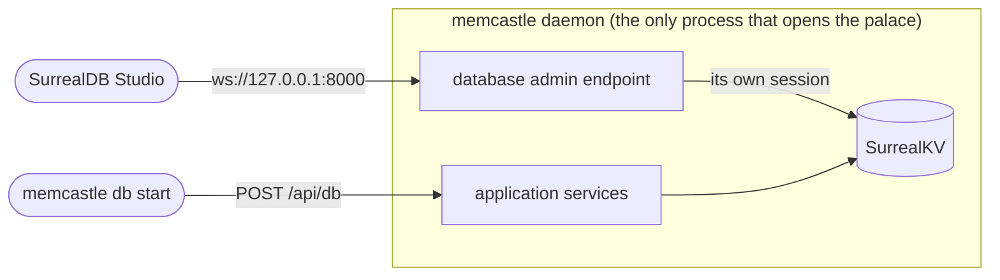

# Database access

An embedded palace is a SurrealKV database that only the daemon may open.
When you want to look inside it, or run a query the MemCastle commands do not offer,
`memcastle db start` opens a SurrealDB-compatible endpoint on the daemon, and
[SurrealDB Studio](https://surrealdb.com/surrealist) (Surrealist) connects to that.

This is a developer and administrator tool.
It is not the MemCastle web interface: Studio shows tables and records, and the [web dashboard](web.md) shows wings,
rooms and drawers (and signs in the same way: the user `memcastle` with the token as the password).
The decision behind it is in [ADR-015](adr/015-database-admin-endpoint.md).

## Why Studio cannot open the database itself

SurrealKV takes a file lock on the palace directory, so one process at a time can open it, and that process is the daemon.
Studio connects to a SurrealDB *server*, and an embedded database has none.
Starting `surreal start` on the same directory is not an alternative:
it is a second process opening storage that the daemon already holds.

**Never run `surreal start`, or anything else, against a live palace's `db` directory.**
At best it fails on the lock.
At worst it works against a copy of the state the daemon is changing under it.

Instead, the daemon itself offers the endpoint, on the database it already has open:



Every Studio connection is its own session over the daemon's database.
Selecting another namespace or setting a variable in Studio changes only that session, never the daemon's own queries.
The endpoint adds no second storage layer and does not touch the schema or the migrations.

## Open it, connect, close it

1. Start the daemon as usual, with its embedded database:

    ```sh
    memcastle serve
    ```

2. In another terminal, ask the daemon to open the endpoint:

    ```sh
    memcastle db start
    ```

    ```text
    database admin endpoint: listening on ws://127.0.0.1:8000
      namespace: memcastle
      database:  palace
      sign in:   user `memcastle`, password `memcastle` (loopback only, authentication is disabled)
    Connect SurrealDB Studio to the URL above. Stop it with `memcastle db stop`.
    ```

3. In Studio, add a connection to that URL, choose the `memcastle` namespace and the `palace` database.
   Sign in as the user `memcastle`.
   If the daemon has [authentication](authentication.md) enabled, the password is the MemCastle token.
   With authentication disabled there is no token, so the password is `memcastle` as well:
   Studio's form asks for both, and any other user or password is refused.
4. Inspect and query the live database.
5. Close the endpoint when you are done:

    ```sh
    memcastle db stop
    ```

Running `memcastle db start` again while it is open changes nothing and prints the same details,
with `already running on` in place of `listening on`:

```text
database admin endpoint: already running on ws://127.0.0.1:8000
  namespace: memcastle
  ...
```

Only flags that contradict the open endpoint are refused, with `memcastle::db::already_running`;
`db stop` first, then start it again with the new ones.

`memcastle db status` says whether it is open and where, and `--json` gives the same for a script.
Stopping the daemon closes the endpoint too, and so does `db stop`, which also closes any open Studio connections.
The endpoint exists only after `db start`: `memcastle serve` alone opens the one listener it always did.

## Defaults and options

| Setting | Flag | Environment variable | Default |
|---|---|---|---|
| `db.bind` | `--bind <IP>` | `MEMCASTLE_DB_BIND` | `127.0.0.1` |
| `db.port` | `--port <PORT>` | `MEMCASTLE_DB_PORT` | `8000`, and `0` lets the OS choose |
| `db.allow_remote` | `--allow-remote` | `MEMCASTLE_DB_ALLOW_REMOTE` | `false` |
| `db.allowed_origins` | `--allow-origin <ORIGIN>` | `MEMCASTLE_DB_ALLOWED_ORIGINS` | none |

The flags apply to the `db start` call; the settings are the defaults the daemon uses when a flag is left out,
and [Configuration](configuration.md#the-database-admin-endpoint) says how they combine.
The port must differ from the daemon's own `server.port`.

## Security

The endpoint is a console onto the **whole** database.
Anyone who can use it can read everything in the palace and rewrite or delete any of it,
including the migration watermark and the stored token verifier.
There is no read-only mode in this version.
Statements run on the database directly, so they bypass every rule that the application keeps:
a record written from Studio that the application does not expect is yours to repair.

What keeps it safe:

- **It is off until asked.**
  Nothing starts it but `memcastle db start`, so a daemon that was only started exposes nothing extra.
  It is not an MCP tool either, so an agent cannot open it.
- **It listens on `127.0.0.1` unless you say otherwise.**
  The daemon refuses any other address unless `--allow-remote` is given *and* the daemon was started with
  `auth.enabled`, and it warns in its log when it listens beyond loopback.
  A refusal is `memcastle::db::unsafe_bind`.
- **It uses the daemon's own authentication.**
  When enabled, a connection can do nothing until it has signed in as `memcastle` with the token, five refused sign-ins
  close it, and a token you rotate or revoke stops working for the next sign-in.
  Studio cannot send a header on a WebSocket, so it sends the token as the password.
  The user name is a fixed identifier, not a secret: with authentication disabled, `memcastle`/`memcastle` guards only
  against a mistyped login, and the protection is the loopback listener and the origin check below.
  See [Authentication](authentication.md#the-database-admin-endpoint).
- **A web page from another site cannot use it.**
  Any page open in your browser can reach `127.0.0.1`, so the endpoint refuses a request whose `Origin` is not a page
  served from this machine.
  The hosted Surrealist at `https://app.surrealdb.com` is therefore refused until you allow it
  with `--allow-origin https://app.surrealdb.com`.
  The SurrealDB Studio desktop app (which sends `app://surrealdb-studio`) and your own local pages need nothing.
  A refusal names the origin in the daemon's log and in the `403` body, so an unlisted client can be allowed with it.
  Some browsers also block a page served over HTTPS from opening a plain `ws://` connection, even to `127.0.0.1`;
  use the desktop app if yours does.

## Beyond this machine

Listening on a non-local address is possible, and deliberately takes three things together:
an authenticated daemon, a non-loopback `--bind`, and `--allow-remote`.

```sh
export MEMCASTLE_AUTH_TOKEN=...   # at least 16 characters, ideally from `memcastle auth generate`
MEMCASTLE_AUTH_ENABLED=true memcastle serve &
memcastle db start --bind 0.0.0.0 --allow-remote
```

The token crosses the network in cleartext, as it does for the REST API, and there is no TLS on the listener.
Put the endpoint behind a TLS-terminating proxy, or reach it through an SSH tunnel to the loopback endpoint instead:

```sh
ssh -N -L 8000:127.0.0.1:8000 alice@build-host
```

The tunnel needs no `--allow-remote` and no change to the daemon, and is the better choice when you can use it.

## What the endpoint supports

It speaks SurrealDB's WebSocket protocol at `/rpc`, in the `flatbuffers`, `cbor` and `json` encodings,
and answers `GET /health` and `GET /version`.
These methods work: `query`, `use`, `let`, `unset`, `info`, `version`, `ping`, `signin`, `authenticate`, `invalidate`,
`reset`, `attach`, `detach` and `sessions`.

These do not, and answer with an error that says what to do instead:

- Live queries (`live`, `kill`).
  A `LIVE SELECT` inside `query` answers with an id that never delivers.
- Transactions over the protocol (`begin`, `commit`, `cancel`).
  A `BEGIN` ... `COMMIT` block inside one `query` works.
- The per-record shorthands (`select`, `create`, `update`, `insert`, ...).
  Send the equivalent statement through `query`.
- HTTP `/sql` and `/rpc` over HTTP, `signup`, and everything in a remote SurrealDB's admin surface, such as export.

Studio's query editor, table explorer and graph views are built on `query`.

## When it is not available

A palace on a [remote SurrealDB](storage.md#embedded-and-remote-stores) already has a server, so `db start` is refused with
`memcastle::db::unavailable`: point Studio at that server directly.
