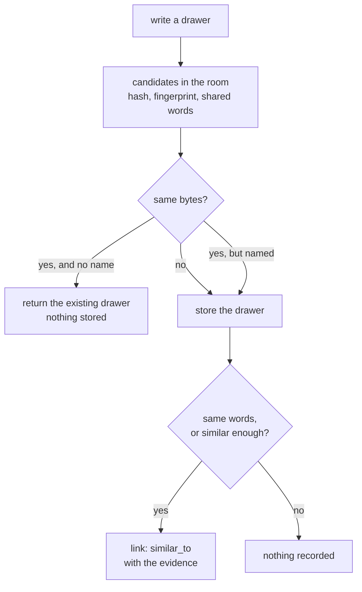

# Deduplication

MemCastle does not store the same memory twice, and it does not decide for you that two similar memories are one.
An exact copy in a room is not written again.
A typo, or the same words with different case and punctuation, is stored and **linked** to what it resembles.
Names in the knowledge graph that differ only in spelling converge on one entity.
Nothing is merged, nothing needs a model, and every call is recorded with the evidence for it.
The reasoning is in [ADR-025](adr/025-memory-deduplication-and-entity-resolution.md).

## Drawers

A drawer's `content` is canonical and is never rewritten.
When one is about to be written, MemCastle compares it with the drawers that are **currently valid in the same room**
and reaches one of four verdicts.

| Verdict | When | What happens |
|---|---|---|
| `exact` | The same bytes. | An unnamed write is **not stored**: you get the existing drawer back. |
| `normalized` | The same words once case, punctuation and whitespace are ignored. | Stored, and linked. |
| `near` | Similar enough, by default 0.9 or more: a typo, a one-character edit. | Stored, and linked. |
| distinct | Anything less alike. | Stored, nothing recorded. |



Edit similarity is measured on the normalised text, where an adjacent swap counts as one edit.
Beyond 2,000 characters it is the overlap of three-character runs, so a long drawer costs no more than a short one.
Texts under 12 normalised characters are only ever `exact` or `normalized`: one letter in a short phrase is a different
word, not a typo.
Accents are not folded, so `café` and `cafe` differ.

### What each writer gets

| Writer | An exact copy |
|---|---|
| `POST /api/wings/{wing}/rooms/{room}/drawers`, unnamed | `200` with `created: false` and the existing drawer. |
| `memcastle_diary_write`, `POST /api/diary` | The same agent's existing entry. Another agent's identical entry is never compared: identities do not see each other's diary. |
| A [checkpoint](mcp-and-api.md#checkpoint-payload) item | Not stored. The job still completes, and its result counts it in `duplicates`. |
| A named drawer, by any route | Stored, because the name is its identity, and linked to the copy. |
| [Mining](mining-sources.md) | Stored, because two identical files are two records, and linked. The job's result counts them in `similar`. |

A copy in another room is a different memory, and a drawer that has been superseded never blocks saying the same thing
again.

### Reading the links

`GET /api/drawers/{id}/duplicates` answers for one drawer, from either end of each link:

```json
{
  "drawer": "…",
  "similar": [
    {
      "drawer": "…",
      "side": "older",
      "kind": "near",
      "similarity": 0.98,
      "signals": { "same_hash": false, "same_fingerprint": false, "similarity": 0.98, "threshold": 0.9 },
      "created_at": "2026-10-04T10:00:00Z"
    }
  ]
}
```

`side` says which drawer is newer: `older` means the drawer you asked about resembles that older one, and `newer`
means that one was written later.
Deleting a link edge, or the newer drawer, undoes the call.
An unknown drawer is a `404` with `memcastle::palace::drawer_not_found`.

Embeddings play no part: they are computed after a drawer is written, by an optional provider.
Memories that are alike in meaning but not in words are found by [search](mcp-and-api.md#searching), not linked.

## Entities

The knowledge graph identified an entity by its exact name.
A name now resolves to an entity it is a variant of, among entities of the **same kind** (a name an extractor could not
classify, kind `other`, may match any).

| Order | Rule | Example | Converges? |
|---|---|---|---|
| 1 | `exact` | `Ada` and `Ada` | Yes. |
| 2 | `normalized`: the same key, ignoring case, punctuation and spacing | `ADA LOVELACE` and `Ada Lovelace`, `Node.js` and `NodeJS` | Yes. |
| 3 | `alias`: a spelling recorded for the entity | `the castle` for `MemCastle` | Yes. |
| 4 | `typo`: exactly one candidate one edit away, in a name of six characters or more | `SurealDB` for `SurrealDB` | Yes. |
| 5 | Anything else | `Maria` and `Mario` | No: a new entity. |

`+` and `#` are part of a name (`C++` is not `C`), accents are not folded, and short names never converge on a typo.
A name that resembles an entity without being equatable to it, or is one edit from two entities, becomes its own entity
and is linked to each with `possibly_same_as`, so it can be reviewed.

The canonical name is never rewritten.
The spelling that was taken to be the entity is added to its `aliases`, and each `mentions` edge keeps the name as the
drawer wrote it and how it was resolved, next to the extraction provenance:

```json
{
  "drawer": "…",
  "provenance": { "drawer": "…", "extractor": "heuristic", "origin": { "document": "b.md", "…": "…" } },
  "observation": { "name": "ADA", "rule": "normalized", "confidence": 0.98 }
}
```

| Route | Purpose |
|---|---|
| `GET /api/entities/{id}/candidates` | The entities this one resembles, or that resemble it, with `side` and `similarity`. |
| `POST /api/entities/{id}/aliases` | Record `{"alias": "…"}` for the entity, which settles a candidate by hand: later sightings converge. |

Entities that already existed are never merged and none is ever deleted.
If an older palace holds `Ada` and `ada` as two entities, new sightings converge on one of them.

## Settings

The `[dedup]` section turns it down or off, see [Configuration](configuration.md#deduplication).

| Key | Default | Effect |
|---|---|---|
| `enabled` | `true` | `false` stores every drawer and links nothing. Entity names still converge on spelling. |
| `near_threshold` | `0.9` | The similarity, from 0.5 to 1, at which a drawer is linked as a `near` duplicate. |
| `entity_fuzzy` | `true` | `false` turns off the typo rule and the candidate links. |

## Existing palaces

Version 3 of the [data migrations](migrations.md) derives the keys this page relies on for what was written earlier.
It merges nothing, so duplicates that already exist stay as they are.
