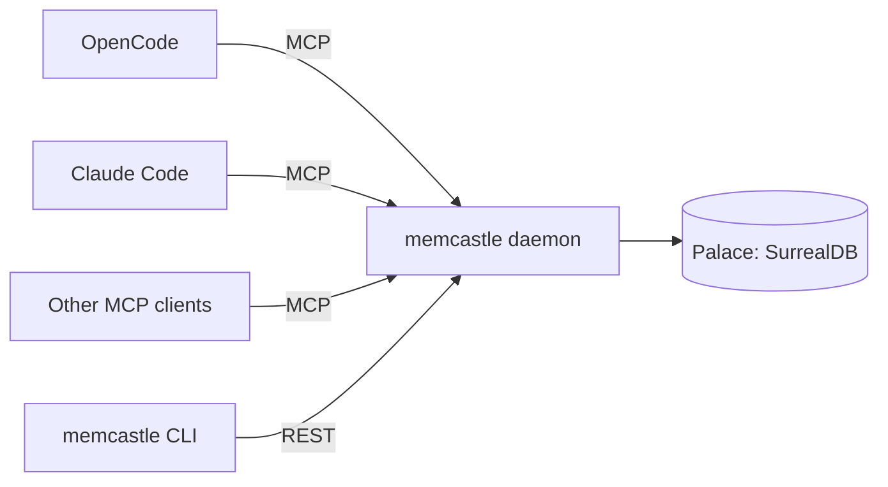

# MemCastle

<figure markdown="span">

</figure>

Local-first, always-on memory server for AI coding agents over MCP/HTTP.

Running several AI coding agents side by side usually means each one gets its own, disconnected memory — or none at all.
MemCastle is a single daemon per palace (the memory store that one or more of your projects share)
that all of them talk to over MCP or HTTP,
so a mining run, a search or a saved decision from one agent is immediately visible to every other agent and to the CLI.
Everything lives in one SurrealDB store, embedded by default, so there is no external service to run.

## Get started

1. [Install MemCastle](installation.md).
2. Follow the [Quickstart](quickstart.md): start the daemon, store and search your first memories.
3. [Connect an MCP client](mcp-clients.md) such as OpenCode or Claude Code.

## Integrations

- [Agent integrations](integrations.md): install, update and remove the Pi, OpenCode, Claude Code and Codex integrations,
  from a package or a checkout.
- [Pi](integrations-pi.md), [OpenCode](integrations-opencode.md), [Claude Code](integrations-claude-code.md) and
  [Codex](integrations-codex.md): what each installs, its settings and troubleshooting.
- [Integration contract](integration-contract.md): what an agent integration must do, whatever the agent.

## Guides

- [Running the daemon](daemon.md): start, stop, supervise and check it.
- [Authentication](authentication.md): require a bearer token from every client.
- [Memory modes](memory-modes.md): make a session read-only, or turn memory off for it.
- [Project configuration](project-config.md): scope a project's memory to a wing and room with a file in the repository.
- [Agent skills](skills.md): the shared instructions an integration loads for the agent.
- [Mining sources](mining-sources.md): fill the palace from files, agent histories and other origins.
- [Deduplication](deduplication.md): how an exact copy or a near-duplicate memory is handled.
- [Writing a mining source](writing-sources.md) and [Publishing and installing sources](publishing-sources.md): make,
  distribute and install a source.
- [Storage and data](storage.md): where data lives, what is in it, how to back it up.
- [Database access](database-access.md): open the daemon's database to SurrealDB Studio.
- [Migrations and upgrades](migrations.md): how a palace is kept up to date across releases.
- [Troubleshooting](troubleshooting.md): diagnostic codes and what to do about them.

## Reference

- [Configuration](configuration.md): paths, the config file, environment variables, flags and precedence.
- [CLI](cli.md): every command and flag.
- [MCP tools and REST API](mcp-and-api.md): the interfaces agents and scripts use.

## Project

- [Architecture](architecture.md): how MemCastle is built and why.
- [Development](development.md): building, testing and the local workflow.
- [Retrieval evaluation](retrieval-evaluation.md): measuring retrieval quality and latency, and comparing changes.
- [Architecture Decisions](adr/README.md): the reasoning behind the choices that shaped it.
- [Contributing](https://github.com/memcastle/memcastle/blob/main/CONTRIBUTING.md): commits, releases and pull requests.
