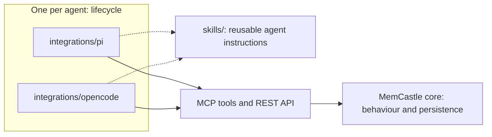

# Integration contract

An integration is the glue that makes one agent (Pi, OpenCode, later Claude Code) use MemCastle at the right moments.
This page is the contract every integration satisfies, and the checklist for writing a new one.
It exists so that a capability is implemented once, in MemCastle, and each client is then validated against the same
expectations instead of rediscovering the architecture.

It is a contract and a test layer, not a framework.
There is no shared runtime, no abstract base class and no code that hides how Pi and OpenCode differ.

## Who does what

| Layer | Owns | Does not own |
| --- | --- | --- |
| MemCastle core | What each operation does, what a mode permits, durable jobs, error codes | When a client calls it |
| MCP and REST | The protocol every client speaks | Anything client specific |
| `skills/` | Agent instructions that are the same text everywhere | Lifecycle hooks |
| `integrations/<client>/` | When to call MemCastle: session start, compaction, timers, commands | How memory works |

An integration talks to MemCastle only over MCP and HTTP, and carries no copy of the persistence layer.
The one piece of memory logic that lives on the client is deciding what is worth remembering and which bucket it belongs
to, because that needs the client's own model and conversation.
MemCastle persists whatever classified payload it is given and never classifies.

Client lifecycle logic does not move into MemCastle to make two clients look alike.
If a client has no hook for something, the gap is documented, not faked (see [Documenting a gap](#documenting-a-gap)).

## Conformance matrix

Each row is one capability.
The first column is a stable id, and `tests/fixtures/integration/capabilities.json` lists the same ids,
so the daemon test fails if this table and the fixtures disagree.
A gap is allowed only where the last column says so, and then it must be documented.

| Capability | MemCastle operation | Client responsibility | Gap allowed |
| --- | --- | --- | --- |
| `session-mode` | `memcastle_set_mode`, `memcastle_status` | Choose full, read-only or off once per session and translate the label | No |
| `wake-up` | `memcastle_wake_up` | Call at session start and inject the result as established context | No |
| `recall` | `memcastle_recall`, `memcastle_search` | Search before answering questions about past work, quote verbatim | No |
| `checkpoint` | `memcastle_checkpoint`, `memcastle_job_get` | Classify what is worth keeping, submit it, watch the job | No |
| `emergency-checkpoint` | `memcastle_checkpoint` with `emergency` | Submit with `emergency: true` before context is lost | Yes |
| `persistent-session` | one MCP session | Keep one handshake open for the whole agent session | No |
| `skills` | none | Load the shared instructions from `skills/` | No |
| `background-mining` | `memcastle_mine` | Trigger mining on the client's own schedule, never twice for one event | Yes |
| `failure-reporting` | error bodies, `Job.error` | Tell the failure classes apart and show the user `help` | No |
| `audit-repair` | `memcastle_audit`, `memcastle_repair` | Offer audit, confirm, dry-run, then apply only what was confirmed | Yes |

The sections below give the expected behaviour and say what must be proved against a real daemon.
"Daemon-side" is proved once, by `tests/integration_contract.rs`, replaying the fixtures.
"Client-side" is proved by each integration's own tests, because only it knows its lifecycle.

### Session identity and memory mode

Operations: `memcastle_set_mode` and `memcastle_status`.

A session is one MCP connection.
The daemon identifies it by the `mcp-session-id` it issues at `initialize`, and keeps the chosen mode only for that session.
Over REST the mode travels in the `X-MemCastle-Mode` header instead.
A session that never selects a mode runs as `full`, and a closed session's mode is not inherited by the next one.
There is no other daemon-side session entity.
`agent_identity` is a free string the client supplies to wake-up and the diary, which the daemon stores but never validates.

The wire values are `full`, `read_only` and `disabled`.
Clients usually offer the labels `full`, `read-only` and `off`, so the client translates them
(`tests/fixtures/integration/modes.json` holds the mapping).
Sending a label that is not a wire value is refused with `memcastle::input::invalid`, and never treated as `full`.
After selecting a mode, the client can read back what the daemon believes through `memcastle_status`.

Client responsibility: select the mode before any other call, and honour it.
For `off` that means more than the daemon's refusals.
The daemon rejects every read and write with `memcastle::app::mode_forbidden`, but it cannot stop a client from injecting
memory it fetched earlier, or from loading a skill that carries it.
A disabled session must behave as if MemCastle does not exist, and context isolation is the client's job.

Daemon-side (tested): three sessions in three modes share one daemon and each reads back its own mode,
every wire value outcome in the fixture holds for every gated tool, and a refused mode leaves the session unchanged.
Client-side (to test): a session in `off` receives no MemCastle-derived context from any source,
and a session in `read-only` never submits a write.

### Wake-up

Operation: `memcastle_wake_up` with `agent_identity`, and optionally `wing`, `max_items` and `max_bytes`.

It returns `diary` (the agent's latest entry in the wing, or `null`), `recent_highlights`
(recent checkpointed drawers, newest first) and `generated_at`.
Without a `wing` the diary lookup is skipped.
The byte budget trims highlights by whole drawer and never the diary entry.
An empty palace answers with no diary and no highlights, which is a normal answer and not an error.

Client responsibility: call it at session start, decide whether to wait for it or let it arrive asynchronously,
and inject the result as established fact.
The highlights are not filtered by `agent_identity`, only by wing.

Daemon-side (tested): the diary and the highlights come back, and the budget holds.
Client-side (to test): the injected context is present on the first turn when the client waits for it,
and the client does not block the session when the daemon is unavailable.

### Recall and search before answering

Operations: `memcastle_recall` and `memcastle_search`.

Both rank lexically unless the daemon has an embedding provider, and then by meaning and words together (`ranking: auto`).
The lexical leg matches every query word first and any word if there was none.
Both accept optional `ranking`, `tags`, `source_kind`, `as_of`, `include_historical` and `expand` arguments, and a client
that sends only `query` keeps working.
Content is returned verbatim, so a client can quote it.
No match is an empty list.
Neither tool forces a client to search, and nothing in MemCastle enforces the habit.

Client responsibility: the search-before-answer instruction (`skills/search-before-answer`), and re-injecting it
each turn if the client drops system context.

Daemon-side (tested): stored text comes back byte for byte, including whitespace and non-ASCII text.
Client-side (to test): a question about past work triggers a search before the answer.

### Checkpoint

Operations: `memcastle_checkpoint`, then `memcastle_job_get` to watch the job.

The payload is already classified by the client into `preference`, `project`, `diary` or `general`
(see [the payload](mcp-and-api.md#checkpoint-payload)).
A checkpoint is a durable job at High priority, so it survives a daemon restart and resumes from where it stopped.
Submission refuses an empty `items` list, blank content, a fact confidence outside 0 to 1 and a malformed name,
before any job exists, with `memcastle::input::invalid` or `memcastle::palace::invalid_path`.
Some clients send the payload as a JSON string, which is accepted.

Client responsibility: decide what is worth keeping, classify it, choose between waiting for the job and not,
and report a failed job.

Daemon-side (tested): every valid fixture is accepted, completes and is recallable, and every invalid fixture is refused
with its code and leaves no job behind.
Client-side (to test): the client sends well-formed payloads for what its classifier produced, and surfaces a refusal.

### Emergency checkpoint

Operation: `memcastle_checkpoint` with `emergency: true`.

An emergency checkpoint is a Critical (100) job, claimed before anything else queued, where a normal one is High (75).
It follows the session's mode like any write.

Client responsibility: submit it at the client's last point before context is lost, typically before compaction.
Where the client exposes no such point, this capability has a documented gap and a manual command is the fallback.

Daemon-side (tested): priorities are 100 and 75.
Client-side (to test): the adapter sends `emergency: true` at that lifecycle point.

### Persistent MCP session

Operations: all of them, over one session.

The client opens one MCP connection and keeps it for the whole agent session.
The mode is chosen once at the start and is still in force many calls later, so reconnecting per call would silently
reset the session to `full`.
The client reconnects after a lost connection and then selects the mode again before anything else.

The daemon forgets a session after five idle minutes, when the daemon restarts, or when the session is deleted.
It then answers the next request on that session with HTTP 404 `Session not found`, and a new session starts as `full`.
A client therefore treats a 404 as a lost session and not as a failed call:
it opens a new session, selects the mode, and sends the same call again once.
This is safe for a write, because the daemon refuses the request before running anything.
A connection that fails without a 404, such as a restarted daemon that no longer answers at the old address,
is reported to the caller, and the next call reconnects.
A client that stays idle pings the daemon at an interval well inside the five-minute limit, so a quiet session is not
dropped and then silently replaced.

Daemon-side (tested): one session runs wake-up, checkpoint and recall, and a mode chosen first still applies at the end.
Client-side (tested in Pi and OpenCode): no reconnect between wake-up, recall and checkpoint,
a forgotten session is replaced with its mode re-selected and a write applied exactly once,
a restarted daemon is reconnected to in the same mode, and an idle session keeps itself alive.

### Skills reuse

There is no MemCastle operation here, because a skill is plain agent text.
`skills/` is the one source of those instructions, and an integration loads them rather than keeping its own copy.
The five [agent skills](skills.md) are `memcastle-setup`, `search-before-answer`, `checkpoint-instructions`, `wake-up`
and `diary`.
A skill never overrides a mode: in `off` it must not be loaded if it would carry MemCastle-derived content.
The shipped skills carry instructions only and no palace content, and each one that calls a gated tool says to stop when
the mode refuses it.

Client-side (to test): the integration reads its instructions from `skills/` and does not duplicate them.
Nothing is tested against a daemon, and the matrix records that with a `null` daemon test.
What is tested is the skills themselves: `tests/skills.rs` checks every tool, command and route a skill names against
this release (see [ADR-020](adr/020-skills-are-versioned-with-the-repository.md)).

### Background mining

Operation: `memcastle_mine` with an absolute `path` and optionally `wing`, or with a `source` such as `pi-sessions`.

Mining is a Background (0) job, so it never delays a checkpoint, and a relative path is refused with
`memcastle::input::invalid`.
The daemon has no scheduler and does not deduplicate *requests*: asking twice is two jobs.
What it does deduplicate is the work: a source remembers where it stopped and which version of each document it filed,
so the second job finds nothing new to file.
"Once a day" and "never twice for one event" are therefore the client's to keep, and an integration never needs to read
a source itself: it only decides when to ask.

Client responsibility: trigger it from the client's own mechanism, where one exists.
Where the client has no suitable timer or event, the gap is documented and a manual trigger
(for example `memcastle mine` from a command) is the fallback.

Daemon-side (tested): the priority, the absolute path rule, and that a repeated request is a second job.
Client-side (to test): one trigger per scheduled event.

### Actionable failure reporting

An integration must tell these classes apart, and say what to do about each.
`tests/fixtures/integration/failure-classes.json` is the machine-readable form.

| Class | How it is detected | Code | The client tells the user |
| --- | --- | --- | --- |
| `daemon_unavailable` | The connection fails, no answer | none | The daemon cannot be reached and how to start it |
| `unauthorized` | HTTP 401 | `memcastle::auth::unauthorized` | A token is needed, and `help` |
| `mode_rejected` | Tool error, HTTP 403 | `memcastle::app::mode_forbidden` | The session's own choice refused it, which is not a fault |
| `invalid_input` | Tool error, HTTP 400 | `memcastle::input::invalid` | The request was malformed, and `help` |
| `job_failed` | A job reaches `failed` | none | `Job.error`, and that the job can be retried |

Every error body is `{error, code, help}`, and a diagnostic code is a public identifier.
The client shows `help` because it names the next step, and never swallows a failure into an empty memory.
A daemon that is down is not "nothing remembered".

Daemon-side (tested): each class is produced for real, and carries the documented code and a `help` line.
Client-side (to test): each class produces a distinct, readable message, and the session continues without MemCastle.

### Audit and repair

Operations: `memcastle_audit`, then `memcastle_repair`, with `memcastle_job_get` for the reports.

An audit is read-only and reports its findings in `Job.result`.
A repair is a dry run unless `dry_run` is `false`, and `based_on_job` narrows it to what a completed audit found.
Applying a repair is a write, so a read-only session is refused, while the audit and the dry run are allowed in any mode.
Repair is deliberately narrow: it removes orphan drawers only.

Client responsibility: where the client can expose a command, run the audit, show the findings one at a time,
confirm, run a dry run, apply only what was confirmed, and optionally record a summary in the diary.
Where it cannot expose a command, document the gap.

Daemon-side (tested): the audit changes nothing, the dry run is allowed in `read_only`, applying is refused there,
and omitting `dry_run` is a dry run.
Real orphan data cannot be created through HTTP or MCP, so applying a repair to real orphans is covered by the unit
tests in `src/repair`.
Client-side (to test): nothing is applied that the user did not confirm.

## Documenting a gap

A client may lack the lifecycle point a capability needs, and the rule is to say so, never to fake it.
Each integration's README records every gap in the same three lines:

- **Missing**: the lifecycle point or mechanism the client does not expose.
- **Fallback**: what the user can do instead, such as a manual command.
- **Effect**: what the user loses compared with a client that has it.

Only the capabilities marked as allowing a gap may have one.
A gap in `session-mode`, `wake-up`, `recall`, `checkpoint`, `persistent-session`, `skills` or `failure-reporting` means
the integration does not conform yet.

Tool names can differ by client without being a gap.
OpenCode prefixes each MCP tool with the server name, so the tools appear there as `memcastle_memcastle_search`.
An integration maps to the daemon's names and never renames anything in MemCastle.

## Adding an integration

1. Copy the conformance matrix into the integration's README, and mark each row implemented, a documented gap or not yet.
1. Implement each row in the client's own language and idiom, talking to MemCastle over MCP and HTTP only.
1. Replay the fixtures under `tests/fixtures/integration/` against a real daemon from the client's own test suite.
1. Write the client-side tests that this page lists for each capability.
1. Document every gap in the three-line form above.

The `integrations-http-only` hook (see [Development](development.md#the-architecture-guard))
fails the build if anything under `integrations/` reaches into MemCastle's storage or job code
instead of using the protocol.

## The fixtures

The fixtures are strict JSON in `tests/fixtures/integration/`, so any language can read them.

| File | Holds |
| --- | --- |
| `capabilities.json` | The matrix ids, their operations and the daemon test for each |
| `modes.json` | The label to wire mapping, every gated operation and what each mode must do with it |
| `checkpoint-payloads.json` | Valid payloads with a token to recall them by, and invalid ones with the code they are refused with |
| `failure-classes.json` | The failure classes, how each is detected, and the code and status |

In `modes.json`, an argument written as `{{mine_dir}}` stands for an existing absolute directory the test creates.

`tests/integration_contract.rs` replays them against an in-process daemon over MCP, using the helpers in
`tests/common/mcp.rs`.
A client-side suite in another language reads the same files and checks the same expectations through its own client,
which is how Pi and OpenCode are held to the same behaviour.
