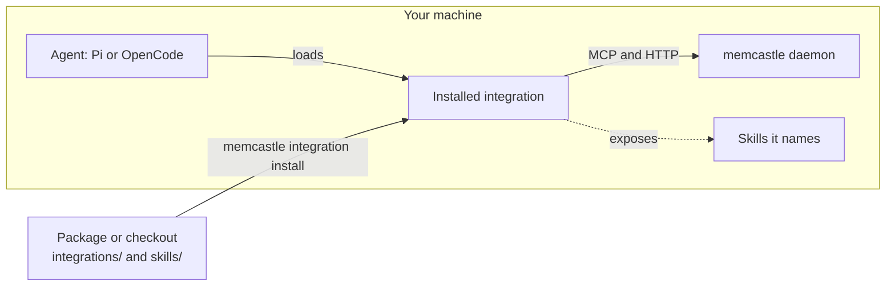
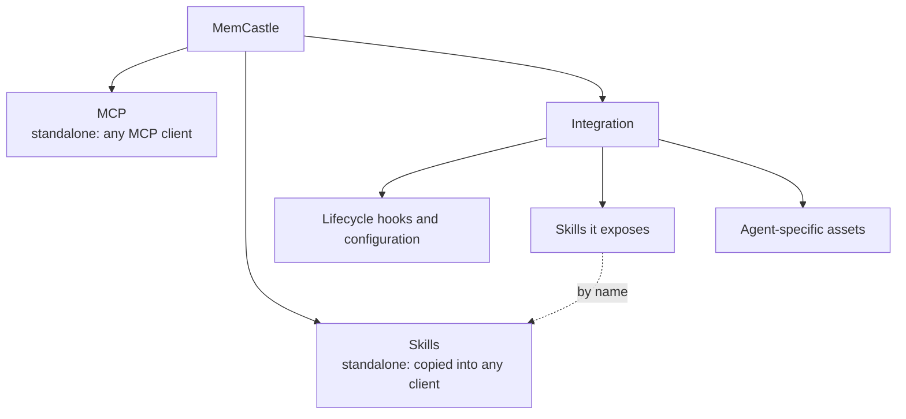

# Agent integrations

An integration is the glue that makes a coding agent use MemCastle on its own:
it loads the wake-up context when a session starts, reminds the model to search before it answers,
and writes checkpoints as the conversation goes.
It decides *when* to call MemCastle and does nothing else; every call goes to the daemon over MCP and HTTP.
What each integration must do is the [Integration contract](integration-contract.md).
This page is about getting one onto your machine.

MemCastle ships the integrations for **Pi** and **OpenCode**, and `memcastle integration` installs them.
Nothing is downloaded and no npm package is involved:
the integrations are part of the MemCastle release, built and versioned with it.



## What an integration packages

An integration is the complete agent-facing MemCastle package for one agent.
MCP and skills stay usable on their own, with no integration installed:



- **MCP** needs no integration: [MCP clients](mcp-clients.md) connect to the daemon directly.
- **Skills** need no integration either: [Install the skills](skills.md#install-the-skills) copies them into the
  directory a client scans.
- **An integration** adds the lifecycle glue, and carries the skills the agent should have, so
  `memcastle integration install pi` is the whole setup and no separate skill installation follows.
  Its manifest lists them, each either a [shared skill](skills.md) referenced by name or a skill of its own.

## Supported integrations

| Integration | Agent | Agent versions | MemCastle versions | Guide |
|---|---|---|---|---|
| `pi` | Pi (`@earendil-works/pi-coding-agent`) | 1.0 and later | 0.2 and later | [Pi](integrations-pi.md) |
| `opencode` | [OpenCode](https://opencode.ai) | 1.18.29 and later, including 2.x | 0.2 and later | [OpenCode](integrations-opencode.md) |

`memcastle integration list` shows the same ranges for the MemCastle you run, since they come from the integrations it ships.
Claude Code has no integration yet; it connects as a plain [MCP client](mcp-clients.md).

## Requirements

- The agent is installed and its command (`pi`, `opencode`) is on your `PATH`.
  The installer runs it to read its version and, for Pi, to register the integration with it.
- The MemCastle you run ships integrations: a native package, a release tarball or a checkout (see
  [Where integrations come from](#where-integrations-come-from)).
  A standalone binary downloaded on its own ships none, and says so.
- The agent and MemCastle versions are inside the ranges the integration declares.
  The installer refuses otherwise, before it writes anything, and tells you which version it found.

You do not need bun, node or npm: the shipped integrations are single bundled files.
The daemon does not have to be running to install one; it has to be running when the agent uses it.

## Install

```sh
memcastle integration list
memcastle integration install pi
memcastle integration install opencode
```

`install` does five things, in this order, and stops at the first one that fails:

1. Finds the integration among the shipped ones and checks it against your MemCastle and your agent.
2. Copies its files, and the [skills](skills.md) its manifest names, to `~/.local/share/memcastle/agents/<id>/`.
3. Records what it copied, with a SHA-256 for each file, in a receipt beside them.
4. Tells the agent about the copy: `pi install` for Pi, one plugin file for OpenCode.
5. Checks the result: the entry file is there, and the agent knows the copy.

It reports every change it made.
If the registration fails, the copy is removed again, and an earlier version that was installed is put back.

Running `install` again is safe.
When the installed copy is already what the package ships and the agent still knows it, nothing is touched and the
command says so.
When it is not (the package was upgraded, a file was edited, the agent forgot it), `install` repairs it.

The copy is yours, not the package's.
Upgrading or removing the MemCastle package never changes an installed integration, and an installed integration keeps
working if the package that shipped it is gone.

## What is installed, and what is left alone

| Where | What | Removed by |
|---|---|---|
| `~/.local/share/memcastle/agents/<id>/` | the bundled integration, its `skills/<name>/` directories, `.memcastle-install.json` | `remove` |
| Pi: its own settings, through `pi install` | one package entry pointing at that directory | `remove` |
| OpenCode: `~/.config/opencode/plugins/memcastle.ts` | a one-line file that re-exports the installed bundle | `remove` |

`~/.local/share` and `~/.config` are the defaults; `XDG_DATA_HOME`, `XDG_CONFIG_HOME` and, for OpenCode,
`OPENCODE_CONFIG_DIR` move them.

Everything else in the agent's configuration is left exactly as it was:

- MemCastle never edits Pi's `settings.json` itself.
  Pi does, through `pi install` and `pi remove`, so the packages you already have stay.
- MemCastle never opens `opencode.json` and never adds an `mcp.memcastle` entry.
  The plugin connects to the daemon itself, and an MCP entry next to it would list every tool twice.
- A `plugins/memcastle.ts` that MemCastle did not write is never overwritten or deleted.
  The installer stops with [`conflict`](#troubleshooting) instead.
- MemCastle never writes your [authentication token](authentication.md) anywhere.
  If the daemon requires one, give the agent `MEMCASTLE_AUTH_TOKEN` in its environment.
- MemCastle never writes into the directories where you keep your own skills (`~/.agents/skills`, `~/.claude/skills`, ...).
  The skills of an integration live inside its installed copy, and the agent is told to read them from there.
  A skill of yours with the same name as one of the integration's is the one the agent uses.

## Configure

The integrations read their settings from the environment (and, for OpenCode, plugin options), not from files that
`install` writes.
A default setup needs none: they find a daemon on `127.0.0.1:8420`, or through the registry file a running daemon
writes.
The variables are listed in each guide: [Pi](integrations-pi.md#configuration),
[OpenCode](integrations-opencode.md#configuration).

## Update

```sh
memcastle integration list
memcastle integration update pi
```

`list` marks an integration `outdated` when the package ships a different version, or different files, than the ones
installed.
`update` installs what the package ships now, and tells you it was already current when it was.
It is `install` for something already installed; it refuses an integration that was never installed
([`not_installed`](#troubleshooting)), so a typo cannot add one.

After an upgrade of MemCastle, run `memcastle integration list`: an integration whose supported MemCastle range no longer
includes the new version shows as `incompatible`, and a new MemCastle that ships a newer integration shows it as
`outdated`.
Restart the agent after an update, because it loads the integration when it starts.

## Remove

```sh
memcastle integration remove pi
```

`remove` asks the agent to forget the copy, then deletes the copy.
It needs neither the package nor the shipped files, so it still works after MemCastle itself was uninstalled,
and it works when the agent is gone too (the copy is deleted, and the report says the agent could not be asked).
Removing something that is not installed succeeds and says so.

## Where integrations come from

Integrations and shared skills live under one **assets root**, in the same layout wherever the root is,
in a package and in a checkout alike:

```text
<assets root>/
├── integrations/
│   ├── pi/
│   │   ├── memcastle-integration.toml
│   │   ├── dist/
│   │   └── skills/                (only for skills this integration alone needs)
│   │       └── <name>/SKILL.md
│   └── opencode/
│       ├── memcastle-integration.toml
│       └── dist/
├── skills/                        (the shared skills, referenced by name)
│   └── <name>/SKILL.md
└── sources/                       (the bundled mining sources, see below)
```

The assets root is the one [runtime assets](configuration.md#runtime-assets) directory, chosen in this order:

1. `--assets-dir <dir>` on the command, `MEMCASTLE_ASSETS_DIR`, or `assets.dir` in the config file.
   An explicit choice never falls through: a directory that does not exist is an error.
2. The package's `share/memcastle` next to the executable (`/usr/bin/memcastle` finds `/usr/share/memcastle`), then
   `/usr/local/share/memcastle` and `/usr/share/memcastle`.
3. Nothing: a standalone binary has no integrations to install.

Any of the MemCastle release packages carry the assets root: the tarballs, the `.deb` and `.rpm`, the AUR package and the
Homebrew formula (see [Installation](installation.md)).
The standalone tarball `memcastle_<version>_integrations.tar.gz` holds just the `integrations/` and `skills/` trees.

`memcastle integration list` prints the assets root it used and how it was chosen, so you can see which of the two you
are looking at.

### Developing MemCastle

The same commands work from a checkout of the repository, with no packaging step and without touching an installed
MemCastle:

```sh
mise run integrations:build                                  # bundle integrations/*/src into integrations/*/dist
memcastle integration list --assets-dir "$PWD"               # the checkout is the assets root
memcastle integration install pi --assets-dir "$PWD"
```

The checkout already has the layout above (`integrations/<id>/`, `skills/`), and `integrations:build` is the step that
creates the `dist/` directories.
Installing from a checkout goes through exactly the code a package install does, so what you test is what ships.
Because a development build never changes the integration's version, the installer compares file contents as well:
rebuild, run `memcastle integration update pi --assets-dir "$PWD"`, and the new bundle replaces the old one.
`MEMCASTLE_ASSETS_DIR` does the same as the flag for a whole shell session.
In this repository `mise.toml` sets it to the checkout for you: with mise active (`mise run`, `mise cli`, or an activated
shell), any `memcastle integration ...` run from the project directory, even an installed `memcastle`, reads the
checkout's bundles and not the package's, so the flag is not needed.
Run the command from another directory to use the installed assets, and see
[Development](development.md#running-the-daemon-locally) for what else it sets.
`mise run integrations:check` unsets it, so the checks never depend on it.

`mise run integrations:package` lays out the tree a release carries in `target/bundled-integrations`,
for installing the packaged layout with `--assets-dir target/bundled-integrations`.
`mise run integrations:check` bundles the integrations and installs them from both layouts as part of the checks.

The bundled mining sources use the same root: with `--assets-dir` pointing at a root whose `sources/` holds a
`source.wasm` and a `memcastle-source.toml` in each directory, the daemon offers those as the
[bundled sources](publishing-sources.md#bundled-sources).
A checkout has no such package (its `sources/` holds projects, whose component is built into `dist/`), so the daemon then
falls back to the installed ones.

## The manifest

Each integration is described by `memcastle-integration.toml` beside its files.
Unknown keys are refused, so a typo is an error and not a silently ignored setting.

```toml
format = 1

[integration]
id = "pi"
version = "0.1.0"
description = "Wake-up, recall, checkpoint and mining lifecycle for the Pi coding agent"

[compatibility]
memcastle = ">=0.2"
agent = ">=1.0"

[agent]
kind = "pi"
entry = "extension.js"

[[assets]]
from = "dist"
to = "."

[[skills]]
name = "wake-up"

[[skills]]
name = "search-before-answer"
```

| Key | Meaning |
|---|---|
| `format` | The manifest format. This MemCastle reads `1`; a newer one is refused whole. |
| `integration.id` | The name `install` takes: 1 to 48 lowercase letters, digits or `-`. It must equal the directory name. |
| `integration.version` | The integration's own semantic version. |
| `integration.description` | One line. |
| `compatibility.memcastle` | The MemCastle versions it works with, as a semver requirement. |
| `compatibility.agent` | The agent versions it works with. Unset means any. An agent whose version cannot be read is refused when this is set. |
| `agent.kind` | `pi` or `opencode`: which adapter registers it. |
| `agent.entry` | The file the agent loads, relative to the installed copy. It must be among the installed files. Required for `opencode`. |
| `[[assets]]` | `from` (inside the integration's directory) and `to` (inside the installed copy, `.` for its top). Paths that climb out are refused. |
| `[[skills]]` | One skill the integration exposes to its agent, copied to `skills/<name>/` in the installed copy. Optional, and repeatable. |
| `skills.name` | The skill's name, which is its directory name: lowercase letters, digits or `-`. Listed once. By default it is the shared `skills/<name>/` of the assets root. |
| `skills.local` | `true` takes the skill from `skills/<name>/` of the integration's own directory instead, for a skill only this integration needs. Defaults to `false`. |

Only the skills a manifest names are installed, and a named skill must have a `SKILL.md`: a missing one is
[`assets_missing`](#troubleshooting), and nothing is written.
Running `install` again, or `update`, after a manifest drops a skill removes it from the installed copy.
An integration that names no skill installs none.
The `[skills]` table that earlier manifests used (`install = true`) is refused, and the message says what to write.

What the manifest cannot express, such as how an agent learns about a copy, is the adapter's job, chosen by `agent.kind`.
Adding an agent is a new adapter and a new `kind`; the manifest format does not change.

## How it relates to the rest

- **The daemon.**
  The integration is a client like any other and finds the daemon the same way the CLI does.
  Installing needs no daemon, and uses no palace.
- **MCP.**
  The integrations speak MCP to the daemon themselves, with the [memory mode](memory-modes.md) of the session.
  There is no MCP tool that installs, updates or removes an integration, so an agent cannot change the code it runs.
- **Skills.**
  The wake-up, search-before-answer and checkpoint instructions are the [skills](skills.md) of the release.
  An integration names the ones it exposes, and they are installed inside its copy, so they are the ones written for this
  MemCastle version and no separate skill installation is needed.
  Both shipped integrations expose all five, and the agent lists them itself.
- **Mining sources.**
  `sources/pi` and `sources/opencode` are different things: WebAssembly sources that mine an agent's session history
  ([Mining sources](mining-sources.md)).
  The lifecycle integrations on this page are what run inside the agent.

## Troubleshooting

Every failure names a diagnostic code, and `memcastle integration` changes nothing on the machine for any of them
except `validation_failed`.

| Code | What happened | What to do |
|---|---|---|
| `memcastle::integration::assets_missing` | No assets root: a standalone binary, or a checkout whose bundles are not built, or a package missing files, such as a skill the manifest names. | Install MemCastle from a package, or pass `--assets-dir` and run `mise run integrations:build` first. |
| `memcastle::integration::not_found` | No integration of that name is shipped under the assets root. | `memcastle integration list` shows the names, and the assets root it looked in. |
| `memcastle::integration::manifest_invalid` | A `memcastle-integration.toml` breaks a rule. The message names the key. | Fix the manifest (or reinstall the package, if you did not write it). |
| `memcastle::integration::incompatible` | Your MemCastle or your agent is outside the range the integration declares. The message names both versions. | Upgrade the one that is too old, or use a MemCastle that ships a matching integration. |
| `memcastle::integration::agent_not_found` | The agent's command could not be run. | Install the agent, and make sure its command is on the `PATH` of the shell you run `memcastle` from. |
| `memcastle::integration::conflict` | A file the integration would write belongs to you (an OpenCode `plugins/memcastle.ts`). | Move it away and retry; it is never overwritten. |
| `memcastle::integration::registration_failed` | The agent refused the copy. The message is what it said. | Run the agent's own command by hand (`pi install <dir>`) to see why. The copy was already removed. |
| `memcastle::integration::validation_failed` | The copy was made and registered, but does not check out afterwards, or its receipt cannot be read. | `memcastle integration remove <id>`, then install again. |
| `memcastle::integration::not_installed` | `update` of an integration that was never installed. | `memcastle integration install <id>`. |

`memcastle integration list` is the first thing to run: its `STATE` column says `modified` when a file changed after
installation or the agent no longer knows the copy, and lists what it found under the table.
`install` repairs it.

See also [Troubleshooting](troubleshooting.md) for codes outside this page, and [ADR-034](adr/034-agent-integration-distribution.md)
for why integrations are distributed this way.
