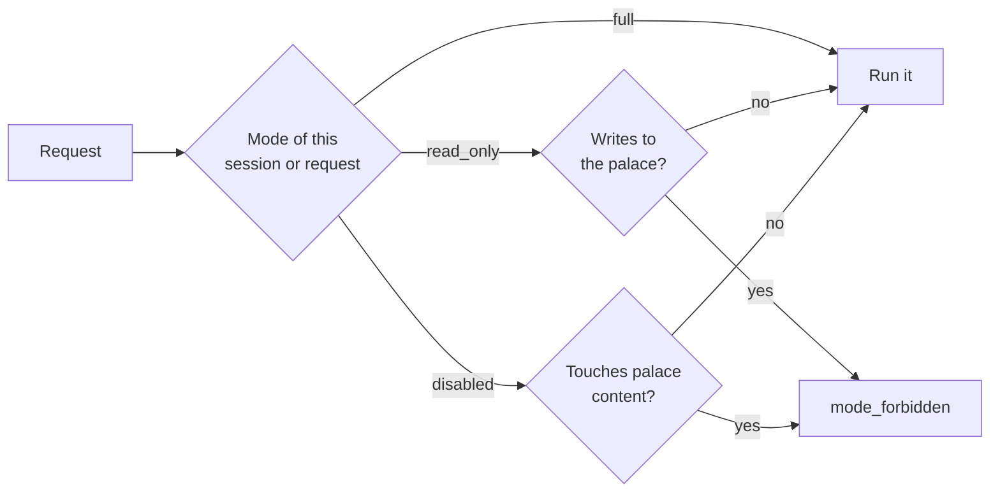

# Memory modes

A memory mode decides what one client is allowed to do with the palace.
It exists so memory can be turned down for a single session — say, an agent that should read but not write —
without stopping the daemon or touching any other client sharing it.

| Mode | Reads | Writes |
|---|---|---|
| `full` (the default) | allowed | allowed |
| `read_only` | allowed | rejected |
| `disabled` | rejected | rejected |

The mode is **never daemon-wide**.
There is no switch that turns the whole daemon off, because the daemon serves many agents at once
and disabling memory for one of them must not interrupt another's reads or running jobs.

## What counts as a read or a write

The rule follows what an operation touches, not what it is called.

- **Reads:** `search`, `recall`, `wake_up`, `diary_read`, listing or showing jobs,
  and listing or showing wings, rooms and drawers.
  Jobs count because a job record carries its whole input, such as the memory a checkpoint is writing,
  and the hierarchy counts because the names and counts of a palace are themselves palace content.
- **Writes:** `checkpoint`, `diary_write`, `mine`, `repair` when it is not a dry run,
  `embed`, superseding a drawer, linking a drawer to an entity, attaching an embedding,
  and creating or deleting a wing, room or drawer.
  Mining and applied repairs count because their purpose is to file or delete drawers,
  and the derived-data writes count because they change the palace even though they never touch a drawer's content.
  Every search option (`ranking`, `as_of`, `expand` and the rest) is still a read.
- **Never gated:** `status`, job control (pause, resume, cancel, retry), demo jobs, `audit` and a dry-run `repair`.
  They report on the palace or steer work that was already allowed, and never expose drawer content.

A rejected operation fails with `memcastle::app::mode_forbidden`, on reads as well as writes.
A disabled session never receives an empty result that could be mistaken for "nothing found".



## Choosing a mode

The mode is carried differently on each interface, and defaults to `full` on all of them.

### MCP

Call the `memcastle_set_mode` tool once at the start of a session.
Every later call on that session uses it, and other sessions are unaffected.

```json
{ "mode": "read_only" }
```

The mode lives as long as the MCP session.
A request that does not belong to a session has nothing to remember a mode under:
it runs as `full`, and `memcastle_set_mode` on it is an error.

### REST

Send the `X-MemCastle-Mode` header on each request.

```sh
curl -s -H 'X-MemCastle-Mode: read_only' 'http://127.0.0.1:8420/api/search?q=formatter'
```

An unrecognized value is a `400`, never silently treated as `full`.

### CLI

Pass `--mode` (or set `MEMCASTLE_MODE`) to run a command the way a session in that mode would.

```sh
memcastle --mode read_only search formatter   # works
memcastle --mode read_only mine ./project     # rejected
```

This is mostly useful to check what a restricted session can and cannot do.

### In an integration

An agent integration usually offers the labels `full`, `read-only` and `off`.
`off` is the integration's label for `disabled`, which is the only value MemCastle accepts,
so the integration translates it.
The daemon refuses every read and write in that mode, but it only protects its own answers.
An integration must also stop injecting anything it fetched earlier, or loaded from a skill, so that a session in `off`
behaves as if MemCastle does not exist.
See [Integration contract](integration-contract.md#session-identity-and-memory-mode).

Modes are advisory boundaries between cooperating clients on one machine, not security:
any client can choose `full`, and [authentication](authentication.md), when enabled, gives every client that holds the
token the same access.

## Why job listing is gated

Listing jobs would otherwise let a disabled session read palace content through the job list,
and letting a read-only session submit a mining job would let it change the palace.
The full reasoning is in [ADR-002](adr/002-memory-mode-session-scoping.md) (why the mode is per session)
and [ADR-007](adr/007-memory-mode-gate-follows-data-access.md) (why the gate follows data access).
