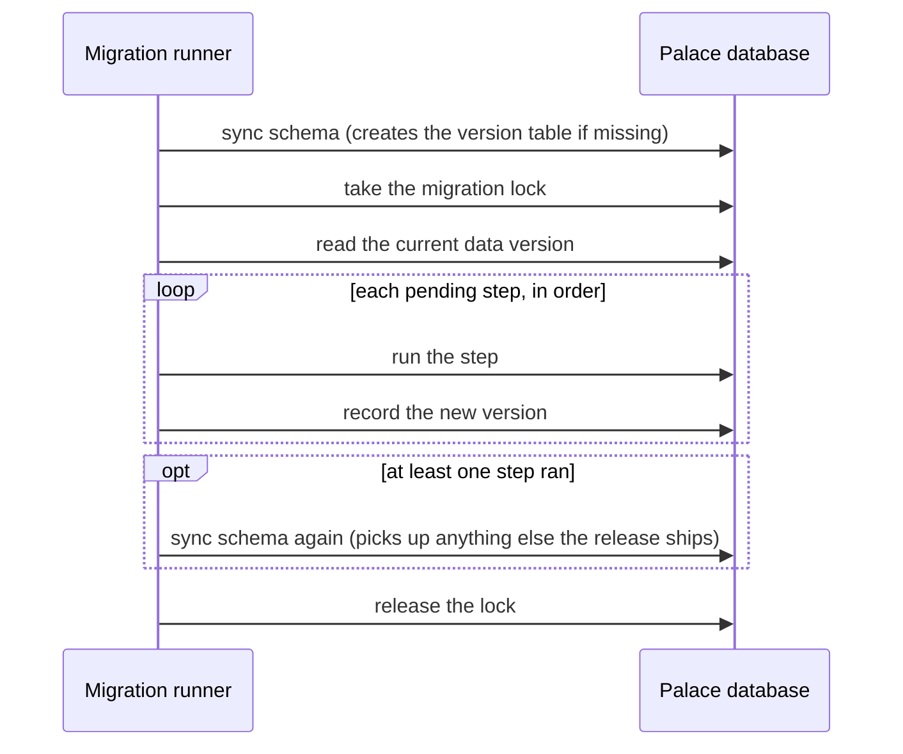

# Migrations and upgrades

MemCastle keeps its data in a versioned shape.
When a release changes that shape, it ships a migration, and the daemon applies it before it serves anyone.
For most upgrades you do nothing: install the new version and start it.

## What gets migrated

Two kinds of change are tracked separately:

- **Schema.** The database's tables, fields and indexes, declared in files embedded in the binary.
  They are synchronized automatically by [SurrealKit](https://github.com/surrealdb/surrealkit) on every start.
  This is idempotent, so an unchanged schema costs nothing.
- **Data.** Ordered, one-time steps for changes that cannot be expressed as a schema sync, such as reshaping stored records.
  MemCastle records how far a palace has got in a version number, and each step runs exactly once.

| Version | Step | What it does |
|---|---|---|
| 1 | `diary-provenance` | Rewrites legacy diary drawers so `provenance.requested_by` names the channel (`unknown` when it was never recorded) rather than the agent. |
| 2 | `canonical-timestamps` | Rewrites optional timestamps into one canonical form so they compare correctly. |

A fresh palace starts at version 0 and is brought to the latest version on its first start.
Data migrations never delete canonical memory, and released migrations are never edited:
a mistake in one is fixed by a new migration.

## What happens on start



When no step is pending, the schema is not synced a second time: the first sync has already made it current.

`memcastle serve` runs this before it starts answering requests, so an MCP client never sees a half-migrated palace.
The listener is already bound by then, and connections wait in its backlog.
If a step fails, the daemon exits with `memcastle::migrate::failed` instead of serving.
The version stays at the last step that succeeded, so once the cause is fixed a later start resumes rather than starts over.
The lock is a lease, so a crashed run does not block the next one forever;
a start that finds it held fails with `memcastle::migrate::locked`.

## Inspect or run migrations by hand

`memcastle migrate` runs the same code as `serve`, but talks to storage directly and needs no daemon.

```sh
memcastle migrate --status   # report, change nothing
memcastle migrate --check    # like --status, but fail if anything is pending
memcastle migrate            # apply whatever is pending
```

Both report flags print JSON:

```json
{
  "current_version": 2,
  "latest_version": 2,
  "pending": []
}
```

`--check` exits with an error (`memcastle::migrate::pending`) when `pending` is not empty, so it fits in a CI job or a
pre-start script.
Applying prints what happened:

```json
{
  "from_version": 2,
  "to_version": 2,
  "applied": []
}
```

An embedded palace can only be opened by one process, so **stop the daemon before running `memcastle migrate`**;
otherwise it fails with `memcastle::store::backend_failed`.
While a daemon is running, `memcastle status` shows the same information under its datastore line
(`migrations 2/2`), and lists any pending steps.

## Upgrading MemCastle

1. Stop the daemon: `memcastle daemon stop`.
2. Back up the palace directory if the data matters, see [Storage and data](storage.md#back-up-and-move-a-palace).
3. Install the new version, see [Installation](installation.md).
4. Start it: `memcastle serve`.
   Pending migrations are applied first, and the daemon starts serving once they succeed.
5. Confirm with `memcastle status`: the datastore line should read `ok`, with equal current and latest versions.

Running jobs are safe across the restart: they checkpoint on shutdown and resume on the next start.

!!! warning
    Migrations only move forward.
    A palace migrated by a newer MemCastle may not be readable by an older one,
    so keep a backup if you may need to go back.

## Design

The reasoning — why schema and data are separate, why migrations are forward-only, and why the daemon fails closed —
is recorded in [ADR-004](adr/004-versioned-database-migrations.md).
