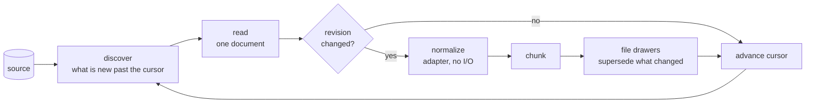

# Mining sources

MemCastle can fill the palace itself, without an agent writing anything and without spending a model's tokens.
Mining reads a **source**, such as a directory or an agent's session history, and files what it finds as drawers.
This page is the model behind it and the reference for the sources MemCastle ships.
The reasoning is in [ADR-023](adr/023-unified-source-model-for-mining.md).

Memory reaches the palace two ways.
**Agent-driven** memory is what an agent writes through MCP (a [checkpoint](mcp-and-api.md#checkpoint-payload), a diary
entry).
**Source-driven** memory is what MemCastle acquires on its own: `memcastle mine` reads a source and no agent is involved.
Both end as drawers, and search does not tell them apart except by `source_kind`.

## How a source is mined



Everything left of "chunk" is the **adapter's** job and is specific to the source.
Everything from "chunk" on, and the loop itself, is the same for every source.

| Stage | Done by | What it does |
|---|---|---|
| discover | adapter | Lists documents after the source's cursor, cheaply and in order. |
| read | adapter | Acquires one document as the source provides it. No model, no agent. |
| normalize | adapter | Expresses it in MemCastle's terms: title, room, name, text segments. Pure. |
| chunk and file | MemCastle | Cuts it into drawer-sized chunks, skips what is unchanged, supersedes what changed. |
| enrich | the `extract` job | Reads what was filed and adds entities and relationships to the knowledge graph; it never rewrites a drawer. |

### Entities and relationships

Mining files drawers and stops.
When an [extraction provider](configuration.md#extraction) is configured, the daemon then queues an `extract` job that reads
the drawers mining filed and adds the entities and relationships they name to the knowledge graph.
It is a separate job on purpose: the pipeline above does not know it exists, no adapter takes part, and a slow or failing
model cannot hold up a mining cursor.
Each fact records the source, document, chunk and revision it was read from, so it can be traced to the drawer that is its
evidence and stops being current when that drawer is replaced.
Any source that mines through the model above is covered, because extraction reads drawers, not sources.
Names that differ only in spelling across documents converge on one entity, and each mention keeps the spelling its
document used.
See [ADR-024](adr/024-entity-extraction-as-an-enrich-job.md) and [Deduplication](deduplication.md).

### Duplicates across documents

Two documents with the same text are two documents, so mining stores both.
After storing a chunk, though, it notes what the chunk resembles among the drawers already in its room: an identical or
nearly identical chunk gets a `similar_to` link with the evidence, and the job's result counts these as `similar`.
Nothing is skipped or merged, and the pipeline learns nothing about sources from it.
See [Deduplication](deduplication.md).

### Identity, cursor and documents

A source is identified by `(provider, account, locator)`: the adapter, the account on it if it has accounts, and the
part of it that is read (a directory, a sessions folder, a channel).
Two jobs that name the same place share one source, and therefore one cursor.

MemCastle keeps, for each source:

- the **cursor**: where the last run stopped, in the adapter's own terms.
  A later job continues from it, which is what makes mining incremental;
- the **last job** that advanced it and when;
- a **credential reference**, if the source needs one: the name of an environment variable or the path of a file.
  A secret is never stored, logged or returned, see [Authentication](authentication.md);

and for each document of a source, the **revision** last filed and the **chunks** it became.

### What "incremental" and "idempotent" mean here

- A re-mine of an unchanged source reads nothing: the cursor is past everything.
- If the cursor is lost or you pass `--full`, everything is read again, and an unchanged document is recognised by its
  revision and skipped.
  Nothing is duplicated either way, so the cursor is a speed-up, not something correctness depends on.
- An edited document keeps the drawers whose text did not change and **supersedes** the ones that did.
  The old text stays as history (`valid_to`), and a search for "as of" an earlier date still finds it.
  Appending to a transcript changes only its last chunk.
- A document that got shorter closes the chunks past its new end, so stale text is not searchable as if it were current.
- A document that vanished from the source is not noticed: deletions are not propagated.
- A job that is paused, interrupted or crashed resumes from its own checkpoint and files nothing twice.

### Chunking

A document that fits in `mining.chunk_chars` characters (6000 by default) is **one drawer, verbatim**.
A longer one is cut into several:
whole units the adapter delimited (a message, say) are packed together up to the size, and a unit larger than a chunk is
cut at a paragraph break, else a line break, else mid-line.
Only the first drawer of a document carries its name.
Sizes count characters, so a cut never lands inside a character.

### Limits

One job files at most `mining.max_documents` documents (2000 by default).
If the source has more, the job completes with `"truncated": true`, its progress message says to run it again, and the
next job continues from the cursor.

## Using it

```sh
memcastle sources                        # what can be mined, and what has been
memcastle mine ~/project                 # a directory
memcastle mine --source pi               # Pi session history, from its default location (once installed, below)
memcastle mine --source pi --locator /backups/pi/sessions
memcastle mine --source pi --full
```

`memcastle sources` (`GET /api/sources`) lists the adapters (built in and installed, with their state), then each source
that has been mined with its document count, last job and last run.
Over HTTP, a source job is `{"type": "mine", "provider": "pi", "locator": "...", "full": false}` on
`POST /api/jobs`, and over MCP `memcastle_mine` takes `source`, `locator` and `full` beside `path` and `wing`.
Mining is a write, so a [read-only or disabled session](memory-modes.md) cannot start it.
The job's `result` reports `documents`, `created`, `superseded`, `retired`, `unchanged`, `skipped`, `similar` and `truncated`.

## The sources MemCastle ships

| Source | Kind | Reads | Cursor | Keeps raw | Credentials |
|---|---|---|---|---|---|
| `directory` | built in | the text files under a directory | modification time | no | no |
| `pi` | package, `sources/pi/` | Pi coding-agent session history | modification time | yes | no |

Only `directory` is compiled into MemCastle.
`pi` is an installed [WebAssembly source](writing-sources.md), built from `sources/pi/` in the repository:
no Pi-specific code is part of the core, and it runs under the same sandbox and the same pipeline as any source a user
writes.
Both cursors are a modification-time watermark: files are ordered by modification time, then by path, and the cursor is
the last one done.
A file that appears with an old modification time (restored from a backup, copied with its times preserved) is behind the
watermark and is picked up by `--full`.

### `directory`

One document per file, identified by its path under the mined root, filed in the room `files` of the wing you give
(default: the directory's name) and named by that path, so `wing/files/src/lib.rs` addresses it.

- It skips directories named `.git`, `target`, `node_modules`, `.venv`, `venv`, `dist`, `build` and `.cache`, at any depth,
  along with any other directory whose name starts with `.` and any symlink.
- It skips empty files, files larger than `mining.max_file_bytes` (2 MiB by default) and files that are not valid UTF-8.
- `source.kind` is `file` and `source.uri` is the file's absolute path.

### `pi`

The conversation history of the [Pi](https://github.com/badlogic/pi-mono) coding agent, read straight from its session
files: `~/.pi/agent/sessions/<working directory>/<session>.jsonl`, or the folder named by `--locator`.
It works on sessions of any age and with no Pi process running.
This is how Pi's *history* gets into MemCastle; the live integration (`integrations/pi/`) is a separate thing that talks
to the daemon over MCP and decides *when* to ask for mining, and never reads these files itself.

Until the official sources are packaged with MemCastle's releases, build and install it from a checkout of the repository:

```sh
memcastle source package sources/pi        # builds the component, writes sources/pi/dist/pi-0.1.0.tar.gz
memcastle source install sources/pi/dist/pi-0.1.0.tar.gz --enable
memcastle mine --source pi
```

Installing lists what the source asks for and needs your consent to exactly that:
read-only access to the folder it is asked to mine and to `~/.pi/agent/sessions`, and the one environment variable `HOME`
(to find that folder when no `--locator` is given).
It asks for no network, runs no program, writes no file and needs no credentials.
`memcastle source test sources/pi` runs its conformance cases, and CI does the same on every change.

Each session is one document, identified by its path under the sessions folder (`<working directory>/<session file>`),
filed in the wing `pi` (or the one you give), in a room named after the session's working directory, and named by its
file, so it can be addressed as `pi/<project>/<session file>`.
Drawers have `source.kind` `transcript` and the tags `transcript` and `pi`.
Provenance is the session itself: `source.uri` is the session file's path, the document's metadata carries the session
id, working directory and format version from its header, and the document's time is when the session started (the
header's timestamp), not when its file was last written.

What is filed: a header (session id and working directory), then each user and assistant message as text with the time it
was written.
Tool calls are kept as one-line markers (`[tool call: read]`) and shell commands the user ran as `[bash: ...]`.
What is deliberately left out: model reasoning, tool results (large, and usually file contents that can be mined as files)
and everything that is not a conversation message.
A line that is not JSON or an entry type the reader does not know is skipped, not an error.
The reader follows Pi's session format version 3 and only lists `*.jsonl` files, directly in the sessions folder or one
folder down, so it never opens anything else under Pi's directory, in particular not its credentials file, and it does not
follow symlinks.
The raw session file is kept next to the drawers, because Pi's sessions are the user's to rotate away.
Mining is incremental and idempotent: a session that has not changed is not read again, and one that grew files only its
new tail.

## Writing a source

There are two ways to add a source.

- **A package** is a WebAssembly component the user installs, in any language that produces one.
  This is the extension model: the core compiles no source-specific code, and a source can be written, shipped and
  updated without a MemCastle release.
  [Writing a mining source](writing-sources.md) is the guide (the contract, the manifest, permissions, lifecycle,
  conformance, packaging), and `memcastle source init` scaffolds one.
- **A built-in adapter** is Rust compiled into MemCastle, for the few sources that are simpler or faster native.

Both implement the same contract, and a source cannot tell which kind it is.
The contract is `mining::adapter::SourceAdapter`, one file under `src/mining/adapters/` for a built-in:

| Method | Contract |
|---|---|
| `provider`, `description`, `capabilities` | The name users give, one line about it, and whether it is incremental, keeps raw documents and needs credentials. |
| `identify(locator)` | Validate the locator and return the source's identity. Make equivalent spellings identical (a canonical path), so they share a cursor. |
| `default_wing`, `default_room` | Where drawers go when nobody chose. |
| `discover(source, cursor, limit)` | Candidates strictly after the cursor, in cursor order, at most `limit`, each with the cursor to store once it is done; and whether anything is left. Cheap: a listing. |
| `read(source, candidate)` | One `RawDocument` with a **revision** that changes exactly when the content does, or `None` to skip. |
| `normalize(raw)` | A `CanonicalDocument`. Pure: no I/O, so it is testable from fixtures. |

A built-in adapter also needs a variant in `mining::registry::AnySource`, its name in `registry::BUILTIN_NAMES` (which
keeps an installed package from shadowing it), and a section on this page.
What an adapter must not do, and a test (`tests/source_isolation.rs`) enforces: touch the store or the job machinery, which
the pipeline owns; and what the pipeline must not do: name a provider, name the WebAssembly runtime, or read a file.
The same conformance cases (`tests/fixtures/sources/conformance/`) run against built-in and installed sources.
A cursor is the adapter's own JSON object, opaque to MemCastle.
An adapter whose cursor does not parse returns `memcastle::mining::cursor_invalid`, whose help says to mine with `--full`.

A model that suits the planned adapters for chat and issue trackers:
the cursor is the provider's own page token or timestamp, `external_id` is the provider's id for the message or issue,
the revision is its `updated_at` or etag, and `needs_credentials` is set, with the credential stored as a reference.
