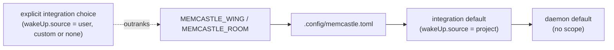

# Project configuration

A project can say which part of the palace its memory belongs to, in a small file that travels with the project.
This page covers that file, the `MEMCASTLE_WING` and `MEMCASTLE_ROOM` variables that override it, how a project is found,
and who uses the answer.

It is **not** the daemon's configuration.
The daemon's settings (where the palace lives, the listener, embeddings, and so on) are in
[Configuration](configuration.md) and in `~/.config/memcastle/config.toml`.
The project file never holds any of them, and the daemon's config file never says which project you are in.

## The file

`.config/memcastle.toml`, under the project's root directory.
Every key is optional, and an empty file is a valid project with no scope.

```toml
[project]
name = "memcastle"      # a display name, and the wing when [memcastle] sets none

[memcastle]
wing = "memcastle"      # the wing this project's memory is filed under
room = "design"         # narrows searches to one room

[mining]                # reserved: accepted when empty, so that it can grow later
```

| Key | Meaning |
|---|---|
| `[project] name` | The project's name. It is the wing when `[memcastle] wing` is absent. |
| `[memcastle] wing` | The wing for this project's wake-up, checkpoints and searches. |
| `[memcastle] room` | The room searches are narrowed to, and the room `memcastle note` files notes in. Recall, checkpoints, diaries and mining name their own rooms, so it applies to nothing else. |
| `[mining]` | Reserved and empty. |

A wing or room name follows the same rules everywhere in MemCastle:
not empty, no leading or trailing whitespace, no control characters, no `/`, and not UUID-shaped.

Unknown keys are **errors**.
A typo such as `wng` is reported instead of silently doing nothing,
and a key that does not exist, like `token` or `palace`, can never be used to smuggle a secret in.

### No palace key

One daemon serves one palace, chosen by its path (`--palace`, `MEMCASTLE_PALACE_PATH` or `palace.path`).
A project file cannot pick a different palace, because that would mean a different daemon, and which daemon to talk to
is the user's decision about their machine and not something a repository should declare.

## Environment variables

For CI, ephemeral workspaces, wrappers and temporary overrides, without touching the file.

| Variable | Overrides |
|---|---|
| `MEMCASTLE_WING` | `[memcastle] wing`, and `[project] name` as the wing |
| `MEMCASTLE_ROOM` | `[memcastle] room` |

A blank value counts as unset.
A value with surrounding whitespace is trimmed.
A value that is not a valid wing or room name is an error that names the variable;
it is not silently ignored, because a wrong override would send memory somewhere unintended.

These two variables are read by agent integrations, in the environment of the agent process, and by the CLI's `note`
command, in your shell's.
The daemon does not read them: its own environment says nothing about the client that is talking to it.
Authentication tokens (`MEMCASTLE_AUTH_TOKEN`) are a separate concern and are never part of project context.

## Precedence

For each of wing and room, the first source that has a value wins,
except that an integration's explicit choice of where wake-up reads from outranks the project file (item 3).



1. **The environment**: temporary and explicit.
1. **The project file**: the project's persistent intent.
   Within it, `[memcastle] wing` comes before `[project] name`.
1. **Client-specific settings**: an integration's own choices.
   Pi and OpenCode's wake-up `source` is `project` by default, which follows the project context and so comes after the
   file.
   Choosing `user`, `custom` or `none` is an explicit choice that outranks both the environment and the project file.
1. **Daemon defaults**: with nothing declared, no scope is applied, exactly as before.

## Finding the project

An integration (or `memcastle note`) looks for the file from the directory its session or shell works in,
walking toward the root:

- the **nearest** `.config/memcastle.toml` wins;
- a nested project uses its own file and **inherits nothing** from a parent project's file;
- the walk **stops at a git root** (a directory with `.git`, whether a directory or a worktree's file), so a project
  that has no file is never given an unrelated parent's scope;
- the walk **stops at `$HOME`**, and `$HOME/.config/memcastle.toml` is never read as a project file, because it would
  claim every directory under the home directory.

When no file is found there is no project context, and nothing changes: wake-up keeps naming the wing after the working
directory, checkpoints keep their destination wings, and searches are not narrowed.
Setting `MEMCASTLE_WING` or `MEMCASTLE_ROOM` is enough to have a context without any file.

## Who uses it

| Consumer | What it does with the context |
|---|---|
| Pi and OpenCode wake-up | Asks about the project's wing (default `project` source) |
| Pi and OpenCode checkpoints | Files `project` and `diary` items that have no wing of their own under the project's wing; `preference` and `general` items are the user's and are never moved |
| Pi and OpenCode search | Tells the model which wing and room to pass to `memcastle_search`, and the wing to `memcastle_recall` |
| `memcastle note` (the CLI) | Files the note under the project's wing and room, from the directory the command runs in; the wing falls back to the directory's name and the room to `notes` |
| Directory mining (the daemon) | Mines a directory inside a project into the project's wing, unless a wing is given explicitly |

An integration reads the file and the environment itself and passes the result to MemCastle as ordinary `wing` and `room`
arguments.
The daemon is not asked to resolve a project, and apart from mining it never reads the file.
The rules are the same for every integration, and a shared set of cases, `tests/fixtures/project-config/cases.json`,
holds each implementation to them
(see the [integration contract](integration-contract.md#project-context)).

The CLI reads the file only for `memcastle note`, with the same reader the directory adapter uses (`src/project.rs`),
the same discovery rules and the same environment variables, then sends the daemon an ordinary wing and room.
Its other commands take `--wing` and `--room` explicitly, as before.
Unlike mining, a file or variable that cannot be used is an error (`memcastle::project::invalid`) and not a logged
fallback: you asked for this note to be filed, and a wrong scope would put it somewhere you did not mean.
`--wing` and `--room` outrank everything here, and with both given the project is not read.

### Mining

When the daemon mines a directory and no wing was given, it looks for a project file from that directory,
with the same discovery rules.
If one declares a wing (or a name), the files go into that wing, so mining, wake-up and checkpoints meet in one wing.
Otherwise the wing is the directory's name, as before, made acceptable the way `memcastle note` makes it:
a name that looks like a UUID gets a `project-` prefix, because a UUID addresses a record by id and cannot name a wing.
A file that cannot be used is logged with its path, and mining carries on with the directory's name:
one typo in a file nobody asked about must not stop a mine that used to work.
Mining's room is chosen by its source, so `[memcastle] room` does not apply.

## Security

The project file is **not an authorization boundary**.
It asks for a scope, and the daemon still decides what a request may touch, which matters in a shared or enterprise
deployment where the file is written by whoever controls the repository.

Do not put secrets in it.
A token has no key to go in, so a pasted one is refused; use `MEMCASTLE_AUTH_TOKEN` or the integration's token option.
The file is meant to be committed.

## Troubleshooting

- **A broken file or variable** is reported once per session, naming the file or the variable, and the session carries on
  without a project scope.
  Fix it and start a new session: the project is resolved once per working directory and not re-read mid-session.
- **Nothing happens.**
  Check the file is at `<root>/.config/memcastle.toml` (not `memcastle.toml` in the root), that no `.git` directory
  sits between your working directory and the file, and that the session is not in `off` mode, which reads no project file.
