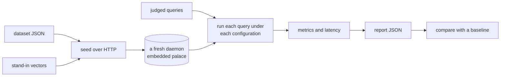

# Retrieval evaluation

MemCastle ships a reproducible way to measure how well search finds what it should, and how fast.
It exists so that a change to retrieval (a new ranking, a new index setting, a new capability) can be judged by numbers
instead of by a handful of hand-picked queries, and so that an old behaviour cannot regress without anyone noticing.

It is a development tool.
Nothing of it is in the `memcastle` binary or in a release, and it is not a release gate.
Read [What the numbers do and do not establish](#what-the-numbers-do-and-do-not-establish) before quoting one.

## Run it

```sh
mise run eval                       # measure the bundled dataset, print a report, write target/eval/report.json
mise run eval:compare -- a.json b.json   # what changed between two reports, failing on a drop
mise run eval:baseline              # re-measure and rewrite the committed baseline (a deliberate act)
mise run eval:longmemeval -- longmemeval_s.json   # session retrieval on a downloaded LongMemEval file
mise run test -- retrieval_eval     # the everyday check: the bundled dataset against the committed baseline
```

The `eval*` tasks are explicit and are never part of `mise run check` or `mise run ci`.
`mise run test -- retrieval_eval` is the part that runs in the everyday suite, in about half a minute.

A typical before-and-after of a change looks like this:

```sh
git stash                  # or check out the commit before the change
mise run eval && cp target/eval/report.json /tmp/before.json
git stash pop              # or check out the change
mise run eval && cp target/eval/report.json /tmp/after.json
mise run eval:compare -- /tmp/before.json /tmp/after.json
```

## How it works



The harness is a client of a real daemon, started in-process in a temporary palace, and it talks to it over HTTP only:
it writes drawers, supersedes some of them, links entities and attaches vectors through the REST API,
then searches through `POST /api/search`.
So what is measured is what any client of the daemon gets, including the filters, the fusion and the graph expansion,
and it never reaches into the store.
The code is under `tests/in_process/retrieval_eval/`, which keeps it out of the binary and out of every release artifact.

## The bundled dataset

`tests/fixtures/retrieval/core.json` is a small household-and-team knowledge base:
59 drawers in four wings, four of them corrections of an earlier drawer, fifteen entity links, and 39 judged queries.
It is small on purpose, so it is deterministic and cheap enough for the everyday suite.

Each query belongs to one category, and a report breaks the numbers down by category:

| Category | Queries | What it asks |
| --- | --- | --- |
| `lexical` | 10 | The query uses the document's own words. The easy case that every configuration should get right. |
| `paraphrase` | 9 | The query shares no meaningful word with its answer, so only vector search can find it. |
| `scoped` | 5 | The same words occur in several wings, and the query is restricted to one wing or room. |
| `temporal` | 10 | A drawer and its correction say nearly the same thing, and the query asks for now, for a past instant, or for a window. |
| `graph` | 5 | The answer shares an entity with the best hit but shares no words with the query. |

Relevance is graded, not binary: 2 marks the answer and 1 marks a drawer that is related to it.
The dataset names its documents with ids of its own, because the daemon assigns drawer ids,
and the harness translates the ids a search returns back into the dataset's.

A file is identified by the SHA-256 of its bytes, recorded in every report.
Two reports of different datasets are never compared silently.

### Time, in epochs

No write route accepts a timestamp, so the daemon stamps validity times itself.
The dataset therefore speaks of epochs.
Epoch 0 is the state after every document was written, and epoch 1 is the state after the corrections were made.
The harness writes epoch by epoch, pauses, and records an instant after each.
A temporal query is asked about those instants:
`as_of_epoch: 0` is a point in time, `between_epochs: [0, 1]` a window, and `historical` every version.
No query carries a wall-clock date, so the outcome does not depend on when it ran.

## Retrieval configurations

| Name | Ranking | Notes |
| --- | --- | --- |
| `lexical` | BM25 | The baseline: how retrieval worked before vectors. |
| `semantic` | vector similarity | Needs a query vector, which the harness supplies. |
| `hybrid` | lexical and vector fused by reciprocal rank | The `auto` default once a query can be embedded. |
| `lexical+expand` | BM25, then drawers related through the knowledge graph | Run on the `graph` queries only. |

Every query is run under the first three, and the `graph` queries also under the fourth.
Scope and time are not configurations: they are filters that every configuration applies,
so they are measured as categories of query, under each ranking.

Expansion is measured on top of lexical search for a reason.
It appends related drawers after the direct hits, and a vector search always fills its page,
so under a vector ranking the related drawers would fall beyond every cut-off, seeded by whatever filled the page.
Lexical direct hits are only drawers that match, which keeps the comparison meaningful.
A vector-seeded expansion is not measured here.

## Vectors: engine quality, kept apart from model quality

An embedding model is a different thing to evaluate from the retrieval engine around it, and mixing them makes a number
mean nothing: a better model would look like a better engine.
So the bundled dataset runs with the daemon's embedding provider off, and the harness computes the vectors itself
and hands them over (`PUT /api/drawers/{id}/embedding` and `query_embedding`).

The stand-in model is a hashed bag of concepts.
Each word lights one slot of a 768-dimensional unit vector, stop words are dropped,
and the dataset's `concepts` table names words that mean the same thing, so "sedan" and "automobile" land together.
A faint dense component per word keeps unrelated texts from sitting at exactly equal distance,
because an exact tie would leave the order at a cut-off to chance.
It is deterministic and needs no download, and it is exactly as strong as the `concepts` table says:
a real model is stronger in some ways and weaker in others.
What it measures is that the index, the filters, the fusion and the graph behave, not that a model understands language.

A report records where its vectors came from.
For the bundled dataset that is the fixed stand-in; for a LongMemEval run with a provider it is the provider and its model.

## Metrics

All metrics are computed per query over the ranked list of document ids, then averaged.
`k` is a cut-off, and a report measures at 1, 3, 5 and 10.

| Metric | Definition |
| --- | --- |
| `recall@k` | The share of the query's relevant documents among the first `k` results. |
| `precision@k` | The share of the first `k` slots that are relevant. It divides by `k`, so returning nothing scores 0. |
| `hit@k` | 1 when any relevant document is among the first `k` (LongMemEval's `recall_any@k`). |
| `all@k` | 1 when every relevant document is among the first `k` (LongMemEval's `recall_all@k`). |
| `ndcg@k` | Discounted cumulative gain with gain `2^grade - 1` and discount `log2(rank + 1)`, over the best possible ordering. |
| `mrr` | The reciprocal of the rank of the first relevant document. |

Precision is low by construction here, since most queries have one or two relevant documents and `k` is 5 or 10.
Read it for comparison between configurations, not as a score out of one.

Equal scores are ordered by the dataset's document id before scoring.
The daemon orders equal scores by an identifier it generated at random, and a metric must not depend on that.

## Latency and throughput

Each configuration is run once untimed (a warm-up, which is also the pass that is scored)
and then `EVAL_REPETITIONS` times (5 by default) over the whole query set, one request at a time.
The report gives the mean, the 50th, 95th and 99th percentile of the round trip as the client sees it, in milliseconds,
and the sequential throughput in queries per second.
It also gives the ingest rate: documents written, with their vectors attached, per second.

Percentiles are nearest-rank, so each is a value that was actually measured.
Throughput here is one client at a time: it says nothing about concurrent load.

Latency depends on the machine, and the build.
`mise run eval` uses the debug test profile, which makes SurrealDB several times slower than a release build.
Compare latency between two runs on the same machine, with the same build, and never between machines.
For a figure that reflects a release build, run the explicit test with nextest's `--cargo-profile release`
(a long first compile).

To see how latency grows, add filler documents:

```sh
EVAL_SCALE=2000 mise run eval
```

The filler is generated from a fixed seed in invented words that no query uses, so the judgments stay true,
and the same scale always gives the same corpus.
It changes what the vector search returns at the tail, so quality at scale is not comparable with the baseline,
and a comparison says so.

## Reports and comparing them

A report is JSON and records its configuration with its numbers:
the MemCastle version, the dataset (name, version, hash, size), where the vectors came from,
the embedding provider and model the daemon had, the storage backend, the cut-offs, the number of repetitions and the scale.
Without these a number cannot be interpreted a month later.

`mise run eval:compare -- <base> <new> [threshold]` lists every metric that changed, worst first, and flags a drop larger
than the threshold (0.02 unless given).
It exits with a failure for a drop, for different datasets and for different parameters.
Configurations present in only one report are listed, never dropped quietly.

Comparing two retrieval implementations (two commits, or a branch and `main`) is the same operation:
run `mise run eval` on each, and compare the files.
The harness starts the daemon of the checkout it runs from, so it measures the retrieval code in that tree.

### The committed baseline and the floor

`tests/fixtures/retrieval/baseline.json` holds the quality metrics of the bundled dataset, with no timings,
since those belong to a machine.
The everyday suite (`mise run test`) runs the dataset against it,
and fails when any metric of any configuration falls by more than 0.02.
That margin is not a target.
It absorbs an approximate vector index and the arbitrary order of equal scores without hiding a real regression.

The same test checks that no query returns a drawer outside the wing, room or time it asked for, whatever the ranking,
and that the dataset still tells the configurations apart (vector search finds paraphrases that lexical search misses,
and expansion reaches the drawers the graph links).
That last check guards the measurement itself:
a benchmark that stopped separating them would make every later comparison empty.

When a change is meant to move quality, `mise run eval:baseline` rewrites the baseline and the diff is reviewed like code.
The baseline is an agreement about what retrieval does today, not a statement about what it should do.

## The documented baseline

The baseline for the bundled dataset (v1), measured on the current retrieval implementation, with the stand-in vectors:

| Configuration | Queries | recall@5 | recall@10 | ndcg@10 | mrr |
| --- | --- | --- | --- | --- | --- |
| `lexical` | 39 | 0.762 | 0.762 | 0.801 | 0.872 |
| `semantic` | 39 | 0.907 | 0.928 | 0.945 | 0.970 |
| `hybrid` | 39 | 0.907 | 0.928 | 0.942 | 0.987 |

By category, `recall@5` and `mrr`:

| Category | `lexical` | `semantic` | `hybrid` |
| --- | --- | --- | --- |
| `lexical` (10) | 1.000 / 1.000 | 1.000 / 1.000 | 1.000 / 1.000 |
| `paraphrase` (9) | 0.315 / 0.444 | 0.944 / 0.870 | 0.944 / 0.944 |
| `scoped` (5) | 1.000 / 1.000 | 1.000 / 1.000 | 1.000 / 1.000 |
| `temporal` (10) | 1.000 / 1.000 | 1.000 / 1.000 | 1.000 / 1.000 |
| `graph` (5) | 0.373 / 1.000 | 0.373 / 1.000 | 0.373 / 1.000 |

On the five `graph` queries, adding expansion to lexical search takes `recall@10` from 0.373 to 1.000.

The lexical row is the baseline that the richer retrievals are measured against.
The `paraphrase` row is where it is weakest, by design, and where vectors help.
Scoped and temporal queries are answered correctly by every ranking: those are properties of the filters,
and the dataset keeps them there as a floor.
Do not read the 1.000 values as "perfect retrieval".
They mean the cases in this small dataset are all handled, and a larger or harder dataset would find the next problem.

Timings are deliberately not in this page.
Run `mise run eval` on your machine.

## What the numbers do and do not establish

They establish:

- That, on this dataset and with these vectors, one retrieval configuration ranks the judged documents higher than another.
- That a change did or did not move those rankings, which is what makes a regression visible.
- That scope and time filters hold under every ranking.
- Roughly how latency and ingest rate compare between two runs on one machine.

They do not establish:

- How well MemCastle retrieves your memories, or any real conversation.
  The dataset is 59 short, clean drawers written for this purpose, and a real palace is larger, noisier and longer.
- How good any embedding model is.
  The vectors are a stand-in, on purpose.
- That the engine is better than another memory system.
  No other system was run on this dataset, so nothing here supports a claim of equivalence with MemPalace or anything else,
  and a number from another benchmark's paper is not comparable with one from this page.
- Anything about answer quality.
  The harness measures whether the right drawers come back, not what an agent does with them.
- Statistical significance.
  With 39 queries a difference of a few points is within what one different query would move.
  Treat small differences as noise and look at categories before totals.
- Production latency or concurrent throughput.

Do not optimize for a single number at the expense of the retrieval contract.
A change that raises `recall@5` by returning something other than the stored, verbatim drawer, or by ignoring a scope,
is not an improvement, and the invariants check above exists to catch the second.

## Extending it

When a retrieval capability lands, the suite is updated in the same change:

1. Add a configuration to `RUNS` in `tests/in_process/retrieval_eval/dataset.rs`, and make the harness request it.
1. Add queries to `core.json` that the new capability should win and the old ones lose, with judgments written first.
1. Run `mise run eval` and look at the categories, then `mise run eval:baseline` and review the diff.
1. Update the baseline table on this page and the list of configurations.

Keep queries free of words that match many documents equally (`the`, `on`, `for`) unless that is the point:
equal scores in the lexical half of a hybrid ranking are ordered by a random identifier,
and they make a number change from run to run.
Run `mise run eval` several times and compare the reports before committing a new baseline; they should be identical.

The dataset is versioned by its `version` field and its hash.
Changing it invalidates the baseline, which the comparison reports instead of comparing.

## LongMemEval

[LongMemEval](https://github.com/xiaowu0162/LongMemEval) is a third-party benchmark of long-term chat memory.
`mise run eval:longmemeval -- <file>` reads its file format and measures retrieval of the session that holds the answer.

The data is not bundled and never will be.
It is large, and its licence and where to obtain it are the benchmark's own.
Download it from the project, check its terms for your use, and pass the path.
A tiny synthetic file in the same format (`tests/fixtures/retrieval/longmemeval-synthetic.json`)
is what the everyday suite uses to prove the path works, and it says nothing about the real data.

The mapping is:

- Each question has its own haystack of chat sessions.
  Each session becomes one drawer (its turns, in order, as `role: content` lines), in a wing named for the question,
  so a question searches only its own haystack.
- The question is the query, scoped to its wing, and the sessions in `answer_session_ids` are the relevant documents.
- Abstention questions, which have no answer session, have no retrieval metric and are skipped.
  The count is in the report.
- `hit@k` is LongMemEval's `recall_any@k` and `all@k` its `recall_all@k`, at session level.

Lexical search always runs.
To add the semantic and hybrid configurations, name an OpenAI-compatible embeddings endpoint:

```sh
EVAL_EMBEDDINGS_URL=http://127.0.0.1:11434/v1 \
EVAL_EMBEDDINGS_MODEL=nomic-embed-text \
mise run eval:longmemeval -- longmemeval_s.json
```

The daemon then embeds every session and every question with that provider, and the run waits for the embedding job to finish.
The report records the provider and model, and the cost of embedding is the provider's:
for the full dataset it is many thousands of sessions.
`EVAL_LONGMEMEVAL_LIMIT=20` runs only the first twenty questions, which is the way to try it out.
An API key goes in `EVAL_EMBEDDINGS_API_KEY`.

This is a session retrieval measurement, not a LongMemEval score.
It does not answer the questions, so it says nothing about end-to-end accuracy and cannot be set beside published numbers.

## Environment variables

| Variable | Used by | Meaning |
| --- | --- | --- |
| `EVAL_REPETITIONS` | `eval`, `eval:longmemeval` | Timed passes per configuration (5, and 1 for LongMemEval). `0` skips latency. |
| `EVAL_SCALE` | `eval` | Filler documents added to the bundled dataset (0). |
| `EVAL_OUT` | `eval`, `eval:longmemeval` | Where the report is written (`target/eval/report.json`). |
| `EVAL_DATASET` | `eval` | Another dataset file in the same format. |
| `EVAL_THRESHOLD` | `eval:compare` | The largest tolerated drop in any metric (0.02). |
| `EVAL_EMBEDDINGS_URL`, `EVAL_EMBEDDINGS_MODEL`, `EVAL_EMBEDDINGS_API_KEY` | `eval:longmemeval` | A provider, for the vector configurations. |
| `EVAL_LONGMEMEVAL_LIMIT` | `eval:longmemeval` | Run only the first N questions. |

## Not goals

- Making benchmark performance a release gate.
  The floor in the everyday suite protects against regressing what the dataset covers; it is not a quality bar for a release.
- Embedding a large dataset in the binary or in a release artifact.
- Claiming equivalence with another memory system without a directly comparable evaluation.
