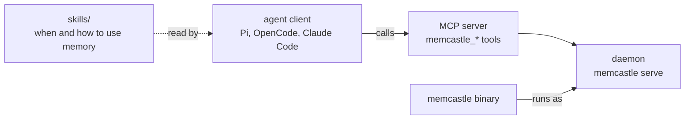

# Agent skills

MemCastle ships a small set of reusable agent skills in the `skills/` directory of its repository.
A skill is a plain-text instruction an agent loads on demand: it explains when to call MemCastle and how to use what it
returns.
Skills are optional, they contain no code, and they are not required to use the daemon, the CLI or the MCP tools.

## Binary, daemon, MCP and skills

Each layer has one job, and a layer above never reimplements the one below.



- The **binary** is `memcastle`: it is the daemon, and it is also the CLI that talks to the daemon.
- The **daemon** owns one palace and does all the work.
- The **MCP server** is the daemon's `/mcp` endpoint, and it exposes the [tools](mcp-and-api.md#mcp-tools).
- A **skill** tells an agent when to call which tool.
  It adds no capability: a skill that names something the MCP server does not expose is a bug,
  and a test fails when that happens.

MemCastle does not enforce what a skill recommends.
It will not make an agent search before it answers, because that is a policy of the agent and its integration,
and the daemon only stores and returns what it is given.
The [integration contract](integration-contract.md) describes how an integration loads these skills.

## The skills

| Skill | Use it when | Tools and commands it relies on |
|---|---|---|
| `memcastle-setup` | MemCastle is not installed, not running or not connected | `memcastle status`, `memcastle daemon start`, `memcastle_status` |
| `search-before-answer` | a question may depend on earlier sessions, decisions or preferences | `memcastle_search`, `memcastle_recall` |
| `checkpoint-instructions` | something durable was decided, solved, discovered or preferred | `memcastle_checkpoint`, `memcastle_job_get`, `memcastle_job_retry` |
| `wake-up` | a session starts or its context was reset | `memcastle_wake_up` |
| `diary` | a work stage ends and the next session needs a note | `memcastle_diary_write`, `memcastle_diary_read` |

The split follows how an agent behaves over a session and not the tool list:
there is no skill for mining, audit, repair or job control, which are operator tasks an agent only performs when asked.

`memcastle-setup` works without a running daemon, because it is what starts one.
Reading it, or installing it, never needs the daemon, and it calls a MemCastle tool only at the end to confirm the setup.

Every skill that calls a tool restricted by a [memory mode](memory-modes.md) says to stop when the session refuses the
call, and never to call `memcastle_set_mode` to get around it.
The skills contain instructions only and no content read from a palace, so loading one does not leak memory into a
session whose mode is `disabled`.

## Install the skills

The skills use the Agent Skills layout, `skills/<name>/SKILL.md` with a `name` and a `description`,
so any client that discovers skills from a directory can use them.
There is no MemCastle command to install them, and no package manager: copying the directories is the whole installation.

1. Get the skills of the release you run.
   The repository at a release tag holds the skills written for that release:

   ```sh
   git clone --branch 0.2.0 --depth 1 https://github.com/noirbizarre/memcastle
   ```

   Use the tag matching `memcastle --version`.
   Downloading the source archive of the release from GitHub works too.
2. Copy the skill directories you want into a location your client scans.
   Copy a whole directory, and install the skills together when you can:
   they are self-contained, but they point at each other by name.

   | Client | Project location | User location |
   |---|---|---|
   | OpenCode | `.agents/skills/`, `.claude/skills/` or `.opencode/skills/` | `~/.agents/skills/`, `~/.claude/skills/` or `~/.config/opencode/skills/` |
   | Claude Code | `.claude/skills/` | `~/.claude/skills/` |
   | Pi | `.agents/skills/` | `~/.agents/skills/` |

   ```sh
   mkdir -p ~/.agents/skills
   cp -R memcastle/skills/*/ ~/.agents/skills/
   ```

   A symbolic link instead of a copy keeps the skills in step with a checkout that you update.
3. Restart the client, or reload its skills, and check that it lists them.
   OpenCode shows them in its `skill` tool, and Pi has a `/skill:<name>` command for each.

`~/.agents/skills/` is the one location that OpenCode and Pi both scan, so it covers both with a single copy.
Claude Code reads `~/.claude/skills/`, which OpenCode also scans.
The locations are those of each client, so check the client's own documentation if a skill does not show up.

A skills installer that takes a Git repository can be pointed at the repository instead,
since the layout is the standard one and nothing needs to be built.

A client with a MemCastle integration may load the skills for you.
Under [`integrations/`](https://github.com/noirbizarre/memcastle/tree/main/integrations) an integration reads them
from `skills/` and never carries its own copy of the text.
Pi appends `search-before-answer` to the system prompt on every turn.
OpenCode lists the skills through its own `skill` tool, from `skills/` where they are, and re-states
`search-before-answer` in the system prompt of every request.
Both read the same `forceMemoryRecall.level` setting (`off`, `sometimes` or `always`), which is the client's policy and
never MemCastle's.
Both also give `checkpoint-instructions` to the model that reviews a conversation for their interval and manual
checkpoints, and for OpenCode's emergency one, as that model's instructions.
What is worth keeping is then worded the same way whoever writes the checkpoint.

## Versions

Each skill states the range of MemCastle versions it was written for in its frontmatter:

```yaml
metadata:
  memcastle-version: ">=0.2.0"
```

The value is a [semver range](https://docs.rs/semver/latest/semver/struct.VersionReq.html).
MemCastle keeps backward compatibility where it can, so a lower bound is usually all a skill needs:
`>=0.2.0` is the first release whose tools and behaviour the skill relies on, and any later release is expected to work.
A change that breaks a skill ships in the repository together with the updated skill, which raises the lower bound.
An upper bound, such as `>=0.2.0, <1.0.0`, remains possible when a skill is known to stop working at some release.

A skill may therefore declare an older floor than the binary you run, but not a newer one.
The `memcastle-setup` skill compares `memcastle --version` with the range, so an agent notices a binary older than the
skills it was given and offers to upgrade it, or to install the skills from the matching tag.
A test fails when the crate's own version is outside a skill's range, which would be a skill describing capabilities
that this checkout does not have.
The floor is therefore raised only once `Cargo.toml` carries the release that introduced what the skill needs.

The repository at a tag is the versioned distribution.
Skills taken from `main` may describe tools a released binary does not have yet, so use the tag that matches your binary.

## What the tests check

`tests/in_process/skills.rs` reads every skill the way a client does, with no build step, and checks that:

- each directory holds a `SKILL.md` whose `name` equals the directory, with a description that says when to use it
- the skills on disk and the table above list the same names
- every `memcastle_*` tool a skill names is registered by a real daemon
- every `memcastle` command a skill runs exists in the CLI's own help
- every `/api/` route a skill names is documented in [MCP tools and REST API](mcp-and-api.md)
- no skill points an agent at the database endpoint, storage or the credential routes
- every skill that calls a gated tool says what to do when the memory mode refuses it
- a skill links only to files inside its own directory, and copying the directories into a client location leaves them
  discoverable
- the setup skill calls no tool but `memcastle_status`, so it works before any daemon exists
- every skill declares a version range with a lower bound, and the crate's own version satisfies it

The tests prove that a skill is about things that exist.
They cannot judge whether the advice is good, which stays a review matter.

## Not in scope

There is no skill marketplace, no runtime that loads skills for you, and no package manager in MemCastle.
A skill never duplicates a tool's behaviour, and no client is required to support every skill the same way.
The decision and its alternatives are in [ADR-020](adr/020-skills-are-versioned-with-the-repository.md).
