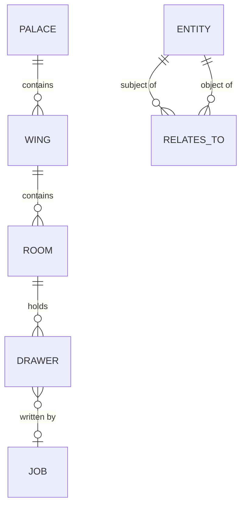

# Storage and data

Everything MemCastle remembers lives in one SurrealDB database, which the daemon owns.
There is no second index file to fall out of sync with it.
By default the database is **embedded**: it runs inside the daemon and stores its files in a directory on disk,
so a local setup needs no external database service.

## Where things live

MemCastle uses the Unix XDG layout on Linux and macOS alike; macOS does not use `~/Library`.
Windows has no dedicated layout and uses the same dot-directories under your home directory.
[Configuration](configuration.md#where-files-live) explains how each location can be moved.

| What | Default location | Moved by |
|---|---|---|
| Palace (your memory) | `~/.local/share/memcastle/default/` | `XDG_DATA_HOME`, `--palace`, `MEMCASTLE_PALACE_PATH`, `palace.path` |
| Config file (optional) | `~/.config/memcastle/config.toml` | `XDG_CONFIG_HOME`, `--config`, `MEMCASTLE_CONFIG` |
| Daemon registry (runtime state) | `~/.local/state/memcastle/run/` | `XDG_STATE_HOME` |

Inside an embedded palace directory:

```text
~/.local/share/memcastle/default/
└── db/          the SurrealKV database: this is your data
```

Only `db/` matters.
It includes the daemon's own small tables, such as the stored [authentication](authentication.md) token digest
(`auth_state`), which therefore travels with a backup of the palace.
It is a SHA-256 digest of the generated token, never the token, and a secret configured through the environment or the
config file is not stored in it at all.
The registry file is deliberately kept outside the palace, so copying or backing up a palace never carries a stale
daemon record with it.

## The data model

A palace is organized as wings, rooms and drawers.



- A **wing** is a project or a source, such as a repository or an agent's diary space.
- A **room** is a topical bucket inside a wing.
- A **drawer** is one verbatim piece of text, the atomic unit of memory.
  Its content is never rewritten, paraphrased or truncated.
  It also records where it came from (a file, or a manual entry by an agent), free-form tags,
  and which job wrote it and through which channel (`cli`, `http` or `mcp`).
  A drawer may also have a **name**, unique within its room, which makes it addressable as `wing/room/name`
  instead of by UUID.
  Most drawers have none: mining names a file's drawer after its path, and `drawer create` and a checkpoint
  item's `name` set one explicitly.

Where a write ends up:

| Written by | Wing | Room |
|---|---|---|
| `mine` of a directory | the `--wing` you give, else the wing the directory's [project file](project-config.md#mining) declares, else the directory's name | `files` |
| `mine --source pi` | the `--wing` you give, or `pi` | the session's working directory name, or `sessions` |
| `diary write` | the wing you give | `diary` |
| `checkpoint` item | the item's `wing`, or `preferences`, `projects`, `diary` or `general` by destination | `diary` for diary items, `entries` otherwise |

Wings and rooms are managed with `memcastle wing`, `room` and `drawer`, see [CLI reference](cli.md#wings-rooms-and-drawers).
Nothing in the database cascades, so deleting a wing or a room removes its rooms and drawers explicitly, in one
transaction: the hierarchy is never left with children whose parent is gone, which is the very state `audit` reports
as orphans.
Counts shown for wings and rooms are computed when asked, never stored.

Entities and relationships form a knowledge-graph layer.
A checkpoint item's `fact` can write to it, and so can the `extract` job, which reads mined drawers.
A `mentions` edge links a drawer to an entity it talks about, and both it and `relates_to` carry an optional `provenance`
that names the drawer, job and extractor an extracted fact came from.
A `drawer_extraction` row marks a drawer the job has read, beside the drawer rather than on it, so extraction never writes
a drawer.
See [Extraction](configuration.md#extraction).

Two more edge tables record what [deduplication](deduplication.md) decided and never act on it.
`similar_to` links a newer drawer to an older one it duplicates or resembles, with the evidence,
and `possibly_same_as` links an entity to others it might be.
A drawer carries a derived `fingerprint` (its content with case, punctuation and whitespace ignored, hashed) beside its
`content_hash`, and an entity a `key` and its `aliases`; all are indexed, none replaces the canonical `content` or `name`,
and deleting an edge undoes the call.

Everything retrieval uses lives in the same database as the drawers: a BM25 full-text index, an HNSW vector index over
`embedding`, and the graph edges.
There is no separate vector file or index to back up, and none can fall out of step with the drawers.
The `embedding` field is derived data and is empty until an [embedding provider](configuration.md#embeddings)
(or a vector you send) fills it, so a palace without one searches lexically.
A drawer's content never changes: correcting it sets the old drawer's `valid_to` and files a replacement, so older memory
stays in the database and is found by an `--as-of` search.

### Limits

- Read commands return 10 results by default (20 for the diary, 50 for `drawer list`) and never more than 200.
- A `wake-up` returns at most 10 highlights and 8192 bytes unless told otherwise.

### What mining reads

`memcastle mine <dir>` reads the text files under a directory, and `memcastle mine --source <name>` reads another source;
see [Mining sources](mining-sources.md) for the model and each source's rules.
For a directory:

- It skips directories named `.git`, `target`, `node_modules`, `.venv`, `venv`, `dist`, `build` and `.cache`, at any depth,
  along with any other directory whose name starts with `.` and any symlink.
- It skips files larger than 2 MiB (`mining.max_file_bytes`), empty files, and files that are not valid UTF-8.
- A file that fits in one chunk (6000 characters by default, `mining.chunk_chars`) is one drawer, verbatim;
  a longer one is cut into several, and only the first carries the name.
- It stops at 2000 documents (`mining.max_documents`), and says so: the job's progress message says to run it again and
  its result records `"truncated": true`.
  The next job continues where this one stopped.

Mining is idempotent.
The palace remembers each mined source, where its last run stopped, and which version of each document it filed, in the
`source` and `source_document` tables.
Mining the same directory again files nothing for a file that has not changed, and an edited file supersedes its drawer:
the old text stays as history and the drawer name moves to the new one.
Drawers filed before this existed are not tracked, so the first mine afterwards files them once more and the earlier copy
keeps the name.
A job that is paused or interrupted and then resumed continues where it stopped and never stores a file twice.

## Embedded and remote stores

The store is chosen with `store.mode` in the config file.

**Embedded** (the default) keeps the database in `<palace>/db`.
SurrealKV's file lock lets only one daemon open it at a time, which is what guarantees a single writer.
`memcastle migrate` while the daemon runs fails with `memcastle::store::backend_failed`,
and so does a second `memcastle serve` on the same palace that listens on a different port.
A second `serve` on the same address never gets that far: the listener is bound first,
so it fails with `memcastle::server::bind_failed`.
Stop the daemon first, or point at a different palace.

By default an embedded palace flushes to disk on every commit, so nothing it acknowledged is lost if the daemon is killed
or the machine loses power.
`store.sync` (or `MEMCASTLE_STORE_SYNC`) relaxes that:
`never` leaves flushing to the operating system, and an interval such as `5s` flushes in the background.
Either is faster, most visibly on a disk with a slow flush, but the most recent commits can be lost if the machine
(not just the daemon) stops abruptly.
Keep the default for a palace you care about; the relaxed modes are meant for tests and throwaway palaces.
A remote store sets its own durability, so the setting does not apply to it.

**Remote** connects to a SurrealDB server over `ws://` or `wss://`:

```toml
[store]
mode = "remote"
url = "ws://localhost:8000"
namespace = "memcastle"
database = "main"
username = "root"
password = "..."
```

Several daemons may share a remote palace.
Job leases keep them from running the same job twice, and a daemon that stalls loses its jobs to another after
`jobs.lease_ttl_secs` ([ADR-006](adr/006-job-leases.md)).
Only root sign-in is supported today, and these settings can only be set in the config file.
`memcastle status` never prints the password.

An embedded store uses the SurrealDB namespace `memcastle` and database `palace`;
a remote store uses the `namespace` and `database` set in `[store]`.

To look inside an embedded store with SurrealDB Studio, use `memcastle db start`
([Database access](database-access.md)), never a separate `surreal start` on the directory:
SurrealKV admits one process, and that process is the daemon.

## The registry file

A running daemon writes `daemon.json` so clients can find it:

```text
~/.local/state/memcastle/run/<palace-hash>/daemon.json
```

`<palace-hash>` is the first 16 hex characters of the SHA-256 of the palace's canonical path,
so each palace has its own file and several daemons can coexist.

```json
{
  "pid": 2529296,
  "bind_addr": "127.0.0.1:8420",
  "started_at": "2026-09-30T01:32:24.049797506+00:00",
  "version": "0.1.0"
}
```

The file is written once the daemon is ready and removed when it shuts down cleanly.
If no home directory can be determined, the registry falls back to a `memcastle/run` directory under the system
temporary directory.
It is safe to delete by hand when no daemon is running; `memcastle status` calls a leftover one `stale`.

## Back up and move a palace

The embedded database is a directory of files that only the running daemon should write.
To make a consistent copy, stop the daemon first:

```sh
memcastle daemon stop
cp -a ~/.local/share/memcastle/default /path/to/backup/
memcastle serve
```

To move a palace, copy the directory and start the daemon with `--palace` (or `palace.path`) pointing at the new place.
Run a newer MemCastle over an older palace as usual; migrations bring it up to date on start,
see [Migrations and upgrades](migrations.md).

To start over, stop the daemon and delete the palace directory.
The next `serve` creates a fresh one.
