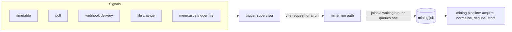

# Triggers

A **trigger** asks the daemon to mine a miner's source on its own: on a timetable, on a poll, when a file changes, or when
an external service calls a webhook.
It decides *when*.
How the source is read, how a document is normalised and what is new stay the job of the source and the mining
pipeline, which a trigger never touches ([ADR-043](adr/043-source-triggers.md)).

Everything here is opt-in:

- **A source supports triggers; it does not start them.**
  A source can say what can trigger it, and that is all the declaration does.
- **A trigger is created disabled.**
  Installing a source, defining a miner, enabling a miner or writing a trigger into the configuration file starts no
  task, opens no port and watches no file.
- **Enabling a trigger checks everything it needs first**, says what is missing and how to set it up, and changes nothing
  until all of it holds.



Every signal ends in the same request that `memcastle miner run` makes, so a trigger can cause nothing a person could not
ask for by hand, and a manual firing, a timetable and a webhook all take one path.

## Defining a trigger

Triggers are the `[[triggers]]` entries of the configuration file, next to the `[[miners]]` they ask to run.
They are managed from the file or from [`memcastle trigger`](cli.md#trigger), and read (never changed) over MCP.
The daemon rewrites only that section, in place, so your comments and the rest of the file survive.

```toml
[[triggers]]
name = "pi-nightly"        # unique: lowercase letters, digits, `-` and `_`; `reload` is reserved
miner = "pi"               # the miner it asks to run
type = "schedule"          # "schedule", "poll", "webhook" or "watch"
enabled = false            # off unless you say otherwise; the daemon never turns it on by itself
every = "1d"               # the other keys depend on the type
at = "03:30"
```

A key the type does not take is an error, not an ignored typo.
A secret is never written in the file: a webhook's shared secret is a `credential` reference to an environment variable
or a file, and a setting that reads like a secret (`token`, `secret`, `api_key`, ...) is refused.

The state in the palace (when a trigger last fired, when it is next due, its last failure, the deliveries it accepted)
never says whether a trigger is enabled: only the file does, so a restart, a recovery or a re-install cannot override
your choice.

## What each type needs

| Type | Fires | Settings | Needs |
|------|-------|----------|-------|
| `schedule` | every `every`, or at `at` (UTC) every `every` days | `every` (`30s`, `5m`, `2h`, `1d`; at least `1s`), `at` (`HH:MM`, whole days only) | nothing |
| `poll` | every `every`, backing off while it keeps failing | `every`, `max_backoff` (default eight intervals) | nothing |
| `watch` | once a change under `path` has been quiet for `debounce` | `path` (absolute), `debounce` (default `2s`, `100ms` to `1h`), `recursive` (default `true`) | a source that declares `watch`; the path must exist |
| `webhook` | when an authentic delivery reaches the listener | `auth`, `header`, `prefix`, `encoding`, `delivery_header`; and a `credential` | a source that declares `webhook`; the [webhook listener](#the-webhook-listener) |

`schedule` and `poll` are available to every source: they only mean "mine again".
A `webhook` and a `watch` need the source to say what a delivery or a change means for it, so they need a declaration
([below](#how-a-source-declares-what-can-trigger-it)).
`memcastle sources` shows what each source supports.

A timetable never fires on the spot when you enable it: its first request is one interval (or the next time of day) away.
When the daemon was down at a due time, it fires once on its way back and not once per missed slot.

### Examples

A daily background mine of Pi sessions, replacing what the Pi integration used to do on its own
([#26](https://github.com/noirbizarre/memcastle/issues/26)):

```sh
memcastle miner set pi --source pi
memcastle trigger set pi-nightly --miner pi --type schedule --setting every=1d --setting at=03:30
memcastle trigger enable pi-nightly
```

Re-mine a directory when its files change:

```sh
memcastle miner set notes --source directory --locator /home/me/notes
memcastle trigger set notes-watch --miner notes --type watch --setting path=/home/me/notes --setting debounce=2s
memcastle trigger enable notes-watch
```

A source with no event mechanism, polled:

```sh
memcastle trigger set docs-poll --miner docs --type poll --setting every=15m --enable
```

## The webhook listener

A webhook trigger is delivered to a listener of its own: a separate socket from the REST API and the MCP endpoint.
The daemon's token authenticates *clients* of the daemon, while the sender of a webhook can only be given a shared secret
for its own trigger, so the two are kept apart, and every route on the main API stays behind the daemon's authentication.

```toml
[webhook]
enable = true            # off by default; nothing listens while it is off
bind = "127.0.0.1"       # loopback by default
port = 8787              # must differ from `server.port` and `db.port`
allow_remote = false     # a bind beyond loopback needs this *and* `auth.enabled`
max_body_bytes = 1048576 # larger deliveries are refused
max_concurrent = 16      # deliveries worked on at once; more are told to retry (429)
```

Nothing listens until you have set `enable` **and** enabled a webhook trigger: the listener is bound when the first
webhook trigger starts and closed when the last one stops.
It is never exposed to the outside by the daemon.
Reaching it from the internet is yours to arrange, and these are the prerequisites:

1. **A reachable address.**
   Keep `bind = "127.0.0.1"` and put a reverse proxy or a tunnel in front of it, or set `allow_remote = true` with
   `auth.enabled = true` to bind a network interface (the daemon refuses a remote bind without authentication).
2. **TLS.**
   The listener speaks plain HTTP.
   Terminate TLS in the proxy: a webhook sender should never be given an `http://` URL on the internet.
3. **A firewall or router rule** that lets the sender reach the proxy or tunnel, and nothing else.
4. **A shared secret** in an environment variable of the daemon or in a file, referenced by the trigger's `credential`.
   It is read at each delivery, so rotating it needs no restart.
5. **The sender's configuration**: the URL `https://<your host>/hooks/<trigger name>`, and the same secret.

```sh
export HOOK_SECRET="$(openssl rand -hex 32)"           # in the daemon's environment
memcastle trigger set notes-hook --miner notes --type webhook \
    --credential-env HOOK_SECRET --setting delivery_header=x-github-delivery
memcastle trigger enable notes-hook                    # refused, with the missing setup, until all of it holds
```

A delivery is `POST /hooks/<trigger name>` and proves itself in one of two ways:

- `auth = "hmac-sha256"` (the default): a header (`header`, default `x-hub-signature-256`) holds the HMAC-SHA-256 of the
  raw body keyed with the secret, after `prefix` (default `sha256=`) and encoded as `hex` (default) or `base64`.
  This is GitHub's scheme.
- `auth = "token"`: the header (default `x-memcastle-token`) holds the secret itself.

Whatever is wrong with a delivery (an unknown trigger, a disabled one, a missing secret, a bad or absent signature) is the
same empty `401`, so the listener does not say which triggers exist.
Signatures are compared in constant time.
The body is hashed to check the signature and then dropped: it is never stored, logged or handed on, because a trigger
says *that* something changed and the source decides what.
Schemes that sign a timestamp as well (Slack's) are not supported yet; a source that needs one can be fronted by a proxy
that verifies it.

An accepted delivery is answered `202` with `{"status": "queued" | "coalesced" | "duplicate", "job": ...}`.

## Bursts, repeats and restarts

- **A burst is one job.**
  A request for a run that finds a run of the same source with the same settings still *queued* joins it instead of
  queueing another: that run reads whatever has changed by the time it starts.
  A run already *running* does not count, because it may have passed the part that changed, so a change during a run
  queues one follow-up.
  At most one run is running and one waiting per miner, however many events arrive.
  This is `coalesced` in the answers and in `memcastle trigger get`.
- **Concurrency is bounded.**
  The webhook listener works on `max_concurrent` deliveries at once and answers `429` with `Retry-After` beyond that;
  a watcher collapses a burst of changes into one request; and jobs run under `jobs.max_concurrency` as always.
- **A repeated delivery runs once.**
  With `delivery_header` set, a delivery whose id was already accepted is answered `202` (so the sender stops retrying)
  and not run again.
  The id is remembered for seven days.
  A delivery that could not be queued is forgotten, so the sender's retry is a new attempt.
  Without `delivery_header` there is nothing to tell a repeat from a new event, and coalescing is what bounds the work.
  Either way the mining pipeline is idempotent: an unchanged document is skipped, so a repeat costs one pass over the
  source and never a duplicate memory.
- **A restart is safe.**
  A delivery accepted but not yet queued when the daemon died is queued when it starts again, if its trigger is still
  enabled in the file.
  A timetable keeps the time it was waiting for.
  A trigger the file says is disabled stays disabled, whatever the palace remembers.

## Failures

Every enabled trigger is one of:

| Status | Meaning |
|--------|---------|
| `disabled` | switched off, which is how every trigger starts |
| `active` | enabled and working |
| `failing` | enabled, but its last attempts failed; `last_error` says what, and how many in a row |
| `unavailable` | enabled, but something it needs is missing (the miner was disabled or removed, the secret or the watched path is gone, the source no longer supports it); the reason says what |

A failing or unavailable trigger never stops the daemon or another trigger, and `unavailable` is worked out each time and
never stored.
The supervisor looks again every few seconds, so the cause of a failure being fixed is enough:

- a watcher that cannot be set up (the path is missing, the system's watch limit is reached) is set up again with a
  growing wait, up to a minute;
- a poll that fails waits longer each time, up to `max_backoff`, and returns to its interval on the first success;
- a listener that cannot bind (the port is taken) is retried on every look, and the reason is on each webhook trigger;
- a hand edit of the configuration file is picked up within a few seconds, or by `memcastle trigger reload`.

`memcastle trigger list` shows every trigger's status, when it last fired and what last went wrong, and the dashboard
shows the same under *Triggers*.
Failures are also published on the [event stream](mcp-and-api.md#the-event-stream) as `trigger` events, which carry the
trigger's name and a fixed word and never a message.

## How a source declares what can trigger it

A source lists the mechanisms it supports beyond the two every source has, in its manifest
([Writing a mining source](writing-sources.md)):

```toml
[triggers.watch]
description = "a session file is created or changed under the session directory"

[triggers.webhook]
description = "the service reports that a conversation changed"
```

This is a capability and nothing more.
It is not a permission, so it is no part of what a user consents to when installing, and it changes neither the source
contract nor the manifest format.
A source that declares nothing is a complete source: it is still schedulable and pollable, and `memcastle miner run`
mines it on demand.
The built-in `directory` source declares `watch` and `webhook`, as do the reference sources where a watched path makes
sense.

The trigger layer never reads the source, never runs its code and never carries a payload to it.
When a trigger fires, the source is asked to `discover` and `read` from its cursor like any other run, and finds whatever
the signal was about.
Vendor integrations (Todoist, GitHub, Slack, ...) are therefore sources that read their service on request, plus a trigger
the user chooses and enables, and not code in the trigger layer.

## Reading triggers from an agent

`memcastle_trigger_list` and `memcastle_trigger_get` show what is configured, and nothing over MCP can define, enable,
disable, remove or fire a trigger: what runs unattended is the user's decision, like what a miner mines.
Secrets are reported as `env` or `file` and whether they resolve, never their name, their path or their value.
