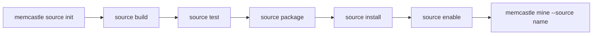
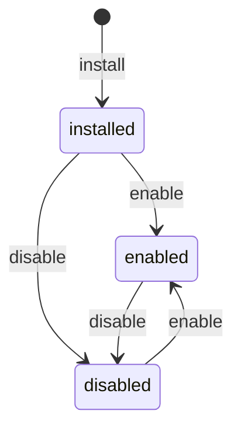

# Writing a mining source

A mining source finds documents in some origin (a chat export, an issue tracker, an agent's session files),
reads them, and puts them in MemCastle's terms.
MemCastle does everything else: chunking, deduplication, drawers, the cursor and the durable job
([Mining sources](mining-sources.md) describes that pipeline).

There are two kinds of source behind one contract.
A **built-in** source is Rust compiled into MemCastle (`directory`).
An **installed** source is a WebAssembly component the user installs, written in any language that produces one.
Both implement the same adapter contract and are held to the same conformance cases,
so the pipeline cannot tell them apart ([ADR-026](adr/026-pluggable-source-adapters-as-webassembly-components.md)).



## Quick start

```sh
memcastle source init my-notes --template rust
cd my-notes
memcastle source build        # dist/source.wasm
memcastle source test         # the conformance cases, in the daemon's own sandbox
memcastle source package      # dist/my-notes-0.1.0.tar.gz

memcastle source install dist/my-notes-0.1.0.tar.gz --enable
memcastle mine --source my-notes --locator ~/notes
```

`init`, `build`, `test` and `package` are local: they need no daemon and no palace.
`install` and the commands after it talk to the daemon.

## What a source implements

The contract is `wit/memcastle-source.wit`, and the same six functions as the native `SourceAdapter` trait.
Everything crossing the boundary is plain data; cursors and metadata are JSON text.

| Function | Contract |
|---|---|
| `identify(locator)` | Validate the locator (or choose the source's default when absent) and return the source's identity. Two spellings of the same place must give the same identity, because the identity is what carries the cursor. |
| `default-wing(source)` | The wing drawers are filed under when the caller names none. |
| `default-room()` | The room drawers are filed under when a document names none. |
| `discover(source, cursor, limit)` | Candidates strictly after `cursor` (JSON; `null` is the beginning), in cursor order, at most `limit`, each with the cursor to store once it is done; and whether anything is left. A listing, not a download. |
| `read(source, candidate)` | One raw document with a **revision** that changes exactly when the content does, or none to skip it (gone, binary, too large). Skipping is not an error. |
| `normalize(raw)` | The canonical document: title, room, kind, tags, and the content as ordered segments. Pure: the host runs it with no permissions at all. |

A source does not chunk, deduplicate, name drawers' ids, store a cursor or know about jobs.
A cursor is the source's own JSON; a cursor it did not produce is reported as `cursor-invalid`, and MemCastle tells the
user to mine with `--full`.
A cursor is an optimisation, never a correctness mechanism: reading a document twice is always safe.

Three errors cross the boundary: `cursor-invalid`, `invalid-input` (a bad locator) and `failed` (anything that should fail
the job).
A trap, a timeout and an out-of-memory are reported by the host as `memcastle::source::failed` or
`memcastle::source::timeout`.

## The manifest

`memcastle-source.toml` sits at the top of a source project and of a package.
Every table refuses unknown keys.

```toml
[source]
name = "my-notes"            # the name given as --source: lowercase letters, digits, "-"
version = "0.1.0"            # semantic version of the package
description = "my notes"     # one line, shown by `memcastle sources`

[compatibility]
contract = "0.1"             # the WIT contract version it was built against
memcastle = ">=0.2.0, <0.3.0"  # the MemCastle versions it runs on

[capabilities]               # the same three as a built-in adapter; all default to false
incremental = true
retains_raw = false
needs_credentials = false

[permissions.filesystem]
read = ["locator"]           # "locator", an absolute directory, or "~/..."

[permissions]
network = false              # all or nothing
process = []                 # bare program names the source may run
env = []                     # environment variables the source may read

[limits]
memory_mib = 64              # at most mining.source_memory_mib
timeout_secs = 30            # per call; at most mining.source_timeout_secs

[build]                      # development only; the daemon never runs it
command = ["cargo", "build", "--release", "--target", "wasm32-wasip2", "--target-dir", "target"]
output = "target/wasm32-wasip2/release/my_notes.wasm"

[test]                       # development only
fixtures = "fixtures"
```

| Key | Rule |
|---|---|
| `source.name` | 1 to 48 lowercase letters, digits or `-`, not starting or ending with `-`. Not a built-in name. |
| `compatibility.contract` | `MAJOR.MINOR` or `MAJOR.MINOR.PATCH`. |
| `compatibility.memcastle` | A semver requirement. A pre-release of a release is held to the release's requirement. |
| `permissions.filesystem.read` | `locator`, an absolute path, or a path starting with `~/`. A directory that does not exist is dropped, not an error. |
| `permissions.process` | Bare program names (`git`), never a path or a command line. |
| `build.output` | Relative to the project; it must be a component, not a core module. |

## Permissions and consent

A source starts with nothing: no filesystem, no environment, no network, no programs.
The manifest lists what it asks for and nothing else is granted.

| Permission | What the host does |
|---|---|
| `filesystem.read` | Opens the listed directories read-only, at the same path inside the sandbox as outside it, so `std::fs` on the locator works unchanged. `locator` is the directory being mined, canonicalised by the host. There is no write access. |
| `network` | Opens the network, all or nothing. The host cannot yet restrict by host name, and the consent prompt says so. |
| `process` | Lets the source call `run-process` for exactly those programs: no shell, a minimal environment (`PATH`, `HOME`, and the variables in `env`), a time limit, a cap on output. Any other program is refused. |
| `env` | Passes the listed variables, when set, into the sandbox. It sees no others. |

`normalize` runs with none of these, whatever the manifest says.

Installing a package that asks for anything needs the user's consent to exactly those permissions.
`memcastle source install` prints them and asks;
the daemon recomputes a digest of the name and the normalized permissions and refuses an install that does not carry it,
so consent for one source or one set of permissions is not consent for another.
A script is never asked and never consents on its own behalf:
pass `--yes`, or `--consent <digest>` after reviewing the permissions the refusal lists.
A package that asks for nothing needs no consent.

Each call runs in a fresh sandbox with a memory ceiling (`mining.source_memory_mib`) and a time limit
(`mining.source_timeout_secs`), either of which the manifest can only lower.
A source that loops is stopped by the engine, not by its own good manners.

## Lifecycle



| State | Meaning |
|---|---|
| `installed` | In the daemon, not yet enabled: it cannot be mined. |
| `enabled` | Available to `memcastle mine --source`. |
| `disabled` | Turned off; files and history are kept. |
| `unavailable` | Installed but unable to run here. Never stored: it is computed on every look from the files and the running MemCastle. |

A source is `unavailable` when its component file is missing, when it no longer matches the digest recorded at install
(so a file swapped on disk is never run), or when its contract or MemCastle requirement is not met.
`memcastle source list` says why, and installing the package again repairs a missing or altered one.
Enabling and disabling are idempotent, and an unavailable source cannot be enabled.
Installing a name that is already installed replaces it and keeps its state.
Removing a source deletes its files and its record, and keeps what it mined.
Built-in sources are always enabled and cannot be disabled or removed.

## Compatibility

The contract has a version (`wit/memcastle-source.wit`, currently `0.1.0`), and a source declares the one it was built
against.

| Host contract | A source built for it runs on |
|---|---|
| `0.N` (before `1.0`) | A host implementing exactly `0.N`. Any minor version may break the contract. |
| `M.N` (`M` at least 1) | A host of the same major `M` whose minor is at least the source's. |

A patch version is documentation only.
A new contract version makes every installed source of the old one `unavailable` with a reason that says to rebuild,
rather than failing at the first mine.
`memcastle source init` scaffolds against the contract of the MemCastle that ran it.

## Templates and their toolchains

| Template | Written in | Toolchain | Notes |
|---|---|---|---|
| `rust` | Rust | `rustup target add wasm32-wasip2` | Compiles straight to a component. Smallest and fastest to start. |
| `cli` | Rust | The same | Wraps a command-line program through `run-process`; the manifest lists the programs. For a source that is easiest written as a script or an existing tool. |
| `typescript` | TypeScript | Node.js, `npm install` (`jco`, `typescript`) | Compiled to JavaScript, then componentized with `jco`, which embeds a JavaScript engine: the component is megabytes and slower to start. |
| `python` | Python | `pip install componentize-py` | Componentized with `componentize-py`, which embeds CPython: only the standard library and pure-Python packages bundled with it are available. |

TypeScript and Python are not compiled directly to WebAssembly, and these templates are provided as starting points:
their toolchains are not installed in MemCastle's CI, so the suite checks that they scaffold a valid project but does not
build them.
Rust and `cli` sources are built and run for real by the test suite.

## Conformance

`memcastle source test` runs the cases listed in the manifest's `[test] fixtures` against the built component, loaded the
way the daemon loads it.
A case is a directory holding `case.json` and a tree; the runner is generic over the adapter contract, so MemCastle runs
the same cases against its native `directory` source and against the reference component.

| Check | What a source must do |
|---|---|
| Identity | `identify` returns the source's own provider name, and the same identity for the same locator. |
| Paging | Each page has at most `limit` candidates, no candidate repeats, and resuming from a page's last cursor starts strictly after it. |
| Foreign cursor | A cursor the source did not produce is refused as `cursor-invalid`. |
| Incremental | After the last cursor, an incremental source finds nothing and says it is exhausted. |
| Revision | Reading a document twice gives the same revision. |
| Normalization | Normalizing twice gives the same document, with the title, kind, tags, room and segments the case expects. |
| Skips | What the case lists as skipped produces no document. |

A case is described by:

| Field | Meaning |
|---|---|
| `name`, `description` | What it checks. |
| `locator`, `limit` | The tree, relative to the case, and the page size (smaller than the number of documents, so paging happens). |
| `documents` | The external ids that must be produced, each with its normalized `title`, `kind`, `tags`, `room` and `segments`. |
| `skipped` | Paths in the tree that must produce no document. |

What differs legitimately between sources (the shape of a cursor, a revision's format, a drawer name) is not compared.

The cases shipped with MemCastle:

| Case | What it covers |
|---|---|
| `text-tree` | Text files in nested directories, with hidden and build directories, a binary file and an empty one; paged by two. |

## Packaging and distribution

`memcastle source package` builds the component (unless `--no-build`) and writes `dist/<name>-<version>.tar.gz`:
`memcastle-source.toml`, `source.wasm`, and the project's `README.md` and `LICENSE` when present.
The archive is deterministic, so packaging the same source twice gives the same bytes and its digest can be published.
Only those top-level files are ever read from an archive.
It reads the package back before reporting success, so a package that would not install is found where it is made.

`memcastle source install` puts the component under `mining.sources_dir` and records the manifest the user agreed to
and the component's SHA-256 in the palace.
Installed sources belong to one daemon: with a shared remote palace, each daemon needs the package installed, and one
that lacks the files reports the source `unavailable`.

## Reference sources

`sources/` holds maintained reference sources, one directory each, with the same package layout as any other.
`sources/directory/` is the built-in `directory` source as a Rust component, and is the worked example to read.
`sources/pi/` is the Pi coding agent's session history, the first official source that is not a built-in: it reads a
real, evolving format, keeps raw documents and asks for two permissions (`docs/mining-sources.md#pi`).
A source that ships with MemCastle's releases, without being compiled into the binary, is built from here and uses
exactly the package contract a user installs.

## Testing your source in CI

`memcastle source test` needs no daemon and builds the component first, so it is all a CI job has to run.
In a project of your own, install the `wasm32-wasip2` target (or your template's toolchain), build `memcastle`,
and run `memcastle source test .`.
In this repository nothing needs adding: each directory under `sources/` that holds a `memcastle-source.toml`
gets its own CI job, which runs `mise run sources:test -- <name>`.

## Troubleshooting

| Code | Cause |
|---|---|
| `memcastle::source::manifest_invalid` | `memcastle-source.toml` does not parse or breaks a rule above. |
| `memcastle::source::package_invalid` | The archive is not readable, or lacks the manifest or the component. |
| `memcastle::source::incompatible` | The contract or MemCastle version does not match, or the component does not fit the contract. Rebuild it. |
| `memcastle::source::consent_required` | The package asks for permissions that were not agreed to. Review them and pass `--yes` or `--consent`. |
| `memcastle::source::not_found` | No installed source has that name. |
| `memcastle::source::not_enabled` | The source is installed but disabled, or unavailable; `memcastle source list` says which. |
| `memcastle::source::builtin` | Built-in sources cannot be disabled, replaced or removed. |
| `memcastle::source::failed` | The source ran and failed, trapped or ran out of memory. The message is the source's own. |
| `memcastle::source::timeout` | One call took longer than its limit. |
| `memcastle::source::permission_denied` | The source ran a program its manifest does not list. |
| `memcastle::source::build_failed` | The build command failed or did not produce a component. |

A source that cannot read a file it expects usually lacks a `filesystem.read` permission:
the sandbox shows a directory it was not granted as simply not there.
